# 09 소송비용

> *이 문서는 스캔본 PDF의 내장 OCR 텍스트를 추출·정리한 것입니다. 러닝헤더와 쪽번호를 제거하고 일부 고빈도 OCR 오류(민시→민사, 대싱→대상 등)를 일괄 보정했으나, 원본 스캔 OCR 품질로 인해 글자 오인식이 일부 남아 있을 수 있습니다. 표·양식은 추출 텍스트 그대로입니다.*

## 페이지 1

?? 饑 찮뼜 % 퇘驗毖爭戰熙申 < 艱 \鞍
\諱$殼蝨혀쇄
? ;
默伊 :훈娥襪
: G넵 諱携
뼜;
‘$혹~딴耭#
躪 .
떪
짧
헒
:
%舞 鰥#豁 :
蟬떫
麝◇:
繆
.‘병
떫\
쳤
얜*
靜짧
簇懺解
瓏
#
몇
忽
벤= =쁜
:
埋 轍
繁
品諱훈쇄
령.
곯 ;;
병
저"3장
소송비 용
承
鬱
諱
짧竊\
?
제1절 총설 496 짧\
쳬2절 소송비용의 종류 499 ;
제3절 소송비용의 예납 및 국고대납 537
제4절 소송비용 부담의 재판 554
쳬5절 소송비용액 확정절차 566
제6절 각종 절차의 소송비용일람 579
짧 橓
\
懸체젊
쳬
靴 $:
\
癖
? 羚凞
※舞 . 뺐 鰥 賄諱\鰥#예뿐밟

---

## 페이지 2

제1절 총설
1. 소송비용저l도
민사소송법은 민사소송에 있어서 사법제도를 이용하는 당사자 등 소송관
계인에게 그 비용을 부담시키는 재판유상주의를 전제로 하여 소송비용의 부
담(민소 98조 내지 116조), 소송비용의 담보(117조 내지 127조) 및 소송구조
(128조 내지 133조)에 관하여 규정하고 있다. 특정인이 사법제도를 이용하게
되는 경우 당사자로 하여금 그 분쟁을 해결하기 위하여 필요한 비용의 일부
를 부담하게 히는 것이다.
민사소송비용법은 당사자의 부담으로 할 소송비용의 종류를 열거하고 그
한도를 소송행위에 필요한 한도의 비용으로 제한하고 있다. 구체적인 비용
액 및 그 산출방법에 관하여는 민사소송 등 인지법 및 디수의 대법원규칙에
규정되어 있다.
2. 소송비용의 의의
넓은 의미의 소송비용은 집행비용(민집 53조)까지 포함하지만, 좁은 의미
에서 소송비용이란 당시자가 특정한 소송절차를 수행함에 있어서 발생한 모
든 비용을 말하는바, 여기에는 소송계속 중의 비용뿐 아니라 소제기 전의 준
비행위를 위한 비용과 소송의 부수절차에서 발생한 비용이 모두 포함된다.
따라서 증거보전절차비용, 제소전화해비용, 독촉절차비용 등은 본안의 소송
비용의 일부가 되고(민소 383조, 389조 단서, 473조 4힝), 청구이의의 소, 집행
문부여에 대한 이의의 소, 제3자이의의 소에서 잠정처분을 명한 경우의 잠
정처분비용, 가집행선고부 판결에 대한 상소 또는 재심사건에서 명한 강제
집행정지비용도 모두 본안의 소송비용에 포함된다.
조정절차의 비용은 조정이 성립된 경우에는 특별한 합의가 없으면 딩치자
로 496 =

---

## 페이지 3

들이 각자 부담하고 조정이 성립되지 아니한 경우에는 조정신청인이 부담하
는데(민조 37조 1힝), 조정신청이 소송으로 이행되었을 때에는 조정절차의 비
용은 소송비용의 일부로 본다(2힝). 소송사건이 조정에 회부된 경우 조정이
성립하거나 조정을 길음하는 결정이 확정된 때에는 소송비용은 조정절차비
용의 일부로 보는데, 조정을 갈음하는 결정에 대한 이의신청이 취하된 경우
에 있어서 이의신청 이후의 소송비용은 그러하지 아니하다(민조규 16조의2)
가압류 가처분 재판비용은 본안소송의 소송비용에는 포함되지 않고 별도
의 비용으로 처리된다. 집행비용은 좁은 의미의 소송비용에 포함되지 아니
하고, 항상 채무자가 부담하게 되어 있으며 집행권원에 의한 강제집행에 의
하여 우선적으로 변상받게 된다(민집 53죄.
민사소송법상 소송비용에 관한 규정 및 민사소송비용법은 형사사건과 소
년보호사건 등 국고가 절차비용을 부담하는 경우를 제외하고는 행정사건’
가사사건, 보전처분사건 등의 경우에도 준용된댜
3. 소송비용의 법위
가. 소송행위에 필요한 한도의 비용
민사소송비용법은 1조에서 “민사소송법의 규정에 의한 소송비용은 소송
행위에 필요한 한도의 비용으로 하고 이하 수조의 규정에 의하여 산정한다”
라고 규정하고 2조부터 8조까지 명시적으로 비용종목을 규정하고 있지만, 9
조에서 “본법에 규정하지 아니한 비용은 그 실비액에 의한다.”라고 규정함으
로써 소송비용의 범위에 관하여 이른바 ‘개괄주의'를 채택하였다.
따라서 민사소송비용법 2조부터 8조까지 명시적으로 정한 비용종목에 해
당하지 않는 비용이라도 같은 법 1조에서 정한 ‘소송행위에 필요한 한도의
비용'에 해당하는 경우에는 소송비용으로 인정되어야 할 것이다. 일반적으로
소송 등에 있어서 공격 .
鎔
방어를 위하여 필요하다고 인정되는 행위에 관한 비
용으로서, 그 행위를 하기 위하여 필요하다고 생각되는 액에 한하여 그 소송
~ - ~. ~~~~
I 제13장
소
소
⊃
비
요
⊂⊃

---

## 페이지 4

비용으로 인정된다. 예컨대 사건의 당사자 및 그 법정대리인, 소송대리인,
보조인 등이 그 사건의 계속 중에 재판기록의 열람복사를 할 때에는 수수
료를 납부하지 아니하고 재판기록을 열람복사할 수 있는데(열람복사규 4조
5힝), 이 경우 법원으로부터 복시물의 교부를 받기 위하여 납부하는 수수료
(6조 2항 본문, 1징당 50원)는 ‘소송행위에 필요한 한도의 비용'에 포함되지 않
는다 .
소송행위에 필요한 비용인가 여부는 소송비용액을 확정할 때에 정하는 것
이지만, 그 판단의 기준시점은 당해 비용이 들어간 행위 시이다. 그러므로 그
행위가 결과적으로 소송에 도움이 된 바가 없더리도 행위 당시의 소송상태
와 사회통념에 비추어 필요한 행위였다고 인정되는 한 그 비용은 소송비용
에 포함된다.
나. 법령에 규정된 비용
소송비용은 구체적으로 민사소송비용법과 그 위임에 의해 제정된 대법원
규칙에서 규정된 범위 내에서만 인정된다. 따라서 설사 당사자가 실제로 법
정액(법령에 규정된 비읽 이상을 지출했다 하더라도 소송비용으로 인정받는
것은 법정액에 한정된다(대법원 ZOOO. 329. 자 99흐1 결정). 당사자가 실제
지출한 모든 비용을 소송비용으로 하게 되면 그 범위가 극히 막연할 뿐 아
니라 과다하게 되어 소송에 따른 비용부담의 위험 때문에 사법제도의 이용
을 저해할 우려가 있기 때문이다.
따라서 당사자가 지출한 ‘법정액 이상의 지출비용'을 상환받고자 하는 경
우에는 일반 법리에 따라 손해배상청구 등 별개의 소를 제기할 수밖에 없다.

---

## 페이지 5

제2절 소송비용의 종류
1.개요
가. 재판비용
‘재판비용'이란 당사자 등이 소송 기타 절차를 수행하기 위하여 법원에 납
부하는 비용으로서 크게 나누어 인지액 및 민사예납금(송달.증거조사 등 개개
의 절차행위를 행힘에 소요되는 비용으로서 법원에 닙부5셔야 히는 비읽으로 분
류된다.
이러한 비용은 일단 그 비용을 요히는 행위를 신청한 사람 또는 그 행위
에 의해 이익을 받는 당사자가 법원에 출연하지맨인지첩부 또는 예닙), 종국
적으로는 비용부담의 재판을 받은 사림으로부터 상환받게 되는 비용이다.
나. 당사자비용
‘당시자비용'이란 딩사자가 소송수행을 위하여 법원에 납부하는 것이 아
니라 직접 제3자에게 지출한 비용을 의미하며 ‘재판 외의 비용’이리고도 부
른다. 예컨대 법원에 제출하는 서류나 도면을 작성하기 위하여 소요된 서기
료 및 그 제출비용, 당시자 본인 또는 대리인이 기일에 출석하기 위하여 지
출한 비용, 변호사보수 등이 이에 해당한다.
당사자가 소송수행을 위해서 지출하는 구체적인 비용의 항목이나 액수는
경우에 따라 달라질 수 있는데, 민사소송비용법과 민사소송비용규칙은 소송
비용으로 상환받을 수 있는 당시자 비용의 힝목과 액수를 구체적으로 정하고
있다. 또한 이 비용은 법원의 관여 없이 지출되는 것이므로, 신청인이 법원에
소송비용액확정결정 신청을 하는 때에 그 비용에 대하여 반드시 소명하여야
한디(대법원 2014. 7. 18. 자 2014무55 결정). 따라서 신청인은 그 비용의 지출
에 관한 증빙자료를 제출하여야만 당사자비용을 싱환받을 수 있다.
l 체,,※
lL %
소
송
비
요
◎

---

## 페이지 6

2. 인지액
가. 의 의
인지액은 소송비용 중 ‘재판비용'의 하나로서, 사법수수료의 성질을 갖는
것이다. 일반적으로 ‘수수료'라 함은 국가 또는 공공단체가 특정인을 위하여
행히는 역무 등에 대한 반대급부로서 그 특정인으로부터 징수하는 수익자
부담의 성질을 갖는 요금을 말하는데, ‘사법수수료'는 사적 분쟁의 해결을
위해 국가가 설치 .운영하는 소송제도의 이용을 구하는 당사자로부터 소의
제기 기타 절차상의 일정한 행위를 구하는 반대급부로서 법률이 정하는 바
에 따라 징수하는 요금이다.
민사소송절차, 행정소송절차, 그 밖에 법원에서의 소송절차 또는 비송사
건절차에서 소장이나 신청서 또는 신청의 취지를 적은 조서에는 다른 법률
에 특별한 규정이 있는 경우가 아니면 인지를 붙여야 한다. 다만 대법원규칙
으로 정히는 바에 따라 그 인지액에 해당하는 금액을 현금이나 신용카드 . 직
불키드 등으로 납부할 수 있다(인지 1조). 신청, 소, 심판의 제기 등이 말로
행하여지는 경우(민소 161조, 소액 4조, 기소 36조)에도 법원시~등이 작성
한 조서에 인지를 붙여야 한다.
나. 범 위
민사소송 등 인지법은, 인지를 붙여야 하는 신청을 ① 소.상소. 반소. 청
구변경신청 . 당사자참가신청 화해신청 . 재심과 같이 붙여야 할 인지액이 소
송목적의 값에 따라 일정한 비율로 정해지는 경우, ② 그 밖의 신청으로서
위 법이 정하는 정액의 인지를 붙여야 하는 경우의 두 가지로 나누어 규정
하고 있다.
또한 소의 제기 등 절차의 시작을 구하는 신청 이외에 그에 부수하는 신
청이나 중간적 신청에 관하여도 모두 인지를 붙이도록 개괄주의를 취히교
있으나, 답변서, 증거신청서 및 법원의 직권발동을 촉구하는 의미의 신청서

---

## 페이지 7

나 민사소송절차와 민사소송법이 준용되는 소송절차, 집행절차 및 비송절차
에서의 나머지 신청서(민소 162조에 띠른 소송기록 열람.증명서 교부 신청서 제
외)에는 인지를 붙이지 아니한다고 규정하고 있디(인지 10조, 인지규 2조의2).
구체적인 인지액 산정 방식은 제6장(접수시무) 제3절 2. 참조.
민사소송 등 인지법에 의하여 붙인 인지액은 그 정액을 소송비용에 산입
한다(민소비용 2죄. 다만 민사소송 등 인지법에 따라 인지환급을 청구할 수
있는 신청인이 환급을 받지 아니한 경우에는 환급받을 수 있었던 부분을 공
제한 나머지 부분만을 소송비용에 산입하여야 한다.
3. 증인.감정인 등에 대한 일당.여비 등
가. 의 의
증인.감정인.통역인.번역인은 제3자이지만 국민의 의무로서 법원의 민
사소송 등 절차진행에 협력하게 되고, 이러한 협력의 과정 중 출석 또는 조
사 및 이를 위한 여비의 지출 등으로 적극.소극의 손실을 입게 되므로, 법
원은 당사자가 미리 내거나 추후 낼 소송비용으로 이러한 제3자의 손실올
보상한다.
법원이 이러한 제3자에게 지급하는 비용으로 일당.여비 .숙박료가 있고
(민소비용 4조), 그 최고액은 민사소송비용법 4조에서 규정하고 있지만, 경제
사정의 변동에 따라 대법원규칙으로 증감할 수 있는데(민소비용 부칙 제336호
소
17조), 이러한 위임에 따라 제정된 민사소송비용규칙은 그 일당을 매년 대법 소
◎
비
용
관회의에서 정하도록 규정하고 있고(민소비용규 3조 2힝), 여비와 숙박료는
법원공무원여비규칙에서 정한 금액 이내로 규정하고 있디G조의2, 3조의3).
나. 증안감정인 등의 범위
민사소송비용법 4조는 일당.여비 등을 청구할 수 있는 사람으로 ‘증인,
감정인, 통역인과 번역인'을 규정하고 있다 그러나 이에 한정되지 않고, ①

---

## 페이지 8

법원이 공공기관 등에 감정을 촉탁하고 감정서를 설명하게 한 때의 설명자
(민소 341조), ② 문서제출명령의 심문을 위하여 출석 요구된 제3자(347조 3
힝), ③ 사실탐지와 증거조사 등을 위하여 법원으로부터 기일에 출석하도록
출석요구를 받은 사뤠비송 11조), ④ 조정의 결과에 이해관계가 있어 조정에
참가하게 된 이해관계인(민조 16조 2힝), ⑤ 기久I사건에서 가정법원, 조정위
원회, 조정담당판사가 출석 요구한 이해관계인 또는 재판장이 절차에 참가
시킨 이해관계인(기소 7조 1항, 37조 2힝) 등도 포함되는 것으로 해석된다. 반
드시 소정의 방식에 의해 출석 요구된 경우뿐 아니라 당사자와 동행하거나
전화연락을 받고 출석한 때에도 일당.여비 등을 청구할 수 있다.
한편 대법원은 필요한 경우 변론을 열어 참고인의 진술을 들을 수 있는데
(민소 430조 2힝), 이 경우 참고인에게는 국고에서 수당을 지급할 뿐 별도의
여비 . 일당은 지급하지 아니하고, 참고인의 수당은 소송비용에 산입하지 아
니한디(대법원변론규 4조 5항, 6힝).
증인의 일당.여비 등에 관하여는 증인의 일당.여비 등의 지급에 관한
예규'가 자세히 규정히고 있다. 이에 따르면 증인이 기일에 출석한 경우리도
정당한 시유 없이 선서 또는 증언을 거부한 경우에는 일당. 여비 등을 지급
하지 않고(4조 2호), 반면에 출석한 증인이 기일의 변경 그 밖에 자신의 책임
없는 사유로 증언을 할 수 없게 된 경우라도 그 증인에게 일당. 여비 등을
지급하여야 한디(6조). 증인에 대한 위와 같은 규정 내용은 감정인통역인.
번역인 등에 대하여도 유추적용된다고 해석된다.
다. 일 당
증인, 감정인, 통역인과 번역인에게 지급할 일당은 법원이 상당하다고 인
정하는 출석 또는 조사 및 이를 위한 여행에 필요한 일수에 따라 지급하고,
그 최고액은 매년 대법관회의에서 정한디(민소비용규 3죄. 증인 등의 일당울
비롯하여 재판 관련 각종 수당 등의 연도별 적용금액은 사법정보통합검색

---

## 페이지 9

종합법률정보 ‘규칙/예규/선례 항목의 상세검색 화면에서 ‘대법관회의 의결
사힝(재판관련 긱종 수당 뒹'을 통하여 확인할 수 있다.
(1) 증인의 일딩
증인의 일당은 매년 대법관회의에서 정한 금액(일정한 법위의 금액으로 정
한 경우에는 그 싱한액)으로 한디(증인여비예규 2조 본문). 예컨대 2025년의 경
우 대법관회의에서 일당을 ‘1일 50,000원 이내'로 정하였으므로 증인의 일
당은 1일 50,000원이 된다 다만 국고에서 지급되는 증인의 일당은 매년 대
법관회의에서 정한 금액의 한도 내에서 예산 사정을 참작하여 지급한디(2조
단서) .
위 ‘증인의 일당. 여비 등의 지급에 관한 예규'는 재판부파다 증인의 직업 .
성별 . 나이에 따라 증인의 일당이 차별적으로 결정 . 지급됨으로 인하여 초래
되는 혼선을 막고 통일적인 업무처리를 위하여 제정된 것이다. 따라서 증인
이 무직자이든 공무원이든, 학생이든, 교도소.구치소 수감자이든 상관없이
대법관회의에서 정한 금액(싱한액)을 동밀하게 일당으로 지급하여야 한다.
다만 재판장은 일정한 시유가 있는 경우(증인이 공동소송인 또는 공동피고인
경우, 구인징발부.과태료재판.감치재판 개시결정이 있은 후에 출석한 경우, 재정
증인인 경우, 제3자의 소송담딩에 있어서 이익귀속주체, 소송대리인, 보조침카인,
소송고지에 있어서 피고지자, 법인 滸l 당시자인 경우 대표자 아닌 구성원인 경우
제13장
등 딩시자와 특수한 관계에 있는 경우, 그 밖에 이에 준히는 특별한 사정이 있는 경
소
우)에 한하여 증인의 일당을 감면할 수 있다(증인여비예규 5조). 송
비
용
(2) 감정인.통역인.번역인 등의 일당
감정인.통역인.번역인의 일당은 매년 대법관회의에서 정한 금액(2025년
의 경우 1일 50,OOO원 이내)의 범위 안에서 법원 또는 수탁판사가 정하도록
되어 있다(민소비용 4조, 민소비용 부칙 제336호 17조, 민소비용규 3조 2힝). 예
컨대 통역인이 출석하였으나 기일이 연기되는 등으로 귀책사유 없이 통역이
행하여지지 않은 경우 통역료는 지급하지 않으나 일당. 여비 .숙박료는 지급

---

## 페이지 10

한다(통역 . 번역예규 24조 1항 1호). 재판장은 통역료 또는 번역료를 산정함에
있어서 일당. 여비를 포괄한 정액으로 정할 수 있는데, 이 경우에는 별도로
일당. 여비를 청구할 수 없다(25조 4회.
법정통역센터에 상시 근무하는 통역.번역인, 수어통역인.농통역인이 전
문임기제 공무원으로서 또는 위탁용역계약에 따라 제공하는 통역 번역에
대하여는 법원에서 별도로 일당을 지급하지 아니하고 그 일당에 대하여는
그 절차의 종류를 가리지 않고 소송비용에 산입하지 아니한다(통역 . 번역예규
13조 4힝).
라. 여 비
(1) 여비의 개념
① 법원공무원 여비 규칙상 여비 개념(넓은 의미)
법원공무원이 공무로 여행을 하는 때에 지급하는 ‘여비'에는 ‘운임 . 일비 .
숙박비 . 식비 . 이전비 . 기족여비 및 준비금등'이 있는데(여비규 2죄, 이 중 ‘운
암 일비 .숙박비 . 식비’의 네 가지가 소송비용과 관련하여 문제 되어 왔다.
② 민사소송비용규칙상 여비 개념(좁은 의미)
민사소송비용규칙상 증인 .감정인 등의 여비에는 원칙적으로 ‘운임 . 식비'
의 두 가지만 포함되고(민소비용규 3조의2 1훼, 일비는 포함되지 않는다. 다
만 법관, 그 밖의 법원공무원의 증거조사에 요하는 여비에 대하여는 법원공
무원 여비 규칙이 준용되므로(4조 1항 본문), ‘일비'도 여비에 포함된디(여비규
2조).
다음 설명은 민사소송비용규칙상 여비 개념에 따른 것이다.
(2)여비의범위
①국내운임
국내운임은 철도.선박항공.자동차 운임의 4종으로 구분하되, 법원이
상당하다고 인정하는 교통수단을 기준으로 하여 지급한다(민소비용규 3조의2

---

## 페이지 11

2훼. 따라서 운임은 실제로 증인 . 감정인 등이 여행한 노정이나 이용한 운송
수단 여하에 불구하고 법원이 상당하다고 인정하는 교통수단을 기준으로 정
하게 된댜
법원이 철도.선박.항공.자동차 중에서 상당하다고 인정하는 교통수단을
정한 경우에, 그 구체적인 운임은 법원공무원 여비 규칙 ,o조 내지 ,3조 및
'6조 '항의 [별표 2] ‘국내 여비 지급표'에 정한 2호 해당자 소정액 이내로
한디(민소비용규 3조의2 4핵 이를 교통수단에 따라 살펴보면 다음과 같은데,
이들 운임은 욍복운임이다.
철도운임은 일반실 실비로 지급하되, 전철구간에 있어서 철도운임 외에
전철요금이 따로 책정되어 있는 때에는 철도운임에 갈음하여 전철요금을 지
급할 수 있으며, 이 경우 전철요금은 실비로 한다(여비규 ,o조 ,힝).
선박운임은 2등급 실비로 지급한다(여비규 ,,조 ,힝).
힝공운임 및 지동차운임은 실비를 지급하되, 비스운임은 국토교통부징콴 또
는 특별시장 광역시장 및 특별자치시장. 도지사특별자치도지시가 정하는 기
준 및 요율의 범위에서 정해진 버스요금을 기준으로 한다(여비규 ,2조 ,항, ,3
조 1항, 별표2).
②국외운임
국외운임은 증인.감정인 등이 국외로부터 국내로, 국내로부터 국외로 여
행하거나 또는 국내로 입국하기 위하여 국외에서 여행(이른바 직항노선이 없
을 때)하는 경우에, 법원이 상당하다고 인정하는 때에 한하여 지급한다(민소
비용규 3조의3 '힝). 국외운임도 물론 욍복운임이고, 다음과 같은 구분에 의
하여 산정하되 통행세를 가산한다(2힝).
철도운임 및 선박운임은 그 운임에 등급구별이 있는 경우에는 중간등급
이하의 운임, 등급구별이 없는 경우에는 승차나 승선에 요하는 실비액으로
한다.
지동차운임은 실비액으로 한다.
l . .
l 쳬떠장
소
송
비
요
◎

---

## 페이지 12

힝공운임은 2등 정액(Economy CIas혜으로 한디(여비규 12조 2항 [별표 3]
‘국외 항공운임 정액표 그 밖의 시람 소정액).
③식비
여비 증 식비는 법원이 상당하다고 인정하는 경우에 한하여 지급한다(민
소비용규 3조의2 3힝). 식비는 여행일수에 따라 지급하는데, 수로여행과 항공
여행에는 따로 식비가 필요한 경우에만 지급한다(여비규 16조 5힝). 여행일수
는 여행을 위하여 실제로 필요한 일수, 즉 기일에출석하기 위한 왕복여행
및 조사를 위해 소요되는 일수에 따르되, 여행도중 천재지변이나 그 밖의 부
득이한 사유로 늘어나는 일수는 이에 포함된다(5조).
국내여비에 포함되는 식비는 1일당 25,000원이디(민소비용규 3조의2 4항,
여비규 16조 1항 [별표 2] ‘국내 여비 지급표, 2호 해딩자 소정액).
국외여비에 포함되는 식비는 국가 및 도시별로 구분하여 1일당 $30~
$67(미 달러홰까지 지급한디(민소비용규 3조의3 3항, 여비규 16조 1항 [별표 4]
‘국외 여비 지급표 6호 해딩자 소정액).
④ 구속된 사람 등의 경우
교도소.구치소 또는 국가경찰관서의 유치장에 체포.구속 또는 유치된 사
람으로서 교도소.구치소 또는 국가경찰관서의 관용차량에 의하여 호송되어
증인 등으로 출석한 경우의 여비에 관하여는 법원공무원 여비 규칙 15조를
유추하여 여비 중 자동치운임은 지급할 필요가 없고, 식비만을 지급하는 것
이 타당하다.
마. 숙박료
여비 중 숙박료는 법원이 상당하다고 인정하는 경우에 한하여 지급한다
(민소비용규 3조의2 3힝). 숙박료는 숙박하는 밤의 수에 따라 지급하는데, 수
로여행과 항공여행에는 숙빅료를 지급하지 아니하되, 천재지변이나 그 밖의
부득이한 사유로 육지에서 숙박할 필요가 있는 경우에는 이를 지급한다(여비

---

## 페이지 13

규 16조 4힝).
국내여행에 수반되는 숙박료는 1박당 100,OOO원(서울특별시), 80,000원
(굉역시), 70,000원(그 밖의 지역)을 상한으로 한 실비이디(민소비용규 3조의2
4항, 여비규 16조 1항 (별표 2] ‘국내 여비 지급표/ 2호 해딩자 소정액).
국외여행에 수반되는 숙박료는 국가 및 도시별로 구분하여 1박당 $77~
$155를 상한으로 한 실비를 지급한다(민소비용규 3조의3 3항, 여비규 16조 1
항의 [별표 4] ‘국외 여비 지급표, 6호 소정액).
4. 감정 둥어l 대한 특별요금
가. 의 의
감정 .통역 . 번역 등에 관한 특별요금은 소송비용에 포함되고, 그 범위는
법원이 정한 금액에 의한다(민소비용 6조). 이러한 특별요금에는 보수로서 감
정인 등의 용역의 대가 외에 감정 .통역 . 번역 등을 위하여 필요한 비용(자료
수집비, 여비 등)을 포함한다.
감정에 괸히여는 캄정인등 선정과 감정료 산정기준 등에 관한 예규’, 통역.
번역에 관하여는 ‘통역.번역 및 외국인 사건 처리 예규'가 규정히고 있다.
이러한 특별요금을 계산힘에는 시무의 난이, 성과, 그에 들인 노력과 시간
기타 여러 가지 사정을 종합적으로 고려하여야 하는데, 재판예규 등에 구체
적 기준이 없는 경우에는 김독관청 등으로부터 인가받아 시행되고 있는 유
소
자격자의 보수규정 등을 참고로 해야 할 것이다. 송
비
요
⊂3
나. 감정료
캄정인등 선정과 감정료 산정기준 등에 관한 예규'는 재판절차에서 시행
하는 각종 감정의 감정인과 감정촉탁기관 및 감정과목별 담당의사의 선정과
지정, 감정절차 및 감정료 산정 등에 관한 시항을 정하고 있는데, 이 예규의
규정에 불구하고 재판장은 구체적 사정을 고려하여 감정료를 적절히 가감할

---

## 페이지 14

수 있다(감정예규 27조). 감정인이 감정서를 작성한 후 법원에 감정서를 제출
하기 전에 소송 등이 화해, 청구의 포기 . 인낙, 소의 취하 기타 재판에 의하
지 아니하고 종결된 경우의 감정료는 이 예규에서 정한 감정료의 2분의 '로
한다(28조 1항).
(1)측량감정
어 토자건물 등에 대한 측량감정의 감정료는 다음의 기준에 따라 정하
되, 건물과 그 부지를 동시에 측량하는 경우에는 건물과 그 부지의 감정료틀
합신한다(감정예규 29조).
① 지적공부상의 이동정리를 수반하는 측량감정의 경우에는 ‘지적측량수
수료 산정기준 등에 관한 규정’에 따른 기준
② 그 밖의 ‘공간정보의 구축 및 관리 등에 관한 법률’에 의한 지적측량감
정의 경우에는 ‘지적측량수수료 산정기준 등에 관한 규정’에 따른 기준 소정
의 금액에 70%를 곱한 금액
③ ‘공간정보의 구축 및 관리 등에 관한 법률'에 의한 일반측량감정의 경
우에는 ‘측량용역대가의 기준'에 따른 기준
(내 측량감정을 위하여 필요한 공부 발급비(공적 징부 발급비)' 물건조사비
그 밖에 이에 준하는 비용은 실제로 소요되는 비용에 의한다(감정예규 30조).
(2)시가.잉료.사용료감정
이 시가. 임료.시용료 감정의 감정료는 다음의 기준에 의한 금액 이내로
한다(감정예규 31조).
① 기본감정료: 감정평가액(임료.사용료 감정의 경우는 시가액)에 따라 ‘감
정평가 법인등의 보수에 관한 기준’(위 기준 중 법원의 소송평기에 대늉㈜는 할
증률을 적용5셔 산정하기로 히는 5조 2항 11호는 적용하지 아니한디)이 정한 평
기수수료의 금액에 8O%(디만 부동산 가격공시에 관한 법률 2조 2호에 띠른 공동
주택 중 이피트의 경우에는 70,0를 곱한 금액
② 초과감정료: 광산.온천 또는 광업권 어장 또는 어업권, 특수용도의

---

## 페이지 15

건축물(교량, 댐, 선거, 대형공장 그 밖에 이에 준히는 물건), 산림 . 입목, 묘포
관상용 식물 그 밖에 이에 준하는 식물, 육로나 공로에 의한 통행이 불가능
한 도서지역 또는 비무장지역에 소재하는 물건에 대하여는 기본감정료의
50%를 기산. 다만 둘 이상이 중복되는 경우에는 하나만을 적용
③ 원격지 감정료: 동일한 명령에 따라 감정할 물건 싱호 간의 거리가 40km
이상인 경우에는, 원격지에 소재하는 물건에 대하여 그 기본감정료의 50%
의 범위 내에서 이를 기신할 수 있음
(내소급감정
감정명령 연도로부터 1년 이상 연도별로 현 시가 등과 동시에 소급감정올
하거나, 1년 이상 연도별로 소급감정만 할 때에는 앞서 본 원칙에서 정한 감
정료에 현 시가 등의 감정료를 기준으로 소급감정년수에 따라 50%~300%
까지 가산할 수 있다(감정예규 32조).
(대 자료수집비 및 여비
시가 등의 감정을 위하여 필요한 자료수집비는 실제로 소요되는 비용에
의하고(감정예규 33조, 30조), 여비는 감정가액이 2억 원까지는 1인 2회, 감
정가액이 2억 원 초과는 2인 2회를 기준으로 하여 민사소송비용규칙에서
정한 여비 정액으로 한다(34조).
(래 동일한 감정명령에 의한 시가 등의 총 감정료가 290,000원 미만인 때
에는 290,000원으로 하고, 7,200,OOO원을 초과할 때에는 7,200,000원으
로 한다. 다만 자동차 등 동산의 감정가액이 5,OOO,000원 이하인 경우에는
100,OOO원으로 한다(김정예규 35조).
(3) 문서 감정
예 필적.문자.인영.지문 등의 비교에 의한 이동(異티 여부의 감정료는
다음의 기준에 따라 정한디(감정예규 36조).
① 기본감정료(감정목적물콰 대조지료 1종류를 감정하는 경우): 350,OOO원
② 초과감정료(감정목적물이 2개 이싱인 경우): 추가 1개당 140,OOO원
l ~一
제B장
소
송
비
용

---

## 페이지 16

(내 인영, 지문의 위조.변조, 문자의 판독, 필기구 및 인주 등의 색소, 위
조. 변조 문서, 지질 등과 같은 이화학적 분석감정 및 문서작성연도감정의
감정료는 다음의 기준에 따라 정한디(감정예규 37죄.
①문서작성연도의 기본감정료: 용지의 지질분석(350,000웬, 먹글씨인 경
우(450,OOO원), 잉크, 그 밖의 경우(350,000원), 인영의 경우(350,OOO원)
② 그 밖의 이화학적 분석의 기본감정료: 400,000원
③ 초과감정료: 추가 1개당 140,000원
(대 감정인의 여비는 1인 1회를 기준으로 민사소송비용규칙에서 정한 여
비 정액으로 한디(감정예규 38조).
(4) 신체감정, 진료기록감정 등
신체감정과 진료기록 감정인에게 지급할 감정료는 다음과 같다(감정예규
39조).
신체감정의 감정인등에게 지급할 감정료는 과목당 다음 각 호의 구분에
따라 계산한 금액으로 하고, 감정과목이 2개 이상인 경우에는 각 과목당 감
정료를 합산한다.
① 문항 수가 20개 이하인 경우: 800,000원
② 문항 수가 21개 이상 40개 이하인 경우: 800,000원于(2O개를 초괴한
문항 수 x 30,000웬
③ 문항 수가 41개 이싱인 경우: 1,400,OOO원十(40개를 초괴한 문항 수 x
5O,OOO원)
진료기록감정의감정인등에게지급할감정료는과목당다음각호의구분
에 따라 계산한 금액으로 하고, 감정괴목이 2개 이상인 경우에는 각 과목당
감정료를 합산한다.
① 문항 수가 20개 이하인 경우: 1,200,OOO원
②문항수가21개이상40개이하인경우:1,200,000원f(20개를초과
한 문항 수 x 30,OOO원)

---

## 페이지 17

③ 문항 수가 41개 이싱인 경우: 1,800,000원 수 (40개를 초괴한 문항 수 x
50,000원)
신체감정, 진료기록감정의 감정인등에게 지급할 사실조회 또는 감정보완
에 대한 비용은 괴목당 다음 각 호의 구분에 따라 계산한 금액으로 한다.
① 문항 수가 5개 이하인 경우: 300,OOO원
② 문항 수가 6개 이상인 경우: 300,000원 十 (5개를 초과한 문항 수 x
50,000원)
위에서 문항 수를 계산할 때 하나의 문항에 가지문항이 딸려 있거나 여러
질의사항이 포함되어 있는 경우에는 이를 별도의 문항으로 보아 문항 수에
산입한다. 재판장은 감정서 제출 또는 사실조회 회신의 신속성, 감정 .사실
조회 또는 감정보완의 난이도, 감정인등의 기일 출석 여부 등을 고려하여 위
감정료 또는 비용을 증액할 수 있다. 재판장은 사실조회 또는 감정보완이 ①
기존 감정서의 명백한 오류를 바로 잡고자 하는 경우, ② 기존 감정서의 내
용 중 불분명한 것을 단지 명확히 하고자 히는 경우, ③ 그 밖에 감정인의
시유로 인하여 사실조회 또는 감정보완을 하는 경우 중 어느 하나에 해당하
는 경우에는 위 비용을 지급하지 아니하거나 감액할 수 있다.
(5) 공사비 등의 감정
공사비, 유익비, 건축물의 구조, 공정 그 밖에 이에 준하는 공사비 등의
감정료는 감정인의 자격에 따라 ‘공공발주사업에 대한 건축사의 업무범위와
대가기준’ 중 감정에 관한 업무의 대가규정 또는 ‘엔지니어링사업대가의 기
준’이 정한 실비정액 가산식으로 산출된 금액으로 한다. 다만 제경비는 직접
인건비의 80%, 기술료는 직접인건비와 제경비를 합한 금액의 15% 이내로
한다(감정예규 40죄.
감정인의 여비는 민사소송비용규칙에서 정한 여비 정액으로 한다(감정예규
41조).
l 혜“
소
소
◎
비
요 ⊂>

---

## 페이지 18

다. 통역료
통역인에게 지급할 통역료는 디음 기준에 따라 산정한디(통역 . 번역예규 25죄.
(1) 실제 통역에 소요된 시간을 기초로 30분 단위(30분씩 끊어 님는 부분은
이를 30분으로 본대로 통역료를 산정하되, 최초 30분에 대하여는 70,OOO원
이후 추가되는 30분에 대하여는 매 30분마다 50,000원을 지급한다. 다만
판결의 선고에만 입회한 경우 그 시간이 30분 미만일 때에는 50,OOO원을
지급하고 30분 이상일 때에는 위 기준에 따라서 지급한다.
(2) 예정된 시간보다 절차가 늦게 진행되는 등의 사유로 통역인이 법정에
서 대기하게 된 경우 그 대기 시간을 고려하여 통역료를 증액할 수 있고, 재
판장은 통역의 난이도, 통역인의 전문성 정도 또는 통역의 수준 등을 감안하
여 통역료를 적절히 증감할 수 있다.
(3) 재판장은 여비, 일당, 통역료, 번역료 등을 포괄한 정액으로 정할 수
있다.
법정통역센터에 상시 근무하는 통역인(수어통역인.농통역인 포힘)이 전문
임기제 공무원으로서 또는 위탁용역계약에 따라 제공하는 통역에 대하여는
법원에서 별도로 통역료를 지급하지 아니하고 그 통역료에 대하여는 그 절
차의 종류를 가리지 않고 소송비용에 산입하지 아니한다(통역 . 번역예규 13조
4훼.
라. 번역료
번역료는 A4용지를 기준(원문이 아닌 번역문을 기준으로 핸으로 장당 번역
료를 산정하되, 국어를 외국어로 번역하는 경우는 장당 30,000원, 외국어를
국어로 번역하는 경우는 장당 20,OOO원을 지급한다. 다만 재판장은 번역의
난이도, 번역인의 전문성 정도 또는 번역의 수준 등 사정을 감안하여 번역료
를 적절히 증감할 수 있다(통역 . 번역예규 25조).
법정통역센터에 상시 근무하는 번역인이 위탁용역계약에 따라 제공하는

---

## 페이지 19

번역에 대하여는 법원에서 별도로 번역료를 지급하지 아니히코 그 번역료에
대하여는 그 절차의 종류를 가리지 않고 소송비용에 산입하지 아니한디(통역
번역예규 13조 4힝).
5. 법원 밖에서 증거조사를 하는 더l 필요한 비용
가. 의 의
법관, 그 밖의 법원공무원이 법원 밖에서 증거조사를 함에 필요한 여비 및
숙박료는 소송비용에 포함되므로 당시자가 부담하여야 한다(민소비용 5조).
한편 현장검증의 경우 검증조서에 붙일 사진의 촬영에 소요되는 비용은
엄밀히 말하면 ‘기타 비용'에 해당하므로 당사자가 이를 부담하여야 한다(민
소비용 9조). 그러나 실무상 그 실비액이 비교적 소액인 경우가 대부분이므로
이를 예납받고 있지는 않다.
법관 등의 증거조시를 위한 여비 등은 증인.감정인 등의 출석을 위한 여
비 등과 다음과 같은 점에서 차이가 있는 것 외에는 그 계산방법은 증인 등
의 여비 등에 관한 것과 마찬가지로 하면 된다.
첫째, 법관.법원공무원의 증거조사에 있어서는 ‘일당’을 지급하지 않는다
(민소비용규 4조 2힝).
둘째, 법관.법원공무원의 증거조사에 있어서 여비의 개념에는 ‘일비’가
포함된디(여비규 2죄,
셋째, 법관. 법원공무원은 법원공무원 여비 규칙 [별표 1] ‘여비 지급 구분
표’에 따라 1호 내지 2호까지 직급에 따라 구분하여 지급한다(증인.감정인
등은 일률적으로 위 구분표의 2호 니목 해당자 소정액으로 한대.
l 쳬매3장
소
소
⊃
비
요
◎

---

## 페이지 20

I별표 1] 여비 지급 구분표
구분l 해딩공무원
I기목l대법원장,대법관,법원행정처장
사법연수원장, 고등법원장, 특허법원장, 법원행정처차장
나목 기타 고등법원 부장판시급 이상의 법관
대법원장 비서실장, 법원공무원교육원장, 차관급인 법원공무원
저l1호 1o호봉 이상의 법관
다목
1급 법원공무원 또는 1급 상당 보수를 받는 법원공무원
9호봉 이하의 법관
리목 2급 및 3급(국장급에 한한다) 법원공무원 또는 2급 및 3급(국장급에 한
한다) 상당 보수를 받는 법원공무원
3급(괴징급에 한한다)부터 5급까지 법원공무원(시간제근무공무원을 포
함한다), 3급(과장급에 한한다)부터 5급까지 상당 보수를 받는 법원공
기목
무원, r법원공무원규칙J 별표 5의5 가급에 해당히는 전문임기제공무원
제2호
(시간제전문임기제공무원을 포함한다)
위 제1호, 제2호 가목에 해당하지 아니히는 법원공무원
나목
(r공무원 보수규정J의 적용을 받는 자를 포힘한다)
나. 범 위
(1) 일반원칙
법관, 그 밖의 법원공무원의 증거조사에 요하는 여비와 숙박료의 실비액
은 법원공무원 여비 규칙 1장 내지 3장에 규정한 기준에 의한다(민소비용규
4조 1항본문). 구체적인 기준은 법원공무원 여비 규칙 [별표 2] ‘국내 여비
지급표'에 따라 정해질 것이다. 다만 물가변동 기타의 사정으로 위 규칙 10
조 내지 13조 및 16조 1항의 [별표 2] ‘국내 여비 지급표’에 정한 금액이 실
제의 비용에 미달하는 경우에는 실제로 지출된 금액으로 하고, 관용차량에
의하여 여행하는 경우에는 자동차운임 또는 현지교통비에 갈음하여 그 차량
운행에 소요되는 연료대(6킬로미터 당 1리터)를 기준으로 한디(단서).

---

## 페이지 21

[벌표 2] 국내 여비 지급표 (단위 원)
자동차 일비 숙박비 식비
구분 철도운임 선박유익 힝공우익
운임 (1 일당) (1 박당) (1 일딩)
실비 실비
제ll호 실비 실비 25 실비
(특실) (1등급)
, 000 25\예O
실비
(싱힌액 서울특
실비 실비
제2호 실비 실비 Z5 별시 1예,얘,
(일반실) (2등급) 굉역시 a),(m
그 넉터 지역
은 70,(m)
, 0예 25,000
비고: 1. 위 표의 제1호란에도 불구하고 별표 1의 제1호 가목 중 대법원장의 일비와 식비
는실비로한다.
1의2.항공마일리지를사용하여항공운임을절약한공무원에대해서는일비의50퍼
센트를추가로지급하되,추가로지급되는일비총액은항공마일리지사용으로
절약된항공운임의범위에서법원행정처장이정하는바에따른다.
2.항공운임이2개이상의등급으로구분되어있는경우에는별표3비고에따라대
법원장이정하는기준에따른다.
3. 버스운임은 국토교통부장관 또는 특별시장 . 광역시장 및 특별자치시 도지사. 특
별자치도지사가정하는기준및요율의범위에서정해진버스요금을기준으로
한다.
4.자가용승용차를이용하여공무로여행하는경우의운임은표의저II호란및제2
호란에따른철도운임또는버스운임으로한다.다만공무의형편상부득이한사
유로자가용승용차를이용한경우에는연료비및통행료등을지급할수있고
구체적인지급기준은법원행정처장이정한다.
제13장
5.운임및숙박비의할인이가능한경우에는할인된요금을지급한다.
소
송
(2) 근무지 내 국내출장의 툭례 비
요
E⊃
‘근무지 내 국내출장'이란 같은 시(특별시 및 광역시 및 특별자치시를 포힘한
대 . 군 및 섬(제주특별자치도를 제외한대 안에서의 출장이나 여행거리가 12킬
로미터 미만인 출장을 말한다(여비규 18조 2힝).
근무지 내 국내출장의 경우에 지급하는 일비(현지교통비).식비.숙박료는
출장여행시간이 4시간 이상인 사람에 대하여는 20,OOO원을, 4시간 미만인

---

## 페이지 22

사람에 대하여는 10,000원을 지급한다(여비규 18조 1항 본문).
근무지 내 국내출장이 아닌 경우에도 실제 출장일수에 대하여만 일비, 숙
박료, 식비 등을 지급하여야 함을 유의하여야 한다.
(3) 공용차량의 특레
공용차량은 대법원 및 그 소속기관이 관리운행하는 차량으로서, 차량의
용도는 승용(전용 및 업무읽 . 승합용 . 회물용 및 특수용으로 구분된다. 이 승
용차량 중 전용차량은 대법관이나 각급 법원장, 법원행정처장이 지정히는
직위 보임자, 치꾄급인 법원공무원 등에게 배정되고, 나머지 차량은 각급기
관의 재판. 일반 업무용으로 배정된다.
관용차량에 의하여 여행히는 경우에는 자동차운임 또는 현지교통비에 갈음
하여 그 차량운행에 소요되는 연료대(6킬로미터당 1리터)를 기준으로 한다(민
소비용규 4조 1항 단서). 또한 근무지내 국내출장의 경우 전용차량 배정자에
대하여는 일비 . 식비 . 숙박료를 지급하지 않고, 공용차량을 이용하는 공무원
에 대하여는 10,000원을 감액하여 지급한다(여비규 18조 1항 단서).
6. 송달료.운반비.공고비 및 기타 법원어l 납부한 비용
가. 통신.운반에 요한 비용
민사소송비용법 7조는 “통신과 운반에 요한 비용은 그 실비액에 의한다.''
라고 규정하고 있으므로 이러한 비용은 소송비용으로서 당시자가 부담하여
야 한다.
‘통신에 요한 비용'으로는 송달료를 들 수 있는데, 당해 심급의 시작을 구
하는 기본적 신청을 할 때에는 반드시 송달료를 예납하여야 한다. 송달료는
성질상 민사예납금의 일종이나 다른 민사예납금괴는 다른 특수성을 가지기
때문에 그 처리에 관하여는 앞서 본 민사예납금에 관한 여러 규정이 준용되
지 않고, 송달료규칙 및 ‘송달료규칙의 시행에 따른 업무처리요령'과 같은
별도의 규정이 제정되어 시행되고 있다

---

## 페이지 23

송달료의 납부기준 및 예납방식에 관한 자세한 내용은 제6쟀접수사무) 제
2절 6. 참조.
‘운반에 요한 비용'이라 함은 주로 상소 또는 이송에 의해 기록을 송부하
거나 반환하는 경우에 발생하는 비용을 말한다. 실무싱은 싱소장 접수 시에
원심법원이 상급심의 송달료와 기록송부 및 반송에 요히는 비용을 예납받아
기록송부 시에 기록과 함께 상급심에 송부하는 절차를 취히코 있는데, 그 예
납의 절차와 방법 등은 송달료와 마찬가지로 처리되고 있으므로, 송달료에
관한 부분을 참조하면 된다
나. 집행관.법원경위에 의한 송달비용
(1) 집행관에 의한 송달비용
집행관에 대한 수수료 및 비용은 대부분 ‘집행비용'(민사집행의 준비 및 실
시를 위히여 필요한 비읽으로서, 이에 대한 설명은 r법원실무제요 민사집행
(I)4에서 자세히 설명하고 있다 여기에서는 ‘소송비용’에 해당하는 집행관
에 의한 서류의 송달에 관한 비용에 관하여 살펴본다.
집행관이 민사소송절차와 관련하여 서류를 송달한 경우에는 집행관수수료
규칙에 따른 수수료와 일당 및 비용(여비 .숙빅료)을 지급받는다.
수수료는 1건에 1,000원(신청에 의히여 휴일 또는 야간cll 행히여지는 경우에
제13장
는 1,500원)이다. 집행관이 동일사건에 관하여 동일한 일시 .장소에서 동일
소
인에게 소송에 관한 서류를 송달하는 경우에는 그 통수에 관계없이 1건으로 소
◎
비
한다(집수규 2조). 용
여비 .숙박료는 집행관이 서류송달을 위하여 이를 지출하는 경우에 지급
받는데(집수규 20조 12호 본문), 그중 여비는 법원경위가 소송서류를 송달할
때 지급받는 여비금액으로 한다.
(2) 법원경위에 의한 송달비용
법원은 집행관을 사용하기 어려운 사정이 있다고 인정될 때에는 법원경위

---

## 페이지 24

로 하여금 소송서류를 송달하게 할 수 있디(법조 64조 3힝).
법원경위가 소송서류를 송달하는 경우 지급할 여비는 법원공무원여비규칙
[별표 2] 국내여비지급표에 정한 일비와 교통요금, 유류비 등 물기수준을 고
려하여 대법관회의에서 정하고, 그 밖에 일당이나 수수료는 지급하지 아니
한대민소규 4조의2 1홰. 이에 따라 대법관회의에서 2025년도에 적용되는
운임, 숙박비, 식비는 민사소송비용규칙 4조 1항에 따라 산정된 실비액으로
일비는 1일 15,OOO원(단, 주간. 야간. 휴일송달을 각 1회씩 실시히는 통힘특별송
달 방식으로 소송서류를 송달하는 경우의 일비는 1일 20,000원)으로 정한 바 있
다. 동일사건에 관하여 동일한 일시, 장소에서 동일인에게 소송에 관한 서류
를 송달하는 경우에는 그 통수에 관계없이 1건으로 한다(Z항).
다. 공고비
민사소송비용법 8조는 “관보. 신문지에 공고한 비용은 그 정액에 의한다.”
라고 규정하고 있으므로, 공고비는 그 정액이 소송비용으로 산입된다.
공시최고절차에서 공시최고와 제권판결 요지의 공고는 공고사힝을 법원
홈페이지 법원공고란에 게시하는 방법으로 하고(공고방법예규 3조), 가사비송
절차에서의 공고는 공고사힝을 법원 홈페이지 법원공고란에 게시하는 방법
으로 한다(4조). 회생절차.파산절차.개인회생절차상의 공고는 관보에의 게
재 또는 대법원규칙이 정하는 방법에 의하도록 되어 있는데(채무지회생 9조
1힝), ‘대법원규칙이 정하는 방법'은 법원이 지정하는 일간신문에 게재하거나
전자통신매체를 이용한 공고의 어느 하나에 해당하는 방법을 말한디(채무자
회생규 6조 1힝).
공고비 역시 성질상 민사예납금의 일종이므로 그 처리에 관하여도 민사예
납금에 관한 여러 규정을 준용하면 될 것이다.

---

## 페이지 25

라. 시실조사 촉탁 비용
법원은 공공기관.학교, 그 밖의 단체 캐인 또는 외국의 공공기관에게 그
업무에 속하는 사힝에 관하여 필요한 조사 또는 보관증인 문서의 등본. 사본
의 송부를 촉탁할 수 있다(민소 294조). 이러한 사실조시촉탁을 한 경우 조사
촉탁의 상대방에게 지급하는 비용은 ‘기타 비용'으로서 소송비용에 포함되고
이는 실비액에 의한디(민소비용 9죄
사실조시촉탁에 관하여는 ‘사실조사 촉탁 등의 비용 지급에 관한 예규’가
제정되어 있다. 이 예규에 따르면 법원은 필요한 경우에는 촉탁의 상대방에
게 조사에 소요되는 예상비용액 산정서를 제출하게 할 수 있고(시실조사비용
예규 4조 1힝), 법원은 위 예상비용액 산정서 또는 조사촉탁할 내용을 종합하
여 예납할 금액을 정하며(2힝), 촉탁의 상대방은 법원에 조사보고서 또는 문
서 등을 제출할 때 비용청구서를 함께 제출하여야 한다(5죄
법원은 조사보고서 또는 제출 문서 등과 비용청구서의 내용을 검토하여
상당하다고 인정히는 금액을 비용으로 지급한다. 다만 의료과오 여부, 질병
의 원인 등에 관하여 대한의사협회 기타 의료단체에 사실조회 .감정촉탁을
하는 경우에 지급할 금액은 250,000원을 기준으로 하여 적절히 가감할 수
있디(사실조사비용예규 6조).
제떠장
마. 법원이 선임한 특별대리인 등의 보수
소
민사소송법 62조, 62조의2, 64조 등의 규정에 따라 법원이 제한능력자나 소
E⊃
비
요
의사무능력자, 법인을 위해 특별대리인을 선임한 경우 그 보수는 법원이 적 ◎
절한 액으로 정하여 예납시키고, 법원보관금취급규칙에 따라 처리하게 된다.
또한 부재자의 재산관리인(민법 26조), 상속재산관리인(1023조 2항, 1040조,
1044조, 1047조, 1053조 2항닭에 대한 보수 및 비용도 이 범주에 포함된다.
다만 이들 특별대리인이나 재산관리인은 보통 예납할 당사자 또는 사건관
계인과 동거하는 친족이거나 기타 밀접한 관계에 있는 사람이 대부분이므로

---

## 페이지 26

그 보수청구를 포기하는 예가 많다. 그 포기의사가 명백한 경우에는 그 보수
의 예닙을 명할 필요도 없다.
바. 변론의 속기 또는 녹음에 드는 비용
변론의 속기 또는 녹음이 법령상 또는 소송절차진행상 필요한 경우에 발
생하는 비용을 말한다. 이러한 비용은 속기 .녹음이 당사자의 신청에 의한
것이든, 직권에 의한 것이든 소송비용에 포함된다(민소규 19조 1항 2호 참조).
일반적으로 변론의 속기 . 녹음을 신청하는 경우에 인지액 외에 속기 . 녹음의
실시를 위한 별도의 비용을 받는 것은 아니지만, 법원이 특별히 속기 .녹음
에 필요한 비용의 예납을 명한 경우에는 이를 예납하여야 한디(속기 .녹음예
규 9조 3힝). 이러한 비용은 기타 비용으로서 소송비용에 산입되는 비용은 실
비액이다(민소비용 9죄.
7. 당사자비용
가. 서기료
(1) 인정 범위
소장 기타 소송에 필요한 서류의 서기료 및 도면의 작성료는 대법원규칙
이 정하는 바에 따른대민소비용 3조).
‘소송에 필요한 서류 또는 도면’이라 함은 소장.신청서, 준비서면, 서증등
본, 번역문 등 법령에 정하여진 절차의 진행을 위하여 당사자가 작성 .제출
하여야 할 것으로서 당해 소송 등 절차에 있어서 자료로 된 것을 의미하고,
‘서기료,란 서류의 작성 수수료 또는 작성비용을 말한다.
제출의무가 정해져 있는 한 법원에 제출하는 원본분 아니라 그 부본 또는
사본에 관하여도 서기료는 인정된다. 그러나 진술되지 아니한 준비서면, 채
택되지 아니한 서증의 사본, 각하된 증거신청의 신청서 등은 당해 사건의 자
료로 된 것이 아니므로 서기료가 인정되지 아니하고, 당사자에게 신청권이

---

## 페이지 27

없고 단지 법원의 직권발동을 촉구하는 의미밖에 없는 신청 등 서류에 대하
여도 서기료는 인정되지 아니한다.
(2) 비용액
서기료는 1면 16행 이상, 1행 20자 이싱으로 된 1면마다 250원이고(1면
에 미달한 경우에는 1면으로 본대, 도면의 작성료는 그 정밀도에 따라 1면에
250원 이상 1,OOO원 이하로 한다. 다만 소액사건심판법 4조 및 5조의 규정
에 의하여 구술로써 소를 제기한 경우에는 소장의 서기료를 소송비용으로
하지 못한다(민소비용규 2조 1항, 2힝).
이들 서류 등을 법무사로 하여금 작성 . 제출하게 한 경우에 법무사에게 지
급한 또는 지급할 서기료.도면작성료 및 제출대행수수료는 대한법무사협회
의 회칙이 정하는 법무사의 보수에 관한 규정에 정한 금액으로 하니(민소비
용규 2조 3훼, 위 금액 전부를 소송비용에 산입하는 것이 소송목적의 값, 사
건의 특성과 난이도 등에 비추어 현저히 부당하다고 인정되는 경우에는 법
원은 상당한 정도까지 감액 산정할 수 있다(4훼.
소송에 필요한 서류가 외국어로 된 경우에는 번역문을 붙여야 하고(민소
277조, 민소규 106조 2홰, 서류를 외국인에게 송달하여야 하는 경우에는 그
외국어로 된 번역문을 붙일 수 있는데, 그 번역료의 액은 실비액에 의한다
(민소비용 9조). ~~~~~
제13장
~쓰폴
소
나. 관청 등으로부터의 서류발급 비용 송
비
용
(1) 인정 법위
법령의 규정상 또는 해석상 관청 기타 공공단체 또는 공증인이 작성 .발급
하는 문서 자체의 제출이 요구되는 경우에는 이를 발급받는 데 소요되는 비
용이 기타 비용으로서 소송비용으로 인정된다(민소비용 9조 침조).
이러한 비용이 인정되는 서류의 예로서는 ① 법정대리인.법인대표자인
자격을 증명하기 위하여(민소 58조, 64조) 또는 소송절차의 수계신청서에 첨

---

## 페이지 28

부하기 위하여(233조 내지 241조) 제출되는 기족관계등록시항증명서 등 또는
법인등기사힝증명서, ② 소송목적의 값 계산의 자료로서 제출되는 토지대장
등본.공시지기확인원 또는 건축물대장등본(인지규 8조 1함 2힝), ③ 기일변
경신청서에 첨부하기 위한 다른 사건의 기일지정증명서, ④ 부동산에 관한
소장에 첨부되는 부동산등기사힝증명서, ⑤ 친족.상속관계 사건의 소징에
붙이는 가족관계등록사힝증명서(민소규 63조 2힝) 등을 들 수 있다.
(2) 비용액
(개 서류빌급을 위하여 지급한 수수료
법원으로부터 발급받는 각종 민사소송서류 등의 인지액은 민사소송 등 인
지법 및 ‘민사접수서류에 붙일 인지액 및 그 편철방법 등에 관한 예규’를,
등기시힝증명서 교부 수수료 등은 ‘등기시힝증명서 등 수수료규칙'을, 기족
관계등록사항증명서 교부 수수료 등은 ‘가족관계의 등록 등에 관한 규칙’을
침조할 것이다.
(내 서류빌급을 위효때 지출된 여비(욍복비용)
서류발급을 위하여 지출된 여비는 실비액에 의한다(민소비용 9조 침조). 다
만 우편으로 신청하여 발급받는 것이 가능한 경우에는 특별한 사정이 없는
한 실제로 발급받은 경위를 따지지 아니하고 욍복 등기우편요금에 의할 것
이다.
다. 제출비용
소장 기타 소송에 필요한 서류 및 관청으로부터 발급받은 서류를 법원에
제출하기 위하여 지출한 비용은 소송비용이 되고, 그 비용액은 실비액에 의
한디(민소비용 9조 침조). 제출비용의 계산단위는 같은 사건에서의 ‘제출횟수’
에 의하므로, 예컨대 소장.위임장.서증 등을 동시에 제출한 경우에는 1회
의 제출비용만이 인정된다.
제출비용은 실비액에 의하여야 하지만, 실제로 서류를 직접 지참하여 제

---

## 페이지 29

출하였는지 또는 우편으로 제출하였는지 여부에 불구하고 일률적으로 등기
우편요금에 의하는 것이 실무관행이다. 당시자가 어떤 제출방법을 택하였는
기는 우연한 사정에 의한 것일 뿐만 아니라, 지참제출의 필요성 유무를 판정
하는 것도 곤란한 문제이기 때문이다.
다만 법무시에게 서류의 작성뿐만 아니라 그 제출까지 의뢰한 경우의 제
출비용은 대한법무사협회의 회칙이 정하는 ‘법무시의 보수에 관한 규정'에
정한 금액으로 하니(민소비용규 2조 3힝), 위 금액 전부를 소송비용에 산입하
는 것이 소송목적의 값, 사건의 특성과 난이도 등에 비추어 현저히 부당하다
고 인정되는 경우에는 법원은 상당한 정도까지 감액 산정할 수 있디(4힝).
라. 당시자 또는 대리인의 기일출석비용
딩시자 본인 또는 법정대리인, 법인의 대표자 기타 딩겠FkW 준히는 시림cl
법원 또는 법관이 정한 기일에 출석하기 위하여 소요되는 바용(일당.여비.숙
빅료)은 증인 . 감정인 등의 경우와 같은 액수의 비용이 소송비용으로 인정된
디(민소비용 4죄. 기일이란 법원 또는 법관이 정한 기일을 의미하는 것이고,
출석 여부는 조서의 기재에 따라 판단한다.
공동친권자인 부모가 함께 출석한 때(민법 909조 1항), 공동지배인(싱법 12
조) . 공동대표(208조)의 경우 공동지배인 또는 공동대표 모두가 출석한 때에
는 출석한 사람 모두의 출석비용이 포함되지만, 그 밖의 법정대리인, 법인대
표자 등은 2인 이상이 출석하더라도 그중 기장 낮은 액의 1인 출석비용만울
소송비용으로 인정힘cl 타당하디(민소 109조 2항 침조).
소송대리인이 선임되어 있는 경우 소송대리인의 기일출석을 위한 일당.
여비 .숙빅료도 소송비용이 되는지에 관하여 견해가 대립한다. 최근 실무는
특별한 사정이 없는 한 소송대리인의 기일출석비용을 소송비용으로 인정하
지 않는 경우가 많다. 긍정설에 의하더리도 소송대리인이 당사자와 함께 기
일에 출석한 때에는 당사자분만이 인정되고, 다만 당시자 본인이 직접 출석
l 쳬떠※
H
소
소
⊃
비
요
㉣

---

## 페이지 30

명령 또는 출석요구를 받은 때, 당사자 본인신문을 위하여 출석한 때에는 본
인분 및 대리인분이 모두 소송비용으로 인정된다. 2인 이상의 소송대리인이
선임되어 있는 경우에는 그중 가장 낮은 액의 1인 출석비용만을 소송비용으
로 인정함이 타당하다(민소 109조 2항 침조).
일당. 여비 .숙빅료의 구체적인 산출기준은 증인.감정인 등에 대한 일당.
여비 등 설명 부분 참조.
마. 변호사의 보수
(1)개요
소송을 대리한 변호시에게 당사자가 지급하였거나 지급할 보수는 대법원
규칙이 정히는 금액의 범위 안에서 소송비용으로 인정된다(민소 109조 1힝).
당시자가 임의로 변호시를 소송대리인으로 선임한 경우뿐 아니라 법원이 선
임을 명한 경우(144조 2훼에도 모두 소송비용으로 인정된다. 소송당사자의
일방만이 변호시를 선임한 경우에도 마찬가지다(대법원 2004. 7. 5. 자 2004
미414 결정).
소송구조에 따라 변호사보수를 구조받은 당시자의 상대방이 소송비용을
부담하게 된 경우에, 변호사는 소송비용을 부담하는 상대방에 대하여 구조
를 받은 당사자의 집행권원으로 변호사보수 등에 관한 소송비용액확정결정
신청과 강제집행을 할 수 있다(민소 132조 1항, 2항).
변호시보수에 관한 소송비용액의 확정결정을 신청할 때에 소명자료로 제
출하여야 하는 변호시보수 영수증은 변호사가 해당 사건의 부가가치세를 신
고할 때 세무관서에 제출하였던 것에 한정되는 것이 아니라, 법원이 소송비
용액의 소명에 충분하다고 인정할 수 있는 것이라면 당해 변호사가 발행하는
사문서인 영수증이라도 민사소송법 110조 2항에서 정한 소송비용액의 소명
에 필요한 서면이 될 수 있다(대법원 2012. 2. 28. 자 2011마2173 결정).

---

## 페이지 31

(2) 인정 범위
소송비용에 산입되는 변호사보수에는 당사자가 보수계약에 의하여 현실적
으로 지급한 것뿐만 아니라 사후에 지급하기로 약정한 것까지 포함되고(대법
원 2005. 4. 30. 자 2004마1055 결정), 따라서 소송비용에 포함되는 변호사보
수인지를 판단할 때에는 특정금액의 지급의무가 발생하였는지가 문제 될 뿐
그 지급방법이나 실제 지급 여부는 영향을 미치지 아니한디(대법원 2022. 4.
8. 자 2021마7301 결정). 착수금 외에 성공보수금을 지급하기로 약정하였다
면 그 성공보수금도 소송비용에 포함된디(대법원 2023. 3. 21 자 2022마7361
결정). 소송위임에 따른 보수계약에서 ‘성공보수는 변호사보수의 소송비용 산
입에 관한 규칙에 따라 소송비용에 산입할 변호사보수로 한다.’는 취지로 약
정하였다면 그러한 성공보수금도 소송비용에 산입되는 변호시보수에 해당할
수 있다(대법원 2023. 3. 21. 자 2022마7361 결정). 제3자가 변호사보수를 지
급한 경우에도 당시자가 지급한 것과 동일하다고 볼 수 있는 사정이 인정되
면 소송비용에 산입되는 변호사보수로 인정할 수 있다(대법원 2020. 4. 24.
자 2019미6990 결정).
변호시보수를 소송비용에 산입하는 것은 소송대리인으로 선임된 변호사가
정상적으로 소송절차에 관여한 경우에 히는 것이지 소송사건의 변론종결시
까지 변론이나 증거조사 등 소송절차에 전혀 관여한 바가 없다면 그에 대하
여 보수가 지급되었다 하더리도 소송비용에 포함될 수 없다(대법원 1992. 11.
소
30 자 90마1003 결정). 그러나 당시자가 상대방의 항소에 대응하여 변호사 송
비
용
를 소송대리인으로 선임하고 변호시보수를 지급하였다면 힝소심 제1회 변론
기일 전에 상대방이 힝소를 취하하였더리도, 그때까지 소송대리인이 소송절
차에 관여하기 위한 준비행위도 하지 않았다거나 지급한 변호사보수를 회수
하였다는 등의 특별한 사정이 없는 한, 그 변호시보수는 소송수행에 필요한
한도 내에서 소송비용에 포함될 수 있다(대법원 2023. 9. 19. 자 2023미6574
결정). 소송대리인이 당사자에게 법원에 제출할 준비서면 초안을 이메일로

---

## 페이지 32

송부하는 것도 소송절차에 관여하기 위한 준비행위로 볼 수 있다(대법원
2025. 3. 11. 자 2024무968 결정).
당사자가 본안소송과 보전소송을 동일한 소송대리인에게 위임한 경우 본
안소송과 보전소송을 구별하여 별도로 변호사보수 지급 약정을 하였는지는
소송위임계약의 체결 경위와 내용, 본안소송과 보전소송의 진행 경과 등 여
러 사정을 고려하여 구체적 . 개별적으로 판단하여야 한다(대법원 2023. 11.
9. 자 ZO23n佰427 결정).
본안소송울 위임받은 변호사가 당시자를 대리하여 소송비용액 확정신청울
하면서 당사자로부터 그 대가를 별도로 지급받거나 지급받기로 하였다면 소
송행위에 필요한 비용의 한도에서 그 대가 역시 변호시보수에 포함될 수 있
는데, 본안소송에 관히여 체결된 보수약정에 따른 보수액이 변호사보수의 소
송비용 산입에 관한 규칙에 따라 산정된 금액에 미치지 못히는 경우에만 그
차액 범위 내에서만 소송비용으로 인정할 수 있고, 위 대가가 소송행위에 필
요한 한도에 포함되는지 판단할 때에는 대한법무사협회 회칙으로 정해진 ‘법
무사 보수기준’을 참조할 수 있디(대법원 2023. 11. 2. 자 2023미욥Z98 결정).
당사자가 부가가치세를 포함하여 변호사보수를 지급하거나 지급하기로 약
정하였다면 그 부가가치세도 소송비용에 산입되는 변호사보수에 해당하는
데, 그 부가가치세가 사업자인 당사자의 부가가치세법 38조 1항 1호에 따른
매입세액에 해당하여 매출세액에서 공제하거나 환급받을 수 있다면 실질적
으로 딩자자의 부딤으로 돌아가지 않으므로 상대방에게 그 부가가치세 상당
의 소송비용 싱환을 구할 수 없고, 반면 그 부가가치세가 부가가치세법 39
조 1항 7호에서 규정한 ‘면세사업에 관련된 매입세액' 등에 해당하여 이를
당사자의 매출세액에서 공제하거나 환급받을 수 없는 때에는 이는 실질적으
로 당사자의 부담이 되므로 상대방에게 그 부가가치세 상당의 소송비용 상
환을 구할 수 있다(대법원 2022. 1. 27. 자 2021미6871 결정).
재무자가지급명령정본을송달받은후이에대응하여변호사를소송대리

---

## 페이지 33

인으로 선임하여 이의신청을 하였다면, 채권자가 소송으로의 이행에 따른
인지를 보정하지 않아 지급명령신청서가 각하되더라도 그때까지 채무자의
소송대리인이 소송절차에 관여하기 위한 준비행위를 하지 않았다거나 지급
한 변호사보수를 회수하였다는 등의 특별한 사정이 없는 한 그 변호시보수
는 소송수행에 필요한 한도 내에서 소송비용에 포함될 수 있디(대법원 2024.
5. 30. 자 zOz4미븝324 결정),
채권조시획정재판의 신청비용cW 변호시보수는 포힘되지 않는디(대법원 2023.
10. 20. 자 Z020미6610 결정). 마류 가사비송사건에서 변호사보수는 그 절차
비용에 산입된다(대법원 2022. 3. 22. 자 2020스507 결정).
(3)산정기준
소송비용에 산입할 변호사의 보수는 ‘변호사보수의 소송비용 산입에 관한
규칙'에서 정하고 있는테, 구체적인 산정기준은 디음과 같다.
소송비용에 산입되는 변호사의 보수는 당사자가 보수계약에 의하여 지급
한 또는 지급할 보수액의 범위 내에서 각 심급단위로 소송목적의 값에 따라
아래와 같은 [변호시보수산입표](변호사보수의 소송비용 산입에 관한 규칙 별푀
의 기준에 의하여 산정한다(변호시보수산입규 3조 1힝). [변호시보수산입표]는
소송물가액이 커짐에 따라 변호사보수의 산정비율이 낮아지는 역진제 방식
으로 되어 있다.
제13장
가압류.가처분명령의 신청, 그 명령에 대한 이의 또는 취소의 신청사건에
소
있어서 소송비용에 산입되는 변호사의 보수는 지급한 또는 지급할 보수액의 송
비
용
범위 내에서, 각 심급단위로 피보전권리의 값에 따라 [변호사보수산입표]의
기준에 의하여 산정한 금액의 2분의 1로 한대변호사보수산입규 3조 2항 본
뮌. 즉 ① 지급보수액과 ② [변호사보수산입표]의 기준에 의하여 산정한 금
액의 2분의 1에 해당하는 금액 중 적은 금액이 소송비용이 된다. 다만 가압
류.가처분명령의 신청사건에 있어서는 변론 또는 심문을 거친 경우에 한한
다(단서). 가입류 . 가처분명령의 신청사건이 변론이나 심문 없이 진행된 경우

---

## 페이지 34

에는 소송이 대심적 구조의 형태를 지니지 않고 ‘변호사보수의 소송비용 산
입에 관한 규칙’ 3조 2항 단서의 반대해석상 변호사보수를 소송비용에 산입
할 수 없다(대법원 2010. 5. 25. 자 2010마181 결정 등). 여기서 ‘심문'이란 당
사자, 그 밖의 이해관계인에게 적당한 방법으로 진술할 기회를 주는 것으로
서 반드시 법정에서 기일을 여는 방식으로 진행할 필요가 없고 서면 또는
구두로 진술할 기회를 부여함으로써 심문 절차를 진행할 수도 있다. 따라서
가입류.가처분명령의 신청사건이라고 하더라도 실질적으로 서로 대립하는
당시자가 소송에서 자기의 권리신장을 위하여 공격 . 방어할 수 있는 기회가
보장되는 대심적 소송구조가 형성된 경우에는 비록 심문기일이 실제로 진행
되지 않았다 하더라도 심문 자체가 진행되지 않았다고 볼 수 없다는 이유로
변호사보수를 소송비용에 산입할 수 있다는 것이 다수의 실무이다. 또한 일
단 가압류가처분명령의 신청사건에 대한 심리가 제1심 단계에서 변론 또
는 심문을 거쳐 대심적인 구조로 들어선 이상 그에 대한 항고심에서 변론
또는 심문기일이 열리기 전에 항고인의 항고취하로 사건이 종결되었다고 하
더라도 그 이전에 항고인의 상대방이 소송대리인을 선임히고 그 소송대리인
이 항고이유에 대하여 답변서 등을 제출하였다면 그 상대방이 지급한 변호
사보수는 소송비용에 산입되고(대법원 2015. 9. 3. 자 2015마1043 결정), 반면
가압류.가처분명령의 신청사건에 대한 심리가 제1심 단계에서 변론 또는
심문을 거쳐 대심적 구조로 들어섰다고 하더라도 항고심에서 변론 또는 심
문기일이 열리기 전에 항고인의 항고취히로 사건이 종결되었고 그때까지 항
고인의 상대방이 선임한 소송대리인이 항고이유에 대하여 답변서를 제출하
는 등의 소송행위를 하지 않았다면 그 상대방이 지급한 변호사보수는 소송
비용에 산입될 수 없디(대법원 2022. 12. 20. 자 2022미6636 결정). 가처분 사
건 및 이에 대한 가처분이의 사건은 모두 하나의 심급단위로 보아 소송비용
에 산입되는 변호사의 보수를 산정하여야 한다(대법원 2024. 1. 25. 자 2023
마7238 결정).

---

## 페이지 35

소송목적의 값과 피보전권리의 값의 계산은 민사소송 등 인지법 2조의 규
정에 의하고, 청구취지 또는 신청취지를 변경한 경우에는 변경한 청구취지
또는 신청취지를 기준으로 한디(변호시보수산입규 4조). 싱소심에서 선임한 변
호시보수 중 소송비용에 산입할 금액의 산정기준이 되는 소송목적의 값은
상소로써 불복하는 범위를 기준으로 한디(대법원 2001. 9, 3‘ 자 2000마4624
결정). 항소인이 항소장 제출 이후 피항소인이 소송대리인을 선임하기 전에
불복신청의 범위를 김축한 경우 소송비용에 산입되는 변호사의 보수는 감축
된 불복신청의 범위를 기준으로 산정하는 것이 타당하다(대법원 ZOI7. 2. 7.
자 2016미937 결정).
본소에 대하여 반소가 제기된 경우 소송비용에 산입될 변호시보수 산정의
기준이 되는 소송목적의 값은 본소와 반소의 목적이 다른 경우에는 본소 소
송목적의 값과 반소 소송목적의 값을 합산한 금액으로 그 목적이 동일한 경
우에는 각 소송목적의 값 중 다액으로 한다(대법원 20Z2. 718 자 2021마
7326 결정).
중재판정 집행 신청사건의 경우 민사소송 등 인지규칙 16조 1호 기목(집
행판결을 구히는 소)을 유추적용하여 중재판정에서 인정된 권리 가액의 1/2울
기준으로 소송목적의 값을 계산하여 그에 따라 소송비용에 산입될 변호시보
수를 산정한디(대법원 2021. 10. 15. 자 2020마7667 결정).
당사자 사이에 소송비용을 일정 비율로 분담하도록 재판이 된 경우 소송
비용액확정신청을 한 신청인에게 피신청인이 상환해야 할 변호사 보수를 확
정할 때에는 신청인이 변호사에게 보수계약에 따라 지급하거나 지급할 금액
과 변호사보수의 소송비용 산입에 관한 규칙에 따라 산정한 금액을 비교하
여 그중 작은금액을 소송비용으로 결정한 다음 그에 대하여 소송비용 부담
재판의 분담비율을 적용하여 계산해야 한디(대법원 2022. 5. 31. 자 2022마
5141 결정).
당사자들 사이에 이른바 성공보수의 약정을 하면서 전 심급을 통하여 최
●
제뻐장
소
소
⊃
비
요
E⊃

---

## 페이지 36

### [표] 변호사보수산입표 (530~531면)

<table border="1" style="border-collapse:collapse; width:100%">
<tr><th style="width:72%">소송목적 또는 피보전권리의 값</th><th>소송비용에 산입되는 비율 또는 산입액</th></tr>
<tr><td>300만원까지 부분</td><td style="text-align:center">30만원</td></tr>
<tr><td>300만원을 초과하여 2,000만원까지 부분 [30만원 + (소송목적의 값 − 300만원) × 10/100]</td><td style="text-align:center">10%</td></tr>
<tr><td>2,000만원을 초과하여 5,000만원까지 부분 [200만원 + (소송목적의 값 − 2,000만원) × 8/100]</td><td style="text-align:center">8%</td></tr>
<tr><td>5,000만원을 초과하여 1억원까지 부분 [440만원 + (소송목적의 값 − 5,000만원) × 6/100]</td><td style="text-align:center">6%</td></tr>
<tr><td>1억원을 초과하여 1억5천만원까지 부분 [740만원 + (소송목적의 값 − 1억원) × 4/100]</td><td style="text-align:center">4%</td></tr>
<tr><td>1억5천만원을 초과하여 2억원까지 부분 [940만원 + (소송목적의 값 − 1억5천만원) × 2/100]</td><td style="text-align:center">2%</td></tr>
<tr><td>2억원을 초과하여 5억원까지 부분 [1,040만원 + (소송목적의 값 − 2억원) × 1/100]</td><td style="text-align:center">1%</td></tr>
<tr><td>5억원을 초과하는 부분 [1,340만원 + (소송목적의 값 − 5억원) × 0.5/100]</td><td style="text-align:center">0.5%</td></tr>
</table>

---
## 페이지 37

*위 변호사보수산입표는 530~531면에 걸쳐 있으며, 530면 표에 통합 정리하였습니다.*

---
## 페이지 38

산한 총액을 기준으로 변호사보수를 산정하여야 한다(대법원 2000. 11. 30.
자 2000마5563 전원합의체 결정). 동일한 변호사를 선임하는 공동소송인들 사
이에 소송물의 중복관계가 있는 경우에는 변호사보수 계산의 기준이 되는
소송목적의 값은 각 공동소송인의 소송물 중 최다액의 소송목적의 값만을
기준으로 하고, 중복된 공동소송인의 소송목적의 값을 합산하여서는 아니
된대대법원 2001. 8. 13. 자 2000마7028 결정).
이와는 달리 별개로 진행된 복수의 소송에서 당사자가 각각 별도로 변호
시를 소송대리인으로 선임하였다가 나중에 법원의 변론병합결정에 의하여
공동소송인이 되었다면, 그 선임된 변호사가 동일인이리고 하더라도 그 공
동소송인마다 따로 소송목적의 값에 따라 변호사보수의 소송비용 산입에 관
한 규칙 3조에 의한 변호사보수액을 산정한 후 이를 합산하여야 한다(대법원
ZOO8. 6. 23. 자 2007미634 결정). 또한 1인 또는 수인에 의하여 특정인을 상
대로 하여 각각 독립된 소송으로 소송이 제기되자, 그 특정인이 각 소송에
대하여 동일한 소송대리인을 선임하여 소송을 수행하게 하였는데, 나중에
법원의 변론병합결정에 의하여 그 복수의 소송이 하나의 공동소송으로 병합
되었다면, 그 특정인이 지출한 변호시보수 중 상대방 공동소송인들이 부담
할 변호사보수를 소송비용에 산입함에 있어서는, 특별한 사정이 없는 한 병
합되기 전의 각 소송의 소송목적의 값을 기준으로 ‘변호시보수의 소송비용
산입에 관한 규칙' 3조에 의한 변호시보수액을 각각 산정한 후 이를 합산하
는 방법으로 소송비용에 산입될 변호사보수액을 산정하여야 한다(대법원
ZOI4. 6. 12. 자 2014마145 결정)
수인의 공동소송인이 패소한 경우, 그중 1인이 승소한 상대방 당시자에게
부담하여야 할 소송비용에 산입되는 변호시보수는 그 1인이 관련된 소송목적
의 값만을 기준으로 산정할 것이 아니고, 전체 소송목적의 값을 기준으로 공
동소송인들이 공동으로 부담할 소송비용에 산입되는 변호사보수를 산정한 다
음 재판 주문에서 공동소송인들에 대하여 명한 소송비용 부담방식에 따라서

---

## 페이지 39

1인이 부담할 몫을 정하여야 한대대법원 2001. 10. 16. 자 2에1마1774 결정).
수인의 공동소송인이 서로 다른 변호시를 선임하여 소송을 수행하게 하였
는데, 소송비용을 상대방이 전부 부담하는 판결이 선고된 경우, 그 상대방이
공동소송인 중 일부 당사자에게 상환할 변호시보수는 그 당시자에 관한 소
송목적의 값을 기준으로 하여 변호시보수의 소송비용 산입에 관한 규칙에
따라 산정된 변호사보수액 전체이며, 그 변호사보수를 공동소송인들 사이에
서 균분하거나 소송목적의 값의 비율에 따라 안분한 금액이 아니대대법원
2013. 7. 26. 자 2013미643 결정). 한편 공동으로 변호사를 선임한 여러 사람
의 당사자 중 한 사람이 변호사보수를 전액 지급하였다면, 변호사보수의 소
송비용 산입에 관한 규칙에서 정한 기준에 의하여 계산한 범위 내에서 그
전액이 소송비용에 산입되는 것이지, 이를 균분하거나 소송목적의 값의 비
율에 따라 안분할 것은 아니다(대법원 1992. 12. 28. 자 92두62 결정). 즉 공동
으로 변호시를 선임한 공동소송인 중 일부만이 변호사보수를 실제 지급한
경우 그 일부에 대해서만 변호시보수를 배분하고 변호시보수를 지급하지 않
은 공동소송인에게는 배분해서는 안 된다(대법원 2020. 10. 30 자 2020마
6255 결정). 다만 공동소송인 중 일부가 지급한 변호사보수가 다른 공동소송
인과 함께 지급한 것으로 볼 수 있는 경우에는 그 다른 공동소송인의 소송
비용으로 산입되는 변호사보수로 인정할 수 있다(대법원 Z022. 12. 20. 자
2022미6583 결정).
변호사보수를 소송비용으로 계산할 때에는 여러 변호사가 소송을 대리하
였더라도 한 변호사가 대리한 것으로 본다(민소 109조 2힝). 따라서 본안소송
에서 소송대리인으로 선임한 변호사가 여러 명이라면 각 변호사보수를 합산
한 금액을 기준으로 변호시보수의 소송비용 산입에 관한 규칙에 의하여 산
정된 금액과 비교하여 그중 적은 금액을 소송비용으로 인정해야 한다(대법원
2023. 7. 27. 자 2022마5954 결정).
! ..
l 제13장
소
소
◎
비
용

---

## 페이지 40

(5) 김액증액
(개 당연 김액
피고의 전부자백 또는 자백간주에 의한 판결과 무변론 판결, 이행권고결
정의 경우 소송비용에 산입할 변호사의 보수는 당시자가 보수계약에 의하여
지급한 또는 지급할 보수액(이하 ‘지급보수액’이라 한대의 범위 내에서, 소송
목적의 값에 따라 ‘변호사보수의 소송비용 산입에 관한 규칙' 별표의 기준에
의하여 산정한 금액의 2분의 1로 한다(변호시보수산입규 5조).
2020. 12. 28. 개정 전 ‘변호시보수의 소송비용 산입에 관한 규칙' 5조는
전부자백 또는 자백간주에 의한 판결과 무변론판결의 경우에 ‘3조의 기준에
의하여 산정한 금액의 2분의 1로 한다.'라고 규정하고 있었다. 위 규칙 3조
는 변호사보수를 ① 지급보수액의 범위 내에서 ② 소송목적의 값에 따라 위
규칙 별표의 기준에 의하여 산정하도록 규정하고 있는데, 지급보수액이 위
별표 기준보다 적을 경우 소송비용으로 인정되는 변호시보수는 지급보수액
의 2분의 1로 감액하여야 하는지에 관하여 실무상 혼란이 있었다. 이에
2020. 12. 28. 개정된 위 규칙 5조는 ① 지급보수액의 범위 내에서, ② 소
송목적의 값에 따라 위 규칙 별표 기준에 의한 산정한 금액의 2분의 1로 한
다고 규정함으로써 실무상 혼란을 정리하였다. 따라서 위 규칙 5조가 적용
되는 경우 소송목적의 값에 따라 위 규칙 별표 기준에 의하여 산정한 금액
을 2분의 1로 감액하고 이 금액을 지급보수액으로 제한한 금액, 즉 위 ①,
②의 금액 중 적은 금액이 소송비용으로 산입되는 변호시보수가 된다.
‘변호시보수의 소송비용 산입에 관한 규칙' 5조는 민사소송법 430조에 의
하여 변론 없이 판결하는 상고심 판결에는 적용되지 않는디(대법원 2007. 4.
26. 자 2007마116 결정).
(내재량김액즘액
위에서 본 바와 같은 방법에 의하여 계산한 변호사의 보수액(‘변호시보수의
소송비용 산입에 관한 규칙' 3조 및 5조에 의늉셔 산정한 금액) 전부를 소송비용

---

## 페이지 41

에 산입하는 것이 현저히 부당하다고 인정되는 경우에는, 법원은 싱당한 정
도까지 이를 감액하여 산정할 수 있디(변호사보수산입규 6조 1항).
여기에서 ‘현저히 부당한 경우,란 소송목적의 값, 변호시보수의 소송비용
산입에 관한 규칙 3조 및 5조에 의해 산정한 보수액의 규모, 소송의 경과와
기간, 소송종결시유, 사건의 성질과 난이도, 변호사가 들인 노력의 정도 등
여러 사정에 비추어 볼 때, 위 규칙 3조 및 5조에 의한 산정액 전부를 소송
비용으로 인정하여 상대빙메게 싱환을 명하는 것이 공정이나 형평의 이념에
빈하는 결과를 가져오는 경우를 말한디(대법원 2007. 4. 26. 자 2005마1270
결정).
다른 한편으로 법원은 ‘변호사보수의 소송비용 산입에 관한 규칙, 3조의
금액이 소송의 특성 및 이에 따른 소송대리인의 선임 필요성, 당사자가 실제
지출한 변호시보수 등에 비추어 현저히 부당하게 낮은 금액이라고 인정히는
때에는 딩사자의 신청에 따라 위 금액의 2분의 1 한도에서 이를 증액할 수
있디(변호시보수산입규 6조 2훼.
바. 법무사의 보수
당사자가 법무시cl게 소장 기타 소송에 필요한 서류의 작성과 제출을 의
뢰한 경우 법무사에게 지급하거나 지급할 서기료, 도면작성료 및 제출대행
제B장
수수료는 대한법무사협회의 회칙이 정하는 ‘법무사의 보수에 관한 규정’에
소
정한 금액으로 한다(민소비용규 2조 3항). 법무사의 보수의 기준에 관한 시항 송
비
용
은 대한법무사협회 회칙으로 정한디(법무사법 19조 3항, 1힝). 이에 따라 대한
법무사협회는 회칙으로 ‘법무사 보수기준'을 정하고 있는데, 2024. 9. 12.
개정 . 시행된 ‘법무사 보수기준' 중 ‘송무. 비송. 집행사건'의 법무사 보수는
디음과 같다.

---

## 페이지 42

### [표] 법무사 보수 산정표(문안 요하는 서류 / 기타 서류) (42면)

![[표] 법무사 보수 산정표(문안 요하는 서류 / 기타 서류)](images/ch09/page_42.png)

추출 텍스트(참고)

VII. 송무 . 비송 . 집행사건의 보수 n
1. 법원. 검찰청 닳W 제출하는 각종 서류 중 문안을 요하는 서류의 작성
(1) 소장(싱소장), 항코장, 답변서, 준비서면, 증거신청서, 회해신청서, 고소 . 고발장,
항고.싱소이유서,보전처분.집행.비송사건의신청서,회생절차개시신청서.회
생채권신고서.채권조시확정재판신청서.간이회생절차개시신청서.파산신청서,
지급명령’조정신청서
※ 소송물가액이 없거나 산정할 수 없는 경우에는 5천만원으로 본다.
소송물가액 기본보수(산정방법)
3천만원까지 560,000원
2억원까지 560,000원
5억원까지 730,000원
10억원까지 1,0에,OOO원
20억원까지 1,200 , 000원
1 , 500 ,
3천만원 초과 3천만원 초괴액의 10/10,000
2억원 초과 2억원 초괴액의 9/10
5억원 초과 5억원 초과액의
10억원 초과 10억원 초과액의
20억원 초과 000원 20억원 초과액의
, 000
4/10,0OO
3/10,OOO
1/10 ,
수
十
十
十
十 O00
(2) 공시최고. 소송비용확정신청서, 민사. 가사. 형사. 소년신청(보전신청 제외) 기타
문안을요히는서류
※ 소송물가액이 없거나 산정할 수 없는 경우에는 5천만원으로 본다.
소송물가액 기본보수(산정방법)
5천만원까지 260,000원
2억원까지 260,000원
5억원까지 277
10억원까지
2o억원까지
, 000원
427 . 000원
627 ,
3천만원 초과 빪黜 1/10
2억원초과
5억원초과 패:칡형 클벎
10억원 초과 000원
20억원 초과 827,000원 꾀억원 초괴액의
, 十 이O
十 5/10,O에
-卜 4/10,O0O
千 2/10,O0O
-卜 1/10,000
2. 법원. 검찰청 등에 제출히는 각종 서류 중 문인을 요하지 않는 서류의 작성
문안을요하지않는서류의직성('건당) l 기본보수
문안을 요하지 않는 서류의 직성(1건당)
기일변경 . 지정의 신청서, 판결획정 . 송딜증명의 신
4o
청서, 집행문부여신청서 및 정식재판청구서, 도면 등.
, 0에원
위 법무사보수 전부를 소송비용에 산입하는 것이 소송목적의 값, 사건의
특성과 난이도 등에 비추어 현저히 부당하다고 인정되는 경우에는 법원은
상당한 정도까지 감액 산정할 수 있다(민소비용규 2조 4힝).
사. 변리시의 보수
변리시는 특히, 실용신안, 디자인 또는 상표에 관한 시항의 소송대리인이

---
## 페이지 43

될 수 있다(변리사법 8조). 특허, 실용신안, 디자인 또는 상표에 관한 소송을
대리한 변리사의 보수에 관하여는 민사소송법 109조가 준용되고, 이 경우
‘변호사'는 ‘변리사'로 본다(특허법 191조의2, 실용신안법 33조, 디자인보호법
172조, 싱丑법 166조). 따라서 민사소송법 109조 1항의 위임에 따라 제정된
‘변호사보수의 소송비용 산입에 관한 규칙'도 변리사보수에 준용된다,
제3절 소송비용의 예납 및 국고대납
1.총설
가. 비용예납의 원칙
재판유상주의의 원칙에 따라 당사자는 소송행위에 필요한 비용을 부담하
여야 하는데, 이러한 소송비용은 종국적으로 재판확정 후 소송비용 부담의
재판을 받은 당사자가 부담한다. 그러나 소송진행 중에는 어떠한 당시자가
종국적으로 소송비용을 부담하게 될 것인가가 미확정인 상태이므로 소송절
치를 원활하게 진행하기 위해서는 결국 법원이 미리 그 비용을 조달하여 지
급할 수밖에 없다.
이와 같이 법원이 미리 지급하는 비용을 국고로부터 지출한다면 나중에 2혁크
이를 당사자로부터 다시 추심하여야 하는 번거로움이 있을 뿐 아니라, 종국
적으로 소송비용의 부담을 명받은 당사자가 무자력인 경우에는 지출비용의
환수가 곤란하게 될 우려도 있다.
민사소송법은 이러한 번거로움과 곤란을 피하고 재판유싱주의의 실효성을
거두기 위하여, 비용을 필요로 하는 소송행위에 대하여 법원이 당사자에게
그 비용을 미리 내게 할 수 있고, 그 비용을 미리 내지 아니하는 때에는 법
원이 그 소송행위를 하지 아니할 수 있다고 규정함으로써(민소 116조), 비용
의 예납을 간접적으로 강제하고 있다.
I 제13장
소
송
비
용

---

## 페이지 44

한편 민사소송규칙은 이러한 비용예납의 원칙을 일률적으로 강제할 경우
에 수반되는 불합리를 시정하기 위하여 소송비용의 국고대닙을 예외적으로
인정하고 있다. 즉 법원은 소송비용을 미리 내야 할 사람이 내지 아니하여
소송절차의 진행 또는 종료 후의 사무처리가 현저히 곤란한 때에는 그 소송
비용을 국고에서 대납팀k} 지출할 수 있다(민소규 20조).
나. 민사예닙금과 법원보관금
당사자가 미리 소송비용으로 예납한 비용은 민사예닙금(소송.조정.비송.
신청 집행 등 사건의 비용예납금)에 해당되는데, 이러한 민사예납금은 법원보
관금의 일종으로서, 그 납부절차와 취급방법에 관하여는 법원보관금취급규
칙에서 규정하고 있다.
법원보관금에는 이러한 민사예납금뿐만 아니라 매수신청보증금, 매각대
금, 세출예산 집행에 따른 계약보증금 . 입찰보증금 . 하자보수보증금, 공무원
의 급여 채권에 대한 가입류금 및 증권관련집단소송의 권리실행금 등 법령
에 의하여 법원이 보관히는 세입세출외현금 등이 포함된디(보관금규 2조).
이러한 법원보관금은 국고외는 상관없이 ‘국고금 관리법 시행규칙’(기획재
정부령)에 의한 세입세출외현금출닙공무원이 취급점에 납부하도록 하였다가
필요할 때마다 출급하여 시용하도록 되어 있다.
2. 비용여l닙의 대상 및 여l닙의무자
가. 비용예납의 대상
법원에 납부하여야 할 소송비용으로서 예납의 대상이 되는 것은 앞에서
살펴본 소송비용의 종류 중에서 인지액 . 당시자비용을 제외한 나머지 소송비
용이 된다. 따라서 ① 증인.감정인.통역인.번역인 등에 대한 일당.여비.
숙박료, ② 감정료.통역료. 번역료, ③ 법관, 그 밖의 법원공무원이 법원 밖
에서 증거조시를 함에 필요한 여비 .숙박료, ④ 송달료.운반비, 공고비, 사

---

## 페이지 45

실조사 촉탁비용, 특별대리인 등에 대한 보수, 변론의 속기 .녹음비용 등은
일정한 예납의무자가 비용을 예납하여야 한다.
예납의무는 원칙상 비용을 요하는 행위의 실시를 신청한 때에 발생하나
구체적으로 그 액수의 확정은 법원의 예납액 결정으로 행해진다. 법정한도
액 이상으로 예납액을 결정할 수는 없지만, 그 소요비용액이 불명인 경우에
는 개산액을 법원이 판단하여 예납시킬 수밖에 없고, 예납액이 실제비용에
미달하는 경우에는 추기예납을 시킬 수 있다.
예납금은 예납된 종류 이외에 다른 행위의 비용으로 유용할 수 없으나,
잔액이 있어 환부하여야 할 금액은 같은 예납인의 같은 소송사건에 있어서
다른 예납의무를 부담하는 행위의 비용으로는 유용할 수 있다.
나. 예납의무자
소송비용의 예납의무자는 그 소송행위로 인하여 이익을 받을 당사xK침카
인을 포함한디)로 하되, 다음 각 호의 기준을 따라야 한다(민소규 19조 1힝).
다만 아래 ②의 속기 또는 녹음, ③의 증거조시를 양쪽 당사자가 신청한 경
우와 ④의 상소인이 양쪽 당사자인 경우에는 필요한 비용을 균등하게 나누
어 미리 내게 하여야 하고 다만 사정에 따라 미리 낼 금액의 비율을 다르게
할 수 있다(2항). r-一 -~~
①송달료
원고(상소심의 경우 싱소인)가 예납의무자이다. 여기에서 송달료는 당시자.
증인.감정인.통역인 등에 대한 기일통지 또는 출석요구비읽민소 167조,
381죄, 법원 또는 당시자가 작성한 소송서류의 송달비용을 모두 포함한다.
② 변론의 속기 또는 녹음에 드는 비용
속기 또는 녹음의 신청인이 예납의무자이다. 직권에 의한 속기 또는 녹음
의 경우에 그 속기 또는 녹음으로 이익을 받을 당시자가 분명하지 아니한
때에는 원고(상소심의 경우 싱소인)가 예납의무자이다.
l 제떠장
소
송
비
용

---

## 페이지 46

다만 듣거나 말하는 데 장애가 있는 사람을 위한 속기, 녹음 및 녹음에 준
하여 이루어지는 녹회에 드는 비용은 국고에서 지급하고, 소송비용에는 산
입하지 아니히므로(민소규 19조의Z 1힝), 그러한 비용에 대한 예납의무는 없
다. 듣거나 말하는 데 장애가 있는 사람을 위한 속기 .녹음.녹화 비용을 국
고로 지급할 때에는 참여시무관등은 ‘수어통역료 등 지급의뢰서'[전산양식
A7030]를 작성하여 재판장의 기명날인을 받아 이를 회계관계공무원에게 송
부한다(수어통역예규 13조 1힝). 위 재판장의 기명날인과 회계관계공무원에
대한 송부는 재판사무시스템을 이용한 전자적인 방법으로 할 수 있다(2힝).
③ 증거조시를 위한 증인.감정안통역인에 대한 여바일당.숙빅료, 감정
인.통역인등에대한보수,법원외에서의증거조사를위한법관그밖
의법원공무원의여바숙박료
이러한 비용은 그 증거조사를 신청한 당시자가 예납의무자이다. 다만 직
권에 의한 증거조사의 경우에 그 증거조사로 이익을 받을 당시자가 분명하
지 아니한 때에는 원고(싱소심의 경우 싱소인)가 예납의무자이다. 주의할 것은
증인 등에 대한 출석요구비용(출석요구서 송달료)은 그 증거조사를 신청한 당
사자가 납부한 예납금이 아니라 송달료에서 지출하게 된다는 점이댜
다만 듣거나 말하는 데 장애가 있는 사람을 위한 통역인에게는 민사소송
비용규칙에서 정하는 바에 따라 여비, 일당 및 숙빅료를 지급하고 통역에 관
한 특별요금은 법원이 정한 금액을 지급하며, 이에 소요되는 비용은 국고에
서 지급하고, 소송비용에는 산입하지 아니히므로(민소규 19조의2 2힝), 이러
한 비용에 대한 예납의무는 없다.
수어통역 .농통역(이하 ‘수어통역 등이라 한디)은 법원이 직권으로 또는 당
시자, 관계인, 방청인의 신청을 받아 실시한다(수어통역예규 3조 1힝). 방청인
이 수어통역 등을 실시히는 경우 7일 전까지 신청하여야 하는데, 다만 위 신
청기간이 지나 신청된 때에도 절차 진행에 지장을 초래하지 않고 기일 전까
지 수어통역 등의 준비가 기능한 경우에는 이를 제공할 수 있고(2힝), 방청

---

## 페이지 47

인이 7일 전까지 수어통역 등을 신청한 경우에도 절차진행 방해 등 수어통
역 등 실시가 적절하지 않은 합리적 이유가 있으면 그 이유를 고지하고 수
어통역 등을 실시하지 아니할 수 있다(3홰. 수어통역 등 비용을 국고로 지
급할 때에는 참여사무관동은 ‘수어통역료 등 지급의뢰서'[전산양식 A7030]를
작성하여 재판장의 기명날인을 받아 이를 회계관계공무원에게 송부한다(13
조 1훼. 위 재판장의 기명날인과 회계관계공무원에 대한 송부는 재판사무시
템을 이용한 전자적인 방법으로 할 수 있다(2힝).
④ 싱소법원에 소송기록올 송부히는 비용
기록송부비용은 상소인이 예납의무자이다.
3. 예닙금의 납부절차와 취급방법
예닙금의 납부절차와 취급방법에 관하여는 법원보관금취급규칙과 ‘법원보관
금취급규칙의 시행에 따른 업무처리지침'이 제정되어 자세히 규율하고 있다.
가. 예납절차
예납이 필요한 소송비용이 발생하게 되면 당해 사건의 법원시무관등(이하
‘사건담임자'라 한디)은 담임법관으로부터 납부할 금액을 확인받은 후 이를 예
납의무자에게 적당한 방법으로 고지하여야 한다(보관금규 9조 1행 사건담임
자가 담임법관으로부터 납부시킬 금액을 확인받아 이를 납부할 당사자에게
소
적당한 방법으로 고지한 때에는 납부시유 발생의 원인이 된 서류 첫 장의 송
비
적당한 여백에 고지금액 및 고지방법을 기재하고 날인하여야 한다(보관금예 용
규 4조 1항). 다만 실무상 납부할 비용액이 법령 . 예규 등에 의하여 정형화되
어 있는 경우에는 담임법관으로부터의 확인절차를 생략하는 사례가 많다.
예납은 비용을 필요로 하는 행위를 시행할 때마다 개별적으로 행함이 원
칙이나, 송달료의 경우와 같이 일괄 예납을 고지할 수도 있다. 예납의무자가
여러 사람이 있는 경우에는 사정을 참작하여 그중 한 사람에게 전부의 예납

---

## 페이지 48

을 고지하거나, 여러 사람이 안분하여 예납하도록 고지할 수도 있다.
소송비용을 예납하고자 하는 당시자는 법원보관금납부서[전산양식 AI250,
보관금규 별지 저ll호서식]를 작성하여 현금(금융기관 발행의 자기앞수표 포힘)
으로 취급점에 납부하여야 하고(보관금규 9조 2홰, 사건을 접수하기 전에 미
리 법원보관금을 납부한 딩지자는 취급점으로부터 교부받은 법원보관금영수
필통지서[전산양식 AI253, 보관금규 별지 제3호서식]를 접수서류에 첨부하여
법원에 제출하여야 한다(4홰.
소송비용을 예납할 것을 고지받고도 당시자가 이를 예납하지 아니하는 때
에는 사건담임자는 담임법관으로부터 아래와 같은 법원보관금 납부명령서[전
산양식 AI254, 보관금규 별지 제2호서식]를 발부받아 이를 당사자에게 교부
하여 소송비용을 취급점에 닙부하게 하여야 한다(보관금규 9조 3힝). 위 납부명
령서 중 ‘보관금종류,란에는 ‘민사이닙금'이리고 기재하되, 그 옆에 괄호를 하
고 그 괼호 안에 비용을 요하는 소송행위(예컨대 증인여비, 감정료 출장비 등)를
명시하면 된다. 당시자는 위와 같은 납부명령에 대하여 불복할 수 없다.
사건담임자는 취급점으로부터 전송된 수납내역을 확인한 후 사건번호, 재
판부번호 등 필요한 시힝을 전산등록하여야 한다(보관금규 11조).
나. 예납금의 출급
증안감정인.통역안번역인의 일당.여비 및 숙박료 기타 필요한 비용은
청구에 의하여 법원이 지급한다(민소비용 11조).
예납금의 출급사유가 발생한 때에는 담임법관, 법원사무관 또는 지출관은
아래와 같은 법원보관금 출급명령서[전산양식 AI257, 보관금규 별지 제7호서
식]를 출급청구자에게 교부하여야 한디(보관금규 13조 1훼. 실무상 사건담임
자가 출급명령서를 기재한 다음 담임법관의 날인을 받고 있는데, 출급명령
서 중 ‘출급금의 종류,란에는 비용을 요하는 소송행위의 종류(예컨대 증인여
비 .감정료. 검증여비 등)를 명시하면 된다.

---

## 페이지 49

### [제2호서식] 법원보관금납부명령서 (49면)

![[제2호서식] 법원보관금납부명령서](images/ch09/page_49.png)

추출 텍스트(참고)

[姬호서쇄
법원보관금납부영령서
사건번호 물건번호
납부금액 금 원정(\ )
보관금종류
닙부연월일 년 월 일
성명 전화
닙 주민등록번호
우편번호
치 (사업자등록번호)
주소
성명 전화
빎 주민등록번호
우편번호
(사업자등록번호)
주소
위의 보관금을 납부하시기 바랍니다
!
법원코드 재판부번호
지II3장
년 월 일
소
송
비
용
법원 지원
직위명 성명 전자서명완료또는㉱
※ 법원보관금 납부시 실명확인을 위하여 필요하오니 주민등록증을 지참하시기 바랍니다

---
## 페이지 50

사건담임자는 출급명령서 사본을 기록에 편철히고, 출급청구자는 교부받
은 출급명령서를 출납공무원에게 제출하여야 한다. 출급명령서를 제출받은
출닙공무원은 출급지시시항을 취급점에 전송하고, 출급청구자에게 출급지시
서를 교부하여 이를 취급점에 제출하게 하여야 한다(보관금규 13조 2항, 3훼.
출급명령이 전자결재를 통하여 이루어진 경우 출급명령이 재판사무시스템에
등록 완료된 때 출급명령서가 교부 및 제출된 것으로 본다(6항).
출급청구자는 교부받은 출급지시서를 취급점에 제출하고 법원보관금을 출
급받는다. 출급청구자가 법원보관금을 자기의 비용으로 자신의 예금계죄에
입금하여 줄 것을 사건담임자 또는 출닙공무원에게 신청한 경우에는 법원보
관금을 신고된 예금계죄에 입금하여 지급하여야 한디(보관금규 15조 1힝). 사
건담임자가 계좌입금신청서를 접수한 때에는 그 계좌입금신청서와 출급명령
서를 즉시 출납공무원에게 직접 송부하여 인계하여야 한다. 다만 계좌입금
신청한 출급청구자 또는 그의 대리인이 출급청구서를 교부받아 직접 출납공
무원에게 제출하기를 원하는 경우에는 그러하지 아니하다(보관금예규 12조 4,
5홰. 출급청구자가 포괄계좌입금신청을 하는 경우에는 계좌입금신청서에 그
취지(향후 신청인이 출급청구자가 되는 모든 사건에 대늉PI 동일계좌입금을 신청한
디는 취지)를 명시하여야 하고, 위 포괄계좌입금신청을 해지하고자 하는 때에
는 별도의 해지신청서를 제출하여야 한다(20조 1항, 2홰.
취급점이 출급청구자의 청구에 의하여 법원보관금을 지급한 때에는 그 지급
내역을 즉시 사건담임자 및 출납공무원에게 전송하여야 한디(보관금규 16조).

---

## 페이지 51

### [제7호서식] 법원보관금 출급(환급)명령서 (51면)

![[제7호서식] 법원보관금 출급(환급)명령서](images/ch09/page_51.png)

추출 텍스트(참고)

[지n호서색
법원보관금 출급(흰급)명령서
l
사건번호
원천징수세금액 서后 공저倖
진행번호 출급금액 부가가치세
소득세 주민세 자짧떼
출급금종류
출급청구일
성명 전화
청
주민등록번호
구 우편번호
(사업지등록번호)
자
주소
성명 전화
대
주민등록번호
리 우편번호
(사업자등록번호)
인
주소
○ 원금만 지급 ○ 원금 및 이자지급
출급구분
○ 원금 및 전체이자지급 ○ 이자만 지급
입금은행 및 계좌번호
비고
l 쳬B장
l L-_ .
위의 보관금을 출급(환급)하시기 바랍니다
년 월 일 --_밑_
소
법원 지원 소
◎
비
전자서명완료
요
직위명 성 명 ⊂3
또는ⓖ
법원보관금 출급(환급)지시서 작성 시 실명확인을 위하여 필요하오니 다음 서류를 지
참하시기 바랍니다.
본인 : 주민등록증, 인장
대리인 $ 위임장, 인감증명, 대리인의 주민등록증, 인장
법인 :
법원코드 재판부번호
※
5 법인동기사항증명서, 위임장, 법인인감, 대리인의 주민등록증, 인장

---
## 페이지 52

다. 사건종결 후의 처리
사건담임자는 사건이 종결되면 지체 없이 전산으로 종결등록을 하여야 하
고(보관금규 20죄, 당해 사건의 법원보관금 잔액이 남아 있는지의 여부를 확
인하여 잔액이 남아 있을 때에는 담임법관으로부터 법원보관금 환급명령서
[전산양식 AI257, 보관금규 별지 제7호서식]를 발부받아 출닙공무원에게 송
부하여야 한댜 다만 사건 종결 당시 납부자의 예납금 중에 미출급 채권이
포함되어 있는 경우에는 이를 제외한 환급 부분에 대하여만 위의 조치를 취
하여야 한다(21조 1훼. 계좌입금신청이 있는 경우의 처리절차는 법원보관금
출급의 경우와 같다. 사건이 종결된 후 사건담임자는 종결사건 법원보관금
수볼내역서[전산양식 AI264, 보관금규 별지 저ll4흐서식]를 출력하여 보관하
여야 한다(7힝).
사건의 재배당 또는 이송결정으로 사건번호가 변경된 경우와 취급점이 변
경된 경우에는 새로운 사건담임자는 재판사무시스템에서 법원보관금에 대하
여 수이송 처리한다(보관금규 22조 1힝), 이 경우 재판사무시스템에서 수이송
처리할 수 없는 법원보관금의 경우에는 재배당전 또는 이송전 법원의 사건
담임자는 이를 환급하여 납부할 당시자가 해당 법원에 납부하도록 하여야
한디(2힝).
4. 예닙의무를 불이행하는 경우의 처리절차
가. 소장.신청 등의 각하
송달료를 예납하라는 보정명령을 이행하지 않은 경우 소장.항소장은 송
달할 수 없으므로 재판장이 각하명령을 할 수 있고(민소 255조 2항, 254조 1
항, 2항, 402조 1항, Z힝), 회생절차개시신청(채무자회생 42조 1호), 파산신청
(309조 1항 1호), 개인회생절차개시신청(595조 3호) 등에 관한 비용을 예납하
지 않은 경우는 신청을 기각할 수 있다. 항소장의 송달에 필요한 비용이 예
납되지 않은 경우 당시자가 송달료를 예납하라는 보정명령을 이행하지 않으

---

## 페이지 53

면 재판장이 그 송달비용을 국고에서 대납지급빈마 지출하지 아니하고 힝소
장각하명령을 하여도 위법하디고 할 수 없다(대법원 1995. 10. 5. 자 94미2452
결정) .
그러나 위와 같이 법에서 명시적으로 규정하고 있는 경우를 제외하고는,
개개의 행위에 드는 비용의 예납이 없다고 하여 소송절차의 시작을 구하는
신청 자체를 부적법한 것으로 각하할 수는 없다.
나. 소송행위의 유보
비용의 예납의무를 부담하는 사람이 법원의 예납명령을 받고서도 응하지
않으면 법원은 그 소송행위를 하지 않을 수 있다(민소 116조 2훼. 그러나 당
사자가 소송을 지연시킬 목적으로 예납의무를 이행하지 아니하는 경우도 없
지 아니할 뿐 아니라, 예납이 없다는 이유만으로 장기간 사건을 방치할 수는
없다.
이러한 경우 법원이 적극적으로 취할 수 있는 조치는 우선 당사자의 신청
으로써 비용을 요하는 개개의 절차상의 행위(예컨대 증거조새를 하게 되어
있는 경우에는 예납명령에서 정한 납부기한까지 예납이 없으면 이미 내린
증거결정 등 재판을 취소혀고 증거신청 등 신청을 각하할 수 있고, 직권으로
결정한 소송행위의 시행을 위한 비용에 관하여 예납명령을 받은 사람이 예 i제료
납하지 아니하는 때에는 그 결정을 취소하고 소송을 진행하거나 변론을 종
소
결할 수 있다. 비용을 예납하지 아니한 증거신청이 유일한 증거방법이라 하 송
비
용
더라도 마찬가지이다.
다. 국고대닙cW 의한 절차진행
다음에서 살펴보는 바와 같이 민사소송규칙 20조에서 정하고 있는 소송
비용의 국고대납 요건이 충족되는 경우에는 국고대납에 의해 절차를 진행시
킬 수 있다.

---

## 페이지 54

5. 소송비용의 국고대닙
가. 의 의
법원은 소송비용을 미리 내야 할 사람이 내지 아니하여(부족액을 추기로 내
지 아니히는 경우를 포함한디) 소송절차의 진행 또는 종료 후의 사무처리가 현
저히 곤란한 때에는 그 소송비용을 국고에서 대납받아 지출할 수 있디(민소
규 20죄.
원칙적으로 당사자가 소송비용을 미리 내지 아니하는 경우에 법원으로서
는 비용이 필요한 그 소송행위를 하지 아니할 수 있는 것이지만(민소 116조
2항), 구체적인 사안에 따라서는 법원이 당시자가 내지 아니히는 비용을 국
고에서 대납받아 지출한 다음 신속히 증거조사 등 소송행위를 하는 것이 적
정한 재판을 위하여 필요할 수 있다는 정책적 고려에서 마련된 제도이다.
소송비용의 국고대납에 대한 법적 근거로는 민사소송규칙 20조 외에도
당시자가 미리 내지 아니한 비용을 법원이 지급한 경우의 환수절차를 규정
하고 있는 민사소송비용법 12조를 들 수 있다.
소송비용의 대납지급절차와 대납금의 관리 및 추심절치에 관하여는 민사소
송규칙 21조와 ‘소송비용 국고대납에 관한 예규'에서 상세히 규정히고 있다.
나. 대납지급 요청
소송비용의 대납지급 요청은 재판장이 법원의 경비출납공무원에게 서면이
나 재판시무시스템을 이용한 전자적 방법으로 하여야 한다. 다만 서류 송달
료의 대납지급 요청은 법원사무관등이 한디(민소규 21조 1힝). 이를 위하여
소송비용국고대납요청서[전산양식 AI300] 양식이 마련되어 있다.
이러한 요청은 소송비용을 지출할 시유가 발생할 때마다 하여야 한다. 다
만 서류의 송달료에 관하여는 필요한 범위 안에서 여러 번 실시할 비용의
일괄 지급을 요청할 수 있다(민소규 21조 2힝).

---

## 페이지 55

[전산양식 AI300] 소송비용국고대납요청서
o○법원
제○민사부
소송비용국고대납요청서
재무관(관서운영경비출납공무원) 귀하
사 건 200 가
원 고
피 고
예납의무자
위 사건에 관하여 다음과 같이 소송비용의 대납지급을 요청합니다
1.대납지급요청액 금 원
2. 대닙금의 내용
3. 대납요청의 사유
4.비 고
◎ 계좌입금 의뢰: 예금주§ ○○○, 은행: ○○은행. 계좌번호:
재판장 판사 (인)
회계 제13장
관계 l
결재
l I
법 원
담당 과장 국장 원장 일자
현금 사무관
수령
20 소
송
비
용

---

## 페이지 56

550 o 제13징 소송비용
다. 대납비용의 지급 및 관리
(1)송달료
법원사무관등은 재판사무시스템에서 송달료국고대닙요청 내역을 입력하
고 관서운영경비출닙공무원에게 전자적으로 송부한다. 1회에 요청할 수 있는
송달료는 딩시자 1인당(대리인이 있는 경우에는 대리인의 수를 기준) 5회분 이내
로 한다. 법원사젊등은 국고대납절차로 송달료를 받은 때에는 다른 송달서
류와 함께 송달료예납의무자에게 송달료추가납부통지서[전산양식 AI238]에
의하여 국고대납한 송달료를 납부하도록 통지하여야 한EK국고대닙예규 3조).
관서운영경비출납공무원은 재판시무시스템을 통하여 국고대납송달료납부
서[전산양식 AI374], 국고대납송달료영수증[전산양식 AI375]을 출력한 후 국
고대납송달료납부서와 국고대납송달료영수증을 송달료 수납은행에 교부하
고, 송달료국고대납요청서에 기재된 금액을 납부한다. 수납은행은 관서운영
경비출납공무원에게 국고대납송달료영수증을 교부하고, 지체 없이 법원시무
관등과 관서운영경비출납공무원에게 ‘송달료 국고대납내역'을 전송하여야
한디{국고대닙이규 4조 1힝). 다만 관서운영경비출납공무원은 재판사무시스템
에서 국고대닙송달료 납부 내역을 입력하고 송달료 관리은행에 전자적으로
송부할 수 있고, 이 경우에 송달료 관리은행은 지체 없이 법원사무관등과 출
납공무원에게 ‘송달료 국고대납내역’을 전송하여야 한다(2힝). 법원시무관등
은 소송기록 표지의 해당 당시자표시란 또는 소송기록 적당한 여백에 붉은
글씨로 ‘송달료 국고대납 사실을 적어야 한디G홰.
(2) 송딜료 이외의 소송비용
송달료 이외의 소송비용에 대하여 국고대납을 받고자 할 때에는 법원사무
관등은 재판사무시스템에서 소송비용국고대납요청서[전산양식 AI300]를 출력
한 후 재판장의 결재를 팀k} 관서운영경비출닙공무원에게 송부한다. 다만 재
판장의 결재와 관서운영경비출납공무원에 대한 송부는 재판시무시스템을 이
용한 전자적인 방법으로 할 수 있다(국고대닙예규 10조 1힝). 법원사무관등은

---

## 페이지 57

소송비용국고대납요청서의 ‘비고'란에 소송비용을 지급받을 자의 예금계죄롤
기재한다. 다만 예금계좌를 알 수 없는 경우에는 그러하지 아니하디(2힝).
관서운영경비출납공무원은 소송비용 국고대납금을 예금계좌로 입금한다.
다만 소송비용국고대납요청서에 예금계좌번호가 기재되지 아니한 경우에는
관서운영경비출납공무원은 법원시럼등에게 소송비용 국고대납금을 지급
한다(국고대닙예규 11조 1힝). 관서운영경비출납공무원이 예금계좌로 입금한
때에는 지체 없이 계좌입금을 확인할 수 있는 서면(입금증)의 사본을 법원사
무관등에게 송부하여야 한다(2힝).
법원시볶l등이 출납공무원으로부터 계좌입금을 완료하였다는 서면의 시본
을 송부받거나 소송비용 국고대닙금을 지급받은 때에는 사건기록 표지 다음
에 국고대납소송비용계산서[전산양식 AI3Ol]를 철하고 그 지급 또는 지출사
유의 발생 시마다 그 내용을 구체적으로 적어야 한다(국고대닙예규 11조 3훼.
위 계산서의 ‘항목'란에는 국고에서 대납지급된 비용의 항목(증인여비, 감
정료, 증거조시여비 틥을 구체적으로 기재하되[예시, 증인여비(국고대닙)], ‘금
액'란에는 국고에서 대납지급된 비용의 금액을, ‘지출액'란에는 대납지급된
금액 중에서 실제 지출한 금액을 각 기재하고, 당일 지출하지 아니하고 법원
보관금계좌에 입금한 경우에는 ‘비고,란에 “보관금계좌입금”이리코 적고, ‘비
고'란에는 대납 지급된 금액에서 실제 지출한 금액을 공제한 잔액 기타 참고
제13장
사항을 적는디(국고대닙예규 11조 4항 1호 내지 4호).
소
법원시무관등이 대납지급받은 소송비용 국고대납금의 전부 또는 일부를 소
◎
비
요
당일 지출하지 아니한 때에는 법원보관금납부서(보관금규 별지 저ll호서식)를 ◎
이용하여 보관금 취급점에 이를 납부하여야 하고, 납부한 법원보관금의 출
급시유가 발생하면 법원시무관등은 법원보관금 출급명령서(보관금규 별지 제7
호서식)에 재판장의 결재를 받아 이를 출급청구권자에게 교부한다(국고대닙몌
규 12조 1항, 2힝). 사건종결등록이 되면 법원사무관등은 법원보관금 출급명
령서에 재판장의 결재를 받아 이를 관서운영경비출납공무원에게 송부하여야

---

## 페이지 58

한다(3힝). 관서운영경비출납공무원은 국고에 반납되는 보관금(이자 포힘)을
조회하여 회계관계 법령에 따라 반납결의를 한 후 법원보관금 출급지시서(보
관금규 별지 제8호서식)를 작성하여 반납고지서와 함께 보관금 취급점에 송부
하여야 한다. 다만 이자는 납입고지서를 발행하여 수입으로 처리하여야 한
디(4항). 출급지시서와 반납고지서(이자 납입고지서 포햅를 송부받은 보관금
취급점은 국고계좌에 반납금액을 입금하여야 한디(5힝).
[전산양식 AI301] 국고대납소송비용계산서
l 20 가
○ ○ 법 원
국고대납소송비용계산서
소송구조를 받은 시람 또는
예납의무자
연 월 일
납부에 관한 재판
구분 ○○결정
일자 20 .
금액금 원
채무자
확정일20 . . .
항 목 그 이
口 ☜
원
채권빌쟁통지
일자20 .
지 출 액
원
자진닙부
. 일자 20
금액금 원
통지서수령일자
20 . ‘
비 고 확 인
ⓖ
.

---

## 페이지 59

라. 대납비용의 환수
(1) 횐수결정
제1심법원은 재판 확정 후(싱소심에서 확정된 때에는 싱소기록이 제1심법원에
반환된 후) 소송비용 대납지급 요청(민소규 21조)이나 다른 법령 규정에 의하
여 지급된 소송비용이 50,000원을 넘는 경우에 예납의무자나 재판에 의하
여 비용을 부담한 자에 대하여 환수결정을 하여야 한다(민소비용 12조 1항,
국고대닙예규 13조 1항 본문, 2항)[전산양식 AI307-1, AI307-2]. 제1심법원은
상당하다고 인정하는 때에는 제1심법원에서 지급된 부분에 한하여 지출 후
지체 없이 예납의무자에 대하여 환수결정을 할 수 있다(국고대닙예규 13조 1
항 단서). 법원사무관등은 법원의 환수결정에 앞서 예납의무자나 재판에 의
하여 비용을 부담한 당시자로부터 환수할 소송비용액을 계산하여야 하는데
필요하다고 인정하는 때에는 소속 법원 사법보좌관의 도움을 구할 수 있다
(3항) .
(2) 국가채권빌생 통지 및 채권관리관의 직무
환수결정이 있는 때에는 법원사무관등은 지체 없이 채권발생통지서[전산양
식 AI305]에 의하여 ‘국가채권관리사무의 위임에 관한 내규’에서 위임 및 지
정한 소속법원의 채권관리관에게 국가채권관리법 11조의2의 규정에 의한
통지를 하여야 하는데, 채권발생통지서에는 환수결정 정본과 송달증명서[전
쳬B장
산양식 A2775]를 붙여야 한디(국고대닙예규 14조 1항, 2힝). 채권발생통지를
소
받은 채권관리관은 국가채권관리법, 국가채권관리법시행령 및 국가채권관리 소
◎
비
요
법시행규칙이 정하는 바에 따라 납입고지, 독촉 등 국가채권의 관리에 관한 ◎
직무를 행하여야 한다(16조 본문).
(3) 딩사자의 닙부
딩火I자는 환수결정이 있기 전후를 불문하고 지급된 소송비용을 법원시무
관등의 확인을 얻어 당해 법원 또는 지원의 수입금출닙공무원에게 납부하여
야 하고, 이를 납부받은 수입금출납공무원은 ‘국고금 관리법 시행규칙' 23조,

---

## 페이지 60

24조에 규정된 처리를 한 후 닙부영수증서 시본을 법원사무관등에게 송부히여
야 하며, 법원사젊등은 이를 소송기록에 편철히여야 한다(국고대닙예규 17조
1항, 2힝). 수입징수관은 제1항의 규정에 의하여 납부된 소송비용에 관하여
채권관리관에게 채권소멸통지[전산양식 AI306]를 하여야 한다(3힝).
(4) 닙입의 고지 및 독촉
채권관리관은 채권의 행시를 위하여 납입고지요청서를 작성하고 환수결
정 시본과 송달증명서 사본을 붙여 수입징수관에게 송부하면서 재무자에 대
한 납입고지할 것을 요청하여야 한다. 다만 채권관리관이 수입징수관을 겸
하는 경우에는 채권관리관이 스스로 채무자에게 납입고지를 하여야 한다.
위 요청을 받은 수입징수관은 지체 없이 채무자에게 납입고지를 하고 그 사
실을 채권관리관에게 통지하여야 한다(국고대닙예규 18조).
채권관리관은 채권의 전부 또는 일부가 납입고지된 납입기한을 경과하여
도 이행되지 아니한 때에는 수입징수관에게 독촉요청서를 송부하여 이행의
독촉을 요청하여야 한다. 이 경우에 독촉장은 납입기간이 경과한 날부터 7
일 이내에 발부하고, 독촉에 의한 납입기한은 독촉장 발부일부터 '5일 이내
로 정하여야 한다. 위 요청을 받은 수입징수관은 지체 없이 재무자에게 독촉
을 하고 그 사실을 채권관리관에게 통지하여야 한디(국고대닙예규 19조, 18조
3힝).
제4절 소송비용 부담의 재판
1.총설
가. 의 의
법원이 사건을 완결하는 재판을 할 때에는 반드시 직권으로 그 심급의 소
송비용 전부의 부담에 관한 재판을 하여야 한디(민소 104조 본문). 상급법원

---

## 페이지 61

이 본안의 재판을 변경하는 경우 또는 사건을 환송받거나 이송받은 법원이
그 사건을 완결하는 재판을 하는 경우에는 소송의 총비용에 대하여 재판하
여야 한다(105조). 당시자에게 소송비용 부담의 재판을 구할 신청권이 없고,
당사자가 소송비용 부담의 신청을 하더라도 이는 단지 법원의 직권발동을
촉구하는 의미를 지니는 데 불과하다.
이러한 소송비용 재판을 하지 아니한 때에는 재판을 누락한 것이 되고,
이 경우 법원은 직권으로 또는 당사자의 신청에 따라 그 소송비용에 대한
재판을 한디(민소 212조 2항 전뭔. 소송비용의 재판을 누락하여 위와 같이
따로 소송비용의 재판을 한 경우에도 본안판결에 대하여 적법한 항소가 있
는 때에는 그 효력을 잃고, 이 경우 힝소법원은 소송의 총비용에 대하여 재
판을 한다(3힝). 다만 소송비용 부담에 관한 주문에서 보조참가로 인한 부분
을 특정하지 않고 패소 당사자가 소송비용을 부담한다는 취지만 기재되어
있더라도 피참가인이 전부 승소한 경우에는 당연히 패소한 당사자가 보조참
가로 인한 소송비용까지 부담하는 것으로 볼 수 있으므로 소송비용 재판의
누락이 아니다(대법원 2022. 4. 5. 자 2020미7530 결정).
소송비용의 재판에 대하여는 독립하여 상소하지 못하고(민소 391조, 425
조), 소송비용의 재판에 대한 불복은 본안에 대한 상소가 전부 또는 일부 이
유 있는 경우에만 허용된디(대법원 1996. 1. 23. 선고 95디38233 판결).
소송대리인에게 대리권이 없다는 이유로 소가 각하되고 민사소송법 108
소
조의 규정에 의하여 소송대리인이 소송비용 부담의 재판을 받은 경우에는, 송
비
용
소송비용을 부담하는 자가 본안의 당시자가 아니어서 소송비용의 재판에 대
하여 독립한 상소를 금지하는 민사소송법 391조, 425조, 443조의 규정이
적용되지 않고, 소송대리인으로서는 자신에게 비용부담을 명한 재판에 대하
여 그 재판의 형식에 관계없이 즉시항고나 재항고에 의하여 불복할 수 있다
(대법원 2016. 6. 17. 자 2016미371 결정).

---

## 페이지 62

나. 소송비용 부담의 재판과 소송비용액의 확정결정
소송비용 부담의 재판에 있어서는 비용을 부담할 당시자는 물론 액수까지
도 확정하여야 할 것이나, 소송비용 부담의 비율만을 정하고 액수의 확정에
관하여는 나중에 별도의 신청에 의하여 소송비용액의 확정결정(민소 11o죄
을 하는 것이 일반적이다. 판결선고 후에도 새로운 소송비용(예컨대 판결서
송달비읽이 생기는 등 소송비용의 구체적인 범위를 확정하는 것이 기술적으
로 곤란하기 때문이다.
이 경우 소송비용 부담의 재판이 집행권원이 되고, 소송비용액의 확정결
정은 소송비용 부담의 재판에 의하여 확정된 소송비용상환청구권의 집행을
위하여 그 액수만을 정하는 부수적 재판이다. 다만 집행문을 부여함에 있어
서는 소송비용액확정결정을 민사집행법 56조 1호의 ‘항고로만 불복을 신청
할 수 있는 재판,으로 보아 독립하여 단독으로 집행권원이 되는 것으로 보고
시무를 처리한다(비용집행문예규). 따라서 소송비용액 확정결정이 확정된 뒤
에는 판결정본에 집행문을 부여하는 예에 의하여 집행문을 부여한다. 집행
문을 부여한 경우 집행문을 부여한 취지와 연월일은 재판시무시스템에서 확
인할 수 있다.
다만 소송이 청구의 포기 . 인낙, 소의 취하, 상소의 취하 등에 의하여 완
결된 경우나, 참가 또는 이에 대한 이의가 취하된 때에는, 법원은 당시자의
신청에 의하여 소송비용 부담의 재판과 소송비용액확정결정을 동시에 한다
(민소 114조 1힝).
2. 소송비용 부담의 재판이 필요한 경우
가. 사건을 완결하는 판결
전부판결이 보통이지만, 잔부판결(일부판결 일부취하. 일부희해 . 일부인낙 후
에 히는 판결) 또는 추가판결(재판의 누릭에 띠른 판결) 그리고 상소기각(또는
싱소각히)판결도 포함한다.

---

## 페이지 63

소송비용 부담의 재판은 당해 심급의 소송비용 전부에 대하여 하여야 하
고 일부 절차만을 분리하여 재판할 수 없디(민소 104조 본문, 소송비용 불기분
의 원칙). 일부판결(200조)에서는 소송비용 부담의 재판을 하지 않고 나중에
잔부판결을 하는 단계에서 소송비용 전부에 대하여 재판을 하는 것이 원칙
이지만 사정에 따라서는 소송비용 부담 재판을 할 수도 있다(104조 단서). 예
를 들어 소의 주관적 병합의 경우에 일부의 공동소송인과의 관계에서 심리
가 완료되어 먼저 일부판결을 할 때에는 그 판결에서 그 부분에 관한 소송
비용 부담의 재판을 한다.
중간적 재판은 사건을 완결하는 재판이 아니므로 소송비용 부담의 재판을
요하지 아니한다. 따라서 이송결정과 같은 중간적 결정이나 증간판결(민소
201조)에서는 소송비용 부담의 재판이 필요하지 아니하다. 그러나 중간적 재
판에서도 사정에 따라서는 예외적으로 그 부분만의 소송비용 부담의 재판을
할 수도 있다(1O4조 단서).
소송종료선언의 판결을 하는 경우에도 소송비용 부담의 재판을 하여야 한
다. 예컨대 소의 취히(또는 취히간쥐가 무효리고 다투어 종료된 소송을 부활하
기 위한 기일지정신청을 한 경우에, 소의 취하가 유효한 것으로 판명되어 종
국판결로 소송종료를 선언하는 경우 소송비용 부담의 주문례는 디음과 같다.
[주문례] 제13장
l l
기일지정신청 이후의 소송비용은 원고가 부담한다
소
소
◎
비
요
위와 같은 소송종료선언 판결에서 “소취하일 이후의 소송비용은 원고의 K⊃
부담으로 한다."라고 정한 경우 ‘소취하일 이후의 소송비용'이라 함은 위 날
짜 이후에 민사소송법이 규정하는 소송절치틀 수행하기 위하여 새로이 지출
한 비용을 의미하는 것이고, 전체 소송을 위하여 위 날짜 이전에 지출한 비
용을 그 비용지출일로부터 소송종료일까지의 기간 중 위 날짜 이후부터 소
송종료일까지의 기간의 비율에 해당하는 금액으로 환산한 비용을 의미하는

---

## 페이지 64

것은 아니다(대법원 ZOO5. 5. 20. 자 ZOO4마1038 결정).
나. 사건을 완결하는 결정.명령
(1)지급명렁
지급명령의 소송비용에 관하여는 신청의 유무에 불구하고 법원이 직권으
로 소송비용의 재판을 하여야 한다. 따라서 지급명령신청서에 독촉절차비용
의 기재가 없는 경우라도 직권으로 계산하여 그 지급을 명하여야 한다. 당사
자가 절차비용액을 명백히 신고하지 않은 경우에는 기록에 의하여 알 수 있
는 범위 내에서만 비용을 산출하면 된다. 신고액 이상의 비용액이 인정되는
경우에도 신고액 이상으로 인정할 수는 없다.
독촉절차가 소송절차로 이행된 때에는 독촉절차비용은 소송비용의 일부로
한다(민소 472조, 473조 4힝).
(2) 가압류가처분
민사소송법 104조에서 규정하는 ‘사건을 완결하는 재판'에는 가압류.가
처분을 명하는 결정도 포함된다고 해석하는 것이 일반적이다.
그러나 민사소송에 있어 소송비용의 재판은 서로 대립하는 당시자가 그
소송수행에 필요한 한도 내에서 지출한 비용을 상대방 또는 그 소송에 관여
한 제3자로부터 상환받을 수 있도록 그 사건을 완결하는 재판에서 직권이나
신청에 따라 결정으로 그 부담자 또는 부담비율을 정하는 것이다. 따라서 서
로 대립하는 상대방이 없거나 형식상 상대방이 있다 하더라도 그 상대방이
그 소송에서 자기의 권리신장을 위하여 공격 또는 방어할 수 있는 기회가
보장된 대심적 구조가 아닌 경우에는 소송비용이 지출되었다고 하더라도 이
는 지출한 당시자가 스스로 부담하여야 하고 상대방에게 그 비용을 부담시
킬 이유가 없으므로 그 비용부담자 등을 정할 필요가 없디(대법원 1985. 7.
9. 자 84키55 결정, 대법원 2022. 10. 20. 자 2022미6636 결정). 가압류 . 가처분
명령의 신청사건에서 변론이나 심문 없이 진행된 경우에는 소송이 대심적

---

## 페이지 65

구조의 형태를 지니지 않고, ‘변호시보수의 소송비용 산입에 관한 규칙' 3조
2항 단서의 반대해석상 변호사보수를 소송비용에 산입할 수 없다(대법원
2010. 5. 25. 자 2010마181 결정). 여기서 ‘심문’이란 당사자, 그 밖의 이해관
계인에게 적당한 방법으로 진술할 기회를 주는 것으로서 반드시 법정에서
기일을 여는 방식으로 진행할 필요가 없고 서면 또는 구두로 진술할 기회를
부여함으로써 진행할 수도 있다. 다만 채권자심문은 주로 보전처분의 요건
의 소명이 부족한 경우에 행하여지는 것으로서 대심적 구조를 지니고 있다
고 보기 어렵다.
채무자 심문 또는 변론을 거친 가입류. 가처분 신청사건에 대한 재판시에
는 당시자가 소송비용 부담 재판을 신청하지 않은 경우라도 직권으로 소송
비용 부담의 재판을 함께 하여야 한다.
(3) 그 밖의 결정명령
그 밖의 사건을 완결하는 결정 . 명령은 대심적 구조가 아니고 일방의 신청
에 따른 서면심리로만 재판이 진행되는 경우이거나, 소장.싱소장 각하명령
과 같이 상대방의 지출을 생각할 수 없는 경우가 대부분이므로, 소송비용 부
담의 재판이 필요하지 않다.
다. 소송이 재판에 의하지 아니하고 완결된 경우
제13장
(') 청구의 포기.인낙, 소의 취하, 상소의 취하, 침7K또는 이에 대한 이의) 취하
소
소송이 재판에 의하지 아니하고 완결된 경우 법원은 당사자의 신청에 의 소
◎
비
요
하여 결정으로 소송비용의 액수를 정하고, 민사소송법 98조 내지 103조, ◎
110조 2항, 3항, 111조와 112조를 준용하여 부담을 명하여야 한디(민소
114조 1항, 2힝). 이 경우 당해 소송이 완결될 당시의 소송계속법원에 민사소
송법 114조 1항의 소송비용 부담 재판을 신청하여야 하고, 제1심 수소법원
에 소송비용액확정결정 신청을 하는 방법으로 할 수는 없다(대법원 1992. 11
30. 자 90마1003 결정).

---

## 페이지 66

따라서 항소심에서 항소가 취하된 경우 제1심 소송비용은 제1심 법원에
소송비용액확정 신청을 하여야 하지만(민소 110조 1힝), 항소심 소송비용에
대해서는 별도로 항소심법원에 소송비용 부담 재판을 신청하여야 한다(대법
원 1992. 11. 30. 자 90마1003 결정). 상고심에서 싱고가 취하된 경우 상고심
소송비용 부담 재판은 싱고법원이 하여야 한디(대법원 2001. 10. 31 자 2001
카기147 결정). 항소심에서 소가 취하된 경우 항소심법원에 제1, 2심 소송비
용 전부에 대한 부담 재판을 신청하여야 하고(대법원 1999. 11. 8. 자 98마
782 결정), 상고심에서 소가 취하된 경우 제1심과 항소심의 소송비용 부담
재판도 실효되므로 모든 심급의 소송비용에 대하여 대법원에 소송비용 부담
재판을 신청하여야 한디(대법원 2024 2. 21. 자 2013이79 결정). 소의 일부가
취하되거나 감축된 경우에도 그 일부 취하 또는 감축으로 그 부분이 종결될
당시의 소송계속법원에 종국판결과 별개의 절차로서 그 부분에 대한 소송비
용 부담 재판을 신청하여야 한다(대법원 2017. 2. 7. 자 2016매37 결정).
예비적 반소는 본소청구 기각판결이 확정되면 소송의 계속이 소급적으로
소멸하고, 이러한 예비적 반소는 소송이 재판에 의하지 않고 끝난 경우에 해
당하므로, 당시의 소송계속법원은 본안재판에서 반소비용에 관하여 판단할
필요가 없고, 이에 대하여 판단하였더리도 이무런 효력이 없으며, 이 경우
당시자는 소송비용 부담의 재판을 통해서만 예비적 반소의 소송비용을 상환
받을 수 있다(대법원 2018 4 6. 자 2017미6406 결정).
(2)재판상호타
재판상 화해가 성립된 경우에는 그 화해 자체에서 소송비용의 부담을 정
하는 경우가 대부분이고 그러한 정함이 없다면 법률상 당연히 각자의 부담
으로 되므로(민소 106죄, 소송비용 부담의 재판이 불필요하다. 만일 각자 부
담 아닌 특별한 정함이 있었을 경우에는 통상의 소송비용 부담의 재판이 있
은 경우와 마찬가지로 소송비용액 확정절차가 뒤따르게 된다.

---

## 페이지 67

라. 조정신청 사건이 조정신청 취하 등으로 종료되는 경우
민사소송법에서 정하는 소송비용 부담 및 확정절차에 관한 조항을 민사조
정절차에 유추적용할 수 있고, 그 조정절차비용에 변호사보수도 산입될 수
있으며, 그와 같은 방식으로 산정한 변호시보수가 현저히 부당하다고 인정
되는 때에는 ‘변호사보수의 소송비용 산입에 관한 규칙' 6조에 따라 이를 상
당한 정도까지 감액할 수 있디(대법원 2022. 10. 14. 자 2020마7330 결정). 따
라서 당시지는 조정신청 사건이 소송으로 이행되지 않은 채 조정취하 등으
로 종료되면 그 조정신청 사건 담당 법원에 조정절차비용 부담 재판을 신청
할 수 있다.
3. 소송비용 부담의 원칙
가. 패소자 부담의 원칙과 예외
소송비용은 원칙적으로 패소한 당사자가 그 전부를 부담한다(민소 98조).
일부패소의 경우에 그 소송비용은 각 당사자가 분담하는 것이 원칙이고,
분담의 방법은 보통 부대청구 부분을 제외한 청구액과 인용액과의 비율에
따라 부담시키지만, 소송의 전 과정을 통한 당사자의 소송활동을 참작하여
법원이 적절하게 정하면 된다(민소 101조 본문). 다만 사정에 따라 일부패소
의 경우에도 당사자의 일방에게 그 전부를 부담시킬 수 있다(단서). 예컨대
쳬13장
일방의 패소 부분이 극히 근소한 경우가 이에 해당한다.
소
다만 법원은 사정에 따라 승소한 당사자로 하여금 다음과 같이 발생한 소 소
E⊃
비
용
송비용의 전부나 일부를 부담하게 할 수 있다.
① 승소 당사자의 불필요한 행위로 인하여 생긴 비용(민소 99조 전단)
② 패소 당시자의 행위가 그 행위 당시에 있어서 필요하였던 경우의 비용
(민소 99조 후단)
③ 승소 당시자의 책임 있는 사유로 인하여 소송이 지연된 경우에 그로
인하여 생긴 비용(민소 100조)

---

## 페이지 68

나. 소취햐 항소취하 등의 경우
소취하로 인하여 소송이 끝난 경우 법원은 소취하의 경위, 각 딩사자의
소송행위의 내용 등 여러 사정을 종합하여 재량에 의하여 소송비용을 부담
할 자와 그 부담액을 정할 수 있으나, 소의 취하는 처음부터 소송계속이 없
었던 것으로 간주되는 것이므로 그 소는 원칙적으로 원고에게 무익한 것, 즉
권리의 신장 또는 방어에 필요한 행위가 아니었던 셈이 되어 특별한 사정이
없는 한 패소한 당시자에 준하여 소를 취하한 원고가 소송비용의 부담자가
되는 것이 원칙이디(대법원 2020 7. 17. 자 2020키획522 결정). 다만 피고가
채무를 이행하였기 때문에 소를 취하한 것과 같은 사정이 있을 때에는 피고
에게 소송비용 전부 또는 일부의 부담을 명할 수 있다(대법원 2015. 3. 3. 자
2015마14 결정).
힝소가 취하된 경우 그 힝소심 사건에 관한 소송비용은 특별한 사정이 없
는 한 민사소송법 114조, 98조를 적용 및 준용하여 항소를 제기하였다가 이
를 취하한 당시자가 부담함이 타당하고, 항소취하에 의하여 효력을 잃게 되
는 부대항소의 비용 역시 항소를 취하한 당사자가 부담힘cl 타당하다(대법원
2013. 7. 22. 자 2013미841 결정).
예비적 반소는 본소청구 기각판결이 확정되면 소송의 계속이 소급적으로
소멸하고, 당사자는 소송비용 부담의 재판을 통해서만 예비적 반소의 소송
비용을 상환받을 수 있는데, 그 소송비용은 소취하의 경우와 마찬가지로 패
소한 당사자에 준하여 피고(예비적 반소원고)가 부담하는 것이 원칙이다. 예
비적 반소를 제기한 피고가 본안소송에 관하여 소송비용액 확정을 신청한
경우 본소의 소송비용에 대해서만 소송비용액을 확정하면 충분하며, 이 경
우 소송비용에 산입되는 변호시보수의 기준이 되는 소송목적의 값은 예비적
반소를 고려하지 않고 이 본소의 소송목적의 값만을 기준으로 산정하여야
한디(대법원 2018. 4. 6. 자 2017미6406 결정).

---

## 페이지 69

다. 특수한 경우
(1) 공동소송의 경우
공동소송인이 함께 패소하였을 때에는 특별한 사정이 없는 한 공동소송인
들이 균등하게 소송비용을 부담하는 것이 원칙이다(민소 102조 1항 본문). 그
러므로 판결주문에서 단순히 소송비용은 공동소송인들이 부담한다고 정하면
공동소송인들은 상대방에 대하여 균등하게 소송비용을 부담하게 되고, 공동
소송인들 상호 간에 내부적으로 비용분담 문제가 생기더라도 그것은 그들 사
이의 합의와 실체법에 의하여 해결되어야 한다(대법원 2001. 10. 16. 자 Z0이
마1774 결정, 대법원 2017. 11. 21. 자 2016마1854 결정).
다만 법원은 사정에 따라 소송비용을 공동소송인의 연대부담으로 명할 수
있다(민소 102조 1항 단서). 소송물인 채무가 연대채무나 합동재무인 경우,
또는 소송의 목적이나 수행권이 공동소송인의 합유에 속하는 경우에는 소송
비용도 연대부담이 적합하다고 할 수 있다. 그러나 이러한 경우에도 반드시
연대부담을 명하여야 하는 것은 아니며, 실무상 거의 이용되지 않고 있다.
법원은 이와 같은 평등부담, 연대부담 이외의 다른 방법에 의하여도 소송
비용을 부담하게 할 수 있고(민소 102조 1항 단서), 공동소송인 중에 권리를
늘리거나 지키는 데 필요하지 않은 행위를 한 자가 있으면 그 비용은 그 행
위를 한 당사자에게 부담하게 할 수 있다(2힝).
소송비용을 공동소송인 중 일부와 상대방 사이에 생긴 부분과 나머지 공
소
동소송인과 상대방 사이에 생긴 부분으로 나누어 각 해당 부분의 공동소송 송
비
용
인이 부담한다고 정할 수도 있대민소 102조 1항 단서) 이 경우 공동소송인
각자가 상대방에게 상환할 변호사보수는 전체 공동소송인의 소송목적의 값
을 합산한 금액을 기준으로 하여 변호사보수의 소송비용 산입에 관한 규칙
에 따라 산정된 변호사보수액 중 전체 공동소송인의 소송목적의 값을 합산
한 금액에서 각 해당 부분에 속한 공동소송인의 소송목적의 값을 합산한 금
액이 차지하는 비율에 따라 안분한 금액을 다시 각 해당 부분의 공동소송인

---

## 페이지 70

사이에 균분하는 방식으로 정하여야 한다(대법원 ZOI3. 7. 26. 자 2013미643
결정). 또한 이 경우 신청인이 소송비용 부담비율이 다른 공동소송인들로부
터 상환받을 소송비용액은 변호사보수나 인지대와 같이 소송목적의 값에 따
라 소송비용이 계산되는 부분은 각 공동소송인에 대한 소송목적의 값의 비
율에 따라 안분하고, 송달료 등과 같이 소송목적의 값과 관계없이 정해지는
부분은 균등하게 배분한 후 이를 합산하여야 한다(대법원 2014. 2. 3. 자
2013마1581 결정).
통상공동소송에서 공동소송인이 같은 비율로 함께 패소하였을 경우, 공동
소송인 사이에 소송목적의 값에 현저한 차이가 있다거나 소송물의 내용이나
성격, 항쟁의 정도 등이 다르다는 등의 사정으로 공동소송인이 공동으로 소
송비용을 부담하는 것이 형평에 반하거나 불합리하다고 생각된다면 민사소
송법 102조 1항 단서를 적극적으로 적용하여 공동소송인별로 소송관계를
구분하여 소송비용의 부담을 정하거나 공동소송인별로 액수나 그 부담비율
을 정하는 등의 방식으로 소송비용 부담 재판을 하는 것이 더 바람직하디(대
법원 2OI7. 11. 21 자 2OI6마1854 결정). 씽방 상소사건에서 각 당사자의 불
복범위에 현저한 차이가 있어 쌍방 싱소 기각과 함께 상소비용을 긱자 부담
으로 정하게 되면 불합리한 결과가 발생할 수 있는 경우에는 당해 심급의
소송비용을 각자 부담으로 할 것이 아니라, 각 당사자의 불복으로 인한 부분
의 상소비용을 불복한 당시자가 각각 부담하도록 하거나, 씽방의 상소비용
을 합하여 이를 불복범위의 비율로 적절히 인분시키는 형태로 주문을 내는
것이 바람직하대대법원 2019. 4. 3. 선고 2018다271657 판결).
반면 공동소송인이 승소한 경우에는 민사소송법 102조 1항 본문이 적용되
지 않고, 원칙적으로 패소한 상대방 딩지자가 같은 법 98조에 의하여 승소한
공동소송인들이 각 지출한 비용을 상환할 의무를 부담한다(대법원 1992. 12.
28. 자 92두62 결정). 공동으로 소송비용을 지출한 수인의 공동소송인이 상대
빙설로부터 상환받을 소송비용액은 변호사보수나 인지대와 같이 소송목적의

---

## 페이지 71

값에 따라 소송비용이 계산되는 부분은 소송목적의 값의 비율에 따라 안분
하고, 송달료 등과 같이 소송목적의 값과 관계없이 정해지는 부분은 균등하
게 배분한 후 이를 합산하여야 한다(대법원 1991 8. 22. 자 91마420 결정, 대
법원 2006. 11. 9. 자 2006마1077 결정 침조).
(2) 참가의 경우
법원은 소송비용과 참기로 인한 비용(민소 103조)을 구분하여 소송비용의
부담을 정하는 재판을 하여야 하고, 보조참가인이 피참가인을 위하여 한 소
송행위에 소요된 비용은 특별한 사정이 없는 한 참가로 인한 비용으로 보아
야 한다(대법원 2OI3. 8. 30. 자 2013무117 결정),
참가로 인한 소송비용은 피참가인이 승소한 때에는 상대방 당시자가, 패
소한 때에는 참가인이 각각 패소자로서 이를 부담한다.
소송계속 중 제3자의 보조참가 신청에 대하여 당사자가 이의를 한 때에는
법원은 참가의 허부를 결정으로 재판하여야 하는데(민소 73조 1힝), 그 결정
에서 이의로 인하여 생긴 비용의 부담에 대하여 민사소송법 98조 내지 102
조에 따라 직권으로 재판하여야 한다(103조). 그러나 실무에서는 참가 허부
의 결정을 함에 있어서 위 이의비용 부담의 재판을 하지 아니히는 것이 보
통이다 참가불허결정의 경우에는 보조참가인에게 이의비용을 부담시켜야
하겠지만 그 비용이 극히 근소하거나 없는 경우가 많기 때문이고, 참가허가
제13장
결정의 경우에는 이의가 없었던 경우와 마찬가지로 종국판결에서 소송비용
소
부담의 재판을 하면 되기 때문이다 소
◎
비
요
(3) 무권대리인의 경우 등 ◎
법정대리인(법인 기타 단체의 대표지도 같다) 또는 소송대리인이 그 대리권
또는 소송행위에 필요한 권한을 받았음을 증명하지 못하거나 추인을 얻지
못하여 법원이 소를 각하할 때에는, 소송비용은 그 소송행위를 한 대리인의
부담으로 하여야 한디(민소 108조, 107조 2항). 이 경우 소송비용을 부담하는
자가 본안의 당사자가 아니므로 소송비용의 재판에 대하여 독립한 상소를

---

## 페이지 72

금지하는 민사소송법 391조, 425조, 443조가 적용되지 않고, 위 소송비용
부담의 재판에 따라 그 대리인이 소송의 당사자가 되는 것은 아니고 법원으
로서도 당사자 사이에서 분쟁에 관하여 재판을 한 것이리코 할 수 없으므로
그 대리인은 당사자 등을 상대빙으로 하여 상소할 수는 없고, 자신에게 비용
부담을 명한 재판에 대하여 재판의 형식에 관계없이 즉시힝고나 재항고에
의하여 불복할 수 있다(대법원 2016. 6. 17. 자 2016마371 결정).
소외인이 원고로 행세하고 원고의 이름으로 소송대리인을 선임한 것이 판
명되어 소송대리권 없음을 이유로 소를 각하하는 경우에 소송대리인이 그
수임에 중대한 과실이 없으면 소송대리인에 대하여 소제기를 위임한 자에게
소송비용을 부담시키는 것이 옳다(대법원 1997. 7. 25. 선고 96다39301 판결).
민사소송법 108조, 107조 2항에 의하여 소송대리인이 그 대리권 또는 소송
행위에 필요한 권한을 받았음을 증명하지 못한 경우도 마찬가지이다(대법원
2014. 7. 4 자 2014미381 결정).
제5절 소송비용액 확정절차
1.총설
가. 의 의
소송비용의 부담을 정하는 재판에서 그 액수가 정하여지지 아니한 경우에
제1심법원은 그 재판이 확정되거나, 소송비용 부담의 재판이 집행력을 갖게
된 후에 당사자의 신청을 받아 결정으로 그 소송비용액을 확정한디(민소 110
조 1홰.
앞에서 본 바와 같이 실무상 소송비용 부담의 재판은 이를 부담할 당시자
및 그 부담의 비율만을 정할 뿐 구체적인 비용액까지 확정하는 예는 거의
없다. 소송비용액 확정결정은 이와 같이 소송비용 부담의 재판에 의하여 정

---

## 페이지 73

하여진 소송비용액 상환청구권의 액수를 구체적으로 확정하여 강제집행이
기능히도록 하는 절차이다.
소송비용액 확정결정은 소송비용의 싱환을 구하기 위하여 소송비용의 액
을 확정하는 유일한 방법으로서, 소송비용에 관한 한 소송비용액 확정절차
oW 의하지 아니하고 별개의 소로써 청구하는 방법은 인정되지 아니한다. 예
컨대 법원의 감정명령에 따라 신체감정을 받으면서 제반 검사비용으로 지출
하였다는 금액은 예납의 절차에 의하지 않고 직접 지출하였다 하더리도 감
정비용에 포함되는 것으로서 소송비용에 해당하는 것이고, 소송비용으로 지
출한 금액은 소송비용액 확정의 절차를 거쳐 상환받을 수 있는 것이므로 별
도로 소구할 이익이 없디(대법원 2000. 5. 12. 선고 991를栢8577 판결).
나. 효력 및 한계
소송비용 부담의 재판은 소송비용 상환의무의 존재를 확정하고 그 지급을
명하는 데 그치고 그 액수는 당사자의 신청에 의하여 소송비용액 확정결정
을 받이야 히므로, 소송비용 부담의 재판만으로 소송비용상환채권의 집행권
원이 될 수 없고(대법원 2006. 10. 12. 선고 2004재“18 판결 참조), 소송비용
상환의무가 재판에 의하여 확정된 경우에는 소송비용액 확정절차에서는 상
환할 소송비용의 액수를 정할 수 있을 뿐이고, 그 상환의무 자체의 존부를 I
심리 . 판단할 수는 없다(대법원 2001. 8. 13. 자 2000미7028 결정). 따라서 소
송비용액 확정절차에서 상대방은 신청인이 제출한 비용계산서의 비용항목이
소송비용에 속하는지 여부 및 그 액수에 대하여 의견을 진술하고 소명지료
를 제출할 수 있을 뿐이고, 소송비용액 확정절차 외에서 이루어진 변제, 상
계, 화해 등에 의하여 소송비용 부담에 관한 실체상의 권리가 소멸되었다고
하더라도 이러한 시유는 소송비용액 확정결정의 집행단계에서 청구에 관한
이의의 소를 제기할 시유가 됨은 별론으로 히고 소송비용액 확정절차에서
심리 . 판단할 대상은 될 수 없다(대법원 2008. 5. 7. 자 2008미482 결정).
! 제l3장
l
소
송
비
요
◎

---

## 페이지 74

소송비용의 상환을 구하는 자는 소송비용액 확정결정에 집행문을 부여받
아 강제집행을 할 수 있다. 즉 소송비용액 확정결정이 확정된 뒤에는 판결정
본에 집행문을 부여하는 예에 의하여 집행문을 부여한디(비용집행문예규). 집
행문을 부여한 경우 집행문을 부여한 취지와 연월일은 재판시무시스템에서
확인할 수 있댜 또한 소송비용액 확정결정을 받은 채권자는 재산명시신청
도 할 수 있디(대법원 1995, 4. 18. 자 94마2190 결정).
기판력 있는 본안판결에서 소송비용 상환의무의 실체관계 판단이 이미 확
정된 후에 그에 근거하여 법원이 상환청구권자인 당시자가 신청한 액수에
따라 소송비용액 확정결정을 하였다면 그 소송비용에 관한 결정은 본안판결
의 소송비용 부담의 실체관계 판단을 계량적으로 구체화한 종국적 판단을
내용으로 히는 것이므로 역시 기판력이 있다(대법원 2002 9. 23. 자 ZOOO마
5257 결정). 한편 소송비용액 확정절차는 권리의무의 존부를 확정하는 것이
아니리는 점에서 비송적 성격을 가지므로 개개의 비용힝목이나 금액에 관하
여는 처분권주의(민소 203조)가 적용되지 않고, 법원은 딩사자가 신청한 총
금액을 한도로 부당한 비용힝목을 삭제 . 감액하고 정당한 비용힝목을 추가
하거나 딩치자가 주장한 힝목의 금액보다 액수를 증액할 수 있는바, 이미 확
정된 소송비용액 확정사건의 기판력은 그 성격상 개별비용항목과 액수에만
미치는 것이 아니라 신청인의 소송총비용에 미친디(대법원 zOII. 9. 8. 자
2009마1689 결정). 따라서 소송비용에 포함되는 개별비용항목에 대하여 소
송비용액 확정신청을 하면서 일부 청구임을 밝히지 아니한 경우, 그 소송비
용액 확정결정의 기판력은 당해 개별비용항목의 액수에 미치므로 다시 그
비용항목 액수의 추가결정을 신청하는 것은 허용되지 않는다(대법원 2011.
9. 8. 자 2009마1689 결정).
2. 신청의 대상
소송비용액 확정결정 신청은 소송비용 부담의 재판이 확정되거나, 집행력

---

## 페이지 75

을 갖게 된 후에 할 수 있디(민소 110조 1훼.
판결의 경우에는 확정된 경우 이외에 소송비용 부담부분에 관하여 가집행
선고를 붙인 경우에도 소송비용액 확정결정 신청을 할 수 있다. 소송비용 부
담부분에 관하여 가집행선고가 붙은 판결에 기초하여 소송비용액 확정결정
을 한 후 그 가집행선고가 실효되면(민소 215조 1힝) 소송비용액 확정신청의
요건을 갖추지 못하게 되므로 만일 즉시항고기간 도과 전이라면 즉시항고로
다툴 수 있을 것이다. 또한 소송비용액 확정결정은 소송비용 부담에 관한 재
판에서 정하여진 금액만을 결정한다는 점에서 완전히 독립된 집행권원은 아
니므로, 만일 위와 같은 사유로 소송비용 부담의 판결이 집행력을 잃게 되면
이미 확정된 소송비용액 확정결정도 그 집행력을 잃게 되며, 소송비용 부담
의 판결이 집행정지된 때에는 그 효력이 소송비용액 확정결정에도 미치게
된다. 소송비용액 확정결정에 따라 소송비용을 지급받은 후 소송비용액 확
정결정이 실효된 때에는 가지급물반환신청(2항, 3힝) 등의 방법으로 지급한
소송비용을 반환받을 수 있다.
결정 . 명령은 그 재판의 고지와 함께 집행력이 생기게 되므로 그때부터 소
송비용액 확정결정 신청을 할 수 있다. 따라서 가압류 가처분을 명하는 재
판에 소송비용 부담의 주문이 있는 경우에는 바로 집행력이 생기므로 소송
비용액확정결정 신청을 할 수 있다. 그러나 가입류 . 가처분 신청을 기각히는
제13장
재판은 확정되어야 소송비용액 확정신청을 할 수 있다.
소
보전처분을 인용한 재판에서 행한 소송비용 부담의 재판은 보전처분에 대 송
비
용
한 이의사건의 재판에서 보전처분을 인용한 결과가 비뀔 수도 있으므로 잠
정적인 것이라 할 것이고, 이의사건의 재판이 종결되기 전에 이미 채권자가
소송비용액 확정결정을 받아 재무자로부터 금전을 지급받은 경우에는 민사
소송법 215조 2항을 준용하여 채무자의 신청에 따라 원상회복과 손해배상
의 재판을 같이 명하여야 할 것이다. 보전처분의 신청비용과 집행비용(예컨
대 등기촉틱에 소요된 비용)은 구별되는 것이므로, 소송비용액 확정결정시에는

---

## 페이지 76

신청비용에 해당하는 부분만을 대상으로 하여 액수를 확정하여야 한다.
앞에서 본 바와 같이 소송이 재판에 의하지 아니하고 완결된 경우(청구의
포기 . 인낙, 소의 취하, 싱소의 취하 틤에 당시자가 소송비용을 상환받기 위해
서는 민사소송법 114조 1항에 의하여 당해 소송이 완결된 당시 소송이 계
속된 법원에 소송비용 부담의 재판을 신청하여야 하고, 이를 제1심 수소법
원에 소송비용 확정 결정신청의 방법으로 할 수는 없다. 또한 독촉절차에서
는 지급명령에 절차의 비용액을 부기하므로 별도의 소송비용액 확정절치를
거칠 필요가 없다.
3. 신청의 절차
가. 신청서 및 소명자료
소송비용액 확정결정 신청은 서면으로 5kl야 한亡K민소규 18조, 민소 110조
1힝). 또한 소송비용액의 확정결정을 신청할 때에는 비용계산서, 그 등본과 비
용액을 소명하는 데 필요한 서면을 제출히여야 한디(2힝).
‘비용액을 소명하는 데 필요한 서면'이란 소송비용으로 실제 지출한 사실
이나 지출될 것임을 소명하는 서면을 말한다. 소송비용 중 당시자가 소송수
행을 위하여 법원에 납부하는 것이 아니라 제3자에게 직접 지출한 이른바
당시자비용은 신청인이 반드시 소명하여야 한디(대법원 2014. 7. 18. 자 ZOI4
무55 결정). 재판비용 중 인지액은 기록상 명백함은 물론이고 그 밖에 법원
에 납부하는 비용은 예납금 중에서 실제로 지급된 액이 기록에 편철된 민사
예납금 출납부[전산양식 AI372], 예납송달료수급계산표[전산양식 AI241]에
기재되어 있으므로 따로 소명할 필요가 없다.
신청서에는 1,OOO원의 인지를 붙여야 한대인지 9조 5항 4호, 인지액 . 편철
방법예규). 신청이 있으면 신청사건(시컨부호 ‘키확,)으로 취급하여 민사신청사
건으로 전산입력하고, 기록은 별책으로 조제한다. 신청의 시기, 당시자 기타
신청의 방식에 홈이 있는 때에는 보정을 명하고 보정명령에 응하지 아니하

---

## 페이지 77

는 경우에는 신청서를 각하한다. 각하결정에는 신청에 관한 비용을 신청인
에게 부담시키는 뜻의 재판도 나타내야 한다. 각하결정에 대하여는 항고할
수 있다. 신청이 관할에 위반되는 때에는 관할법원에 이송한다. 신청서의 양
식은 [전산양식 A2300]과 같다.
한편 소송비용 부담 재판에 의하여 확인된 권리의무의 구체적 범위를 확
정하는 시후적 .부수적 절차에 불과한 소송비용액 확정신청을 취하하는 경
우에까지 소의 취하 요건을 규정한 민사소송법 266조 2항이 적용되는 것은
아니므로, 피신청인이 소송비용액 확정결정의 신청인이 제출한 비용계산서
에 대하여 의견을 진술하는 등으로 신청인의 계산 내역을 다투었다고 하더
리도, 신청인은 피신청인의 동의 없이 소송비용액 확정신청을 취하할 수 있
다(대법원 2015. 911 자 2014미909 결정).
나. 관할법원
판결.결정으로 소송비용 부담의 재판이 행해진 때에는 ‘제1심법원’이 관
할한디(민소 110조 1힝). 이는 성질상 전속관할이다(대법원 2015. 10. 19. 자
Zol5마1190 결정). 싱소심에서 부담의 재판이 변경된 경우도 마찬가지이다.
상소심에 제기된 재심청구 사건의 판결에서 소송비용 부담 재판을 한 경우
에도 그 소송비용액 확정결정은 제1심법원이 관할한디(대법원 2008. 3. 31.
자 2006마1488 결정).
반면 소송이 재판에 의하지 아니하고 완결된 경우(화해로 완결된 경우 제외)
에는 위와 달리 소송이 완결된 당시의 소송계속법원에 민사소송법 114조 1
항에 따른 소송비용 부담 재판을 신청하여야 한다. 이에 대하여 자세한 설명
은 앞의 제4절 2. 다. (1) 참조.
소송비용액확정결정절차에서의 법원의 시무는 사법보좌관이 행할 수 있는
데(법조 54조 2항 1호, 사법보좌관규 2조 1항 1호), 민사소송법 110조 1항의
소송비용액확정결정은 성질상 제1심 수소법원의 전속관할에 속하고, 사법보
l 제13장
소
소
◎
비
요
☜

---

## 페이지 78

죄관규칙의 규정으로 위와 같은 민사소송법상의 전속관힐에 관한 규정이 변
경된 것으로 볼 수는 없으므로, 소송비용액 확정신청에 관한 사법보좌관의
처분에 대한 이의신청의 인가 여부의 재판은 수소법원에서 처리하여야 한다
(대법원 2015. 10. 19. 자 2015마1190 결정). 예컨대 지방법원 합의부가 재판
한 민사합의사건에 관한 소송비용액 확정신청에 대하여 사법보좌관이 한 처
분을 본안사건의 수소법원인 지방법원 합의부가 아닌 단독판사가 인가한 것
은 전속관할 위반이다(대법원 2008. 6. 23. 자 2007미634 결정).
다. 당사자
소송비용액확정결정 신청을 할 수 있는 사람은 소송비용 부담의 재판 또
는 재판상의 회해에서 비용싱환청구권이 인정된 사람과 그 승계인이다. 따
라서 소송비용의 부담이 원고.피고 양쪽에게 안분하여 명하여진 경우에는
당사자 누구나 신청인적격이 있지만, 소송비용을 당사자가 ‘각자' 부담히도
록 명하여진 경우에는 원고.피고 어느 쪽도 확정신청의 이익이 없다.
소송이 재판 또는 화해에 의하지 아니하고 완결된 경우에는 비용부담자
자체가 미확정이므로 양쪽 당시자 누구나 신청인이 될 수 있다. 그 밖에 비
용부담의 재판에서 비용싱환청구권이 인정된 제3자, 예컨대 참기에 의한 비
용상환청구권을 인정받은 보조참가인, 비용상환청구권을 압류하여 추심명령
을 벋은 채권자, 소송구조에 의하여 유예된 보수를 추심할 수 있는 변호사.
집행관 등도 신청할 수 있다. 보조참가인과 피참가인이 별도로 변호사를 선
임한 경우 보조참가인이 보조참가로 인한 소송비용액의 확정을 신청한 사건
과 피참가인이 소송비용액의 확정을 신청한 사건은 당시자를 달리하는 별개
의 신청이어서 중복신청이 아니디(대법원 2013. 8. 30. 자 2013무117 결정).
당시자의 승계인은 승계집행문을 부여받은 후에 신청할 수 있다. 소송비
용 부담의 재판 이후에 비용부담 의무자의 승계가 있는 경우, 그 승계인을
상대로 소송비용액확정 신청을 하기 위해서는 승계집행문을 부여받이야 한

---

## 페이지 79

다(대법원 2009. 8. 6. 자 2009미897 결정).
신청의 상대방은 비용부담의 재판에서 비용싱환의무자로 된 사람이다. 법
정대리인 . 소송대리인 . 법원시무관. 집행관 등 제3자도 비용상환이 명하여진
경우에는 상대방이 될 수 있다(민소 107죄. 확정된 본안재판에 부수하여 소
송비용의 부담을 정하는 재판이 이루어졌디코 하더라도 채무자가 면책결정
을 받은 경우에는 특별한 사정이 없는 한 그 재무자를 상대로 소송비용액확
정을 구할 권리보호의 이익이 없대대법원 2023. 12. 21, 자 2023미6918 결정).
소송비용 부담을 정한 재판에서 선정당사자에게 소송비용 부담을 명한 경우
소송비용액 확정절차에서는 선정당시자가 상환할 소송비용의 액수만 정할
수 있을 뿐이고 선정당시자와 선정자들 사이의 소송비용 분담이나 선정지들
이 부담할 소송비용액에 관하여 정할 수 없다(대법원 2001. 11. 7. 자 2001마
5442 결정, 대법원 2024. 5. 17, 자 2023미7572 결정).
본안소송에 관하여 위임받은 소송대리인의 대리권은 본안소송에 부수되는
사후절차인 소송비용액 확정절차에도 미치므로(민소 90조 1훼, 본안소송의
소송대리인인 변호사는 별도의 위임 없이도 본안소송의 부수적 절차인 소송
비용액 확정신청에 관한 대리권을 행시할 수 있다(대법원 2023. 11. 2. 자
2023마5298 결정).
§체“
4. 상대방에 대한 최고
소
법원은 소송비용액을 결정하기 전에 상대방에게 비용계산서의 등본을 교 송
비
용
부하고, 이에 대한 진술을 할 것과 일정한 기간 이내에 상대방 자신의 비용
계산서와 그 비용액을 소명하는 테 필요한 서면을 제출할 것을 최고하여야
한다(민소 111조 1힝).
최고서의 양식은 [전산양식 A2302]와 같댜

---

## 페이지 80

가. 상대방이 비용의 전부를 부담하는 경우
신청인이 신청서에 첨부.제출한 비용계산서를 상대방에게 송달하고 일정
기간 이내에 이에 대하여 진술할 것을 최고한다. 상대방의 진술은 비용계산
서에 적힌 비용항목과 그 금액 등에 관하여 의견을 밝히고, 이를 인정하지
아니하는 경우에는 구체적인 이유를 표시하며, 반증이 있는 때에는 그 소명
자료를 제출하는 것을 의미하는데, 이러한 진술은 법원이 소송비용액을 결
정하는 데 참고자료가 된다. 최고서는 상대방 본인에게 송달한다.
나. 신청인과 상대방이 안분하여 비용을 부담할 경우
이 경우 상대방에 대한 최고는 당해 사건의 소송비용의 총액에 관하여 명
백히 하고, 각각 분담하여야 할 비용액을 확정시킨 후 대등액에서 상계하여
1개의 비용액 확정결정을 하기 위하여 필요한 것이다.
상대방이 최고에 응하여 그 자신이 지출한 비용계산서와 비용액의 소명서
류를 제출하면, 그 비용계산서의 등본을 다시 신청인에게 송달하여 그에 대
한 의견을 묻는다. 신청인과 상대방이 계산에 관하여 이의가 있는 때에는 양
쪽이 제출한 소명자료를 조시하여 결정하면 되나, 필요하다고 생각되는 경
우에는 변론을 열거나, 당시자와 이해관계인, 그 밖의 참고인을 심문할 수
있대민소 134조 1항, 2힝).
상대방이 최고서를 받고서도 최고서에 정해진 기간 이내에 진술서와 자신
의 비용계산서를 제출하지 아니하는 때에는 상대방이 지출한 소송비용은 고
려하지 아니하고 신청인이 신청한 비용만으로써 그 분담액을 정한디(민소
111조 2항 본문). 그러나 최고기간 내에 필요서류를 제출하지 않았다 하더라
도 비용싱환청구권은 소멸하는 것이 아니므로 상대방은 나중에 자신의 상환
청구권의 대상이 되는 비용액의 확정결정을 신청할 수 있다(단서). 다만 최고
에 응하지 않음으로써 상대방은 자기가 지출한 비용과 상계할 기회를 상실
함은 물론 후에 신청하는 소송비용액확정절차에 소요되는 비용을 부담하여

---

## 페이지 81

야 히는 불이익을 입게 된다
5. 비용액의 겨l산
소송비용액확정결정 신청이 있는 때에는 법원은 법원사무관등에게 소송비
용액을 계산하게 하여야 한대민소 115조). 따라서 비용액의 계산은 법원사
무관등의 중요한 직무의 하나를 이룬다.
가. 계산의 원칙
소송비용액의 계산은 당사자가 신청한 개개의 비용힝목이 민사소송비용법
에 비추어 소송비용으로 될 수 있는가의 여부 및 그 액수가 적정한 것인가
의 여부에 관하여 상대방이 제출한 서류 등을 참고자료로 하여 개별적으로
조사하는 것이다.
소송비용액확정절차는 권리의무의 존부를 확정하는 것이 아니라는 점에서
비송적 성격을 가지므로 개개의 비용항목이나 금액에 관하여는 처분권주의
(민소 203조)가 적용되지 않고, 법원은 당시자가 신청한 총 금액을 한도로 부
당한 비용힝목을 삭제 . 감액하고 정당한 비용힝목을 추가하거나 당사자가
주장한 힝목의 금액보다 액수를 증액할 수 있다(대법원 2011. 9. 8. 자 2009
마1689 결정).
제13장
소송비용을 계산함에 있어서는 소송비용 부담의 재판에서 부담을 정한 소
소
송비용의 범위, 즉 당해 심급에서의 소송비용인지, 소송총비용인지의 여부를 송
비
요
정확히 파악하여야 한다. 환송 후의 항소심에서 ‘‘항소비용은 원고가 부담한 ◎
다."리는 내용의 종국판결을 선고한 경우에는 비록 소송총비용이란 용어를
시용하지는 아니하였으나 그 환송 전의 항소심판결과 환송판결 및 환송 후
의 판결까지의 소송총비용에 관하여 패소자인 원고의 부담으로 한다는 재판
을 한 것으로 해석된다(대법원 1996. 4 4. 자 96마148 결정).
비용액 확정절차 자체를 위해서도 새로운 비용이 발생하는바, 이 비용에

---

## 페이지 82

관하여는 직권으로 당해 사건의 소송비용액확정결정시에 본안사건에 관하여
행해진 소송비용 부담의 재판의 취지에 따라 그 액을 정할 것이다. 그러나
소송비용액확정결정 신청의 피신청인이 부담하여야 할 소송비용액이 없는
경우에는 송달료 등 소송비용액 확정절차에서의 비용은 신청인이 부담할 성
질의 것이지 피신청인으로 하여금 이를 부담하게 할 수 없다(대법원 20o5. 5
20 자 2004마1038 결정).
나. 계산방법
상대방이 소송비용의 전부를 부담하는 경우에는 신청인(비용싱환청구권재
이 지출한 비용만을 계산하여 그 액수를 확정하면 족하므로 별문제가 없다.
딩사자 쌍방이 소송비용을 일정 비율로 분담하도록 재판이 된 경우 각 당
사자가 부담할 비용은 대등한 금액에서 상계된 것으로 보게 되므로(민소 ''2
조 본문), 당사자 쌍방으로부터 제출된 비용계산서에 기하여 각자 지출한 비
용총액을 산정하고 그 각자의 비용총액 각각에 대하여 분담비율에 따라 각
자가 부담할 소송비용액을 정한 후 대등액에서 상계하고 남은 차액에 관하
여 지급을 명하는 방법으로 소송비용액을 확정한다(대법원 2015. 2. 13. 자
2014마2193 결정). 여기서 상계의 대상이 되는 ‘그 각자의 비용총액 각각에
대하여 분담비율에 따라 각자가 부담할 소송비용액'은 각 당사자가 그 상대
방에게 소송비용 상환의무를 부담할 부분만을 의미하고, 자신이 지출한 비
용총액에 대하여 자신의 분담비율을 적용한 부분(자기부딤분)은 상대방에게
그 상환의무를 부담하지 않아 상계의 대상에서 제외된디(대법원 2024. 4. 19.
자 2024미5007 결정).
예컨대 소송비용 부담의 재판이 “소송비용 중 1/3은 원고가, 나머지는 피
고가 각 부담한댜”라고 된 경우, 원고의 비용싱환청구액의 산출은 다음 표
와 같은 과정을 거쳐 산출한다.

---

## 페이지 83

! 지출비용총액 l 자기부담분 상대방부담분
원고(신청인) 150.OOO원 50,매원 1예,恤원
피 고 60,”원 40,예O원 20,몌원
원고의싱횐청구액1이,예O원-20,叩원=80,매원
lI
이 경우 상환청구액은 상대방이 부담해야 할 신청인(원고)의 지출비용액에
서 신청인이 부담해야 할 상대방의 지출비용액을 감하여 산출히는데, o) 과
정을 공식화하면 다음과 같다.
신청인의 상환청구액 =
(신청인 지출비용액 x 상대방 부딩비율) - (상대방 지출비용액 x 신청인 부딩비율)
상계 결과 잔액이 없거나 오히려 신청인이 상대방에게 상환해야 할 소송
비용액만 있다면 ‘상대방이 신청인에게 상환하여야 할 소송비용액은 없다.’
는 취지의 결정을 하고(대법원 2023. 7. 13. 자 2018D杞O41 결정), 신청을 기
각하지는 않는 것이 실무이다. 마찬가지로 신청인이 신청한 소송비용액 일
부를 인정하지 않는 경우에도 일부 기각 주문을 내지 않는다.
6. 소송비용액확정결정
☎~록~~. ~.뛸
비용액을 확정하는 재판은 결정으로 한다(민소 110조 1힝). 신청액 중 일 제뻐장
부만 인용된 경우에도 일부 기각의 재판을 할 필요는 없다. 결정서에는 비용
계산서를 별지로 붙여야 한다. 결정서의 양식은 [전산양식 A2301]과 같다.
수인의 공동소송인 중 일부만 소송비용액 확정을 신청한 경우에는 공동소
송인 전원이 신청한 경우를 전제로 소송비용액을 계산한 다음 그중 당해 신
청인이 상환받을 수 있는 금액에 대하여만 확정결정을 하여야 하고, 수인의
공동소송인 중 일부만을 상대로 소송비용액 확정을 신청한 경우에도 공동소
송인 전원을 상대로 신청한 경우를 전제로 소송비용액을 계산한 다음 그증
H =올 굻흐= 흐흐흐 류흐
소
송
비
용

---

## 페이지 84

당해 피신청인이 부담하여야 할 금액에 대하여만 확정결정을 하여야 한다.
이러한 법리는 소송이 재판에 의하지 아니하고 완결되어 수인의 공동소송인
중 일부에 관하여 소송비용 부담의 재판과 함께 소송비용액 확정을 구하는
신청이 있는 경우에도 적용된다(대법원 ZOO8. 6. 26 자 2008마534 결정).
소송비용액확정결정에 대해서는 즉시항고를 할 수 있다(민소 110조 3힝).
소송비용액확정결정절차에서의 법원의 사무는 사법보좌관이 행할 수 있는데
(법조 54조 2항 1호, 사법보죄관규 2조 1항 1호), 사법보좌관의 소송비용액확정
결정에 관한 처분에 대해서는 이의신청을 할 수 있고(4조 1힝), 사법보좌관이
이의신청을 받은 때에는 이의신청사건을 지체 없이 소속 법원의 단독판사
또는 합의부에 송부하여야 한디(5힝). 이의신청사건을 송부 받은 단독판사
또는 합의부는 이의신청이 이유 있다고 인정되는 때에는 사법보좌관의 처분
을 경정하고(6항 3호), 이의신청이 이유 없다고 인정되는 때에는 사법보죄관
의 처분을 인가하고 이의신청사건을 힝고법원에 송부하는데, 이 경우 이의
신청은 즉시항고로 본다(5호).
힝코심은 제1심법원이 산정한 소송비용액이 법령에 따라 정당하게 신출
된 것인지 직권으로 살필 의무가 있다(대법원 2006. 8. 9. 자 2006미455 결정).
신청한 금액이 모두 받이들여진 경우에도 신청인이 신청금액을 증액하기 위
하여 항고를 제기하였다면 항고심은 그 확장된 신청취지에 따라 판단하여야
한다(대법원 2024. 10 22. 자 2024미6671 결정). 다만 항고심은 당시자의 불
복신청 범위 내에서 제1심결정의 당부를 판단할 수 있을 뿐이므로, 설령 제
1심결정이 부당하다고 인정되는 경우라 하더라도 그 결정에 불복한 당사자
의 불이익으로 변경하는 것은 당사자가 신청한 불복의 한도를 넘 어 제 1심결
정의 당부를 판단하는 것이 되어 허용될 수 없다(대법원 2014. 12 12. 자
2014마1447 결정).
소송비용액확정결정절차에서 상대방은 사법보좌관의 처분에 대한 이의신
청 절차나 이어지는 항고법원의 재판절차에서 자신의 비용계산서와 비용액

---

## 페이지 85

### 각종 절차의 소송비용일람표 (85면)

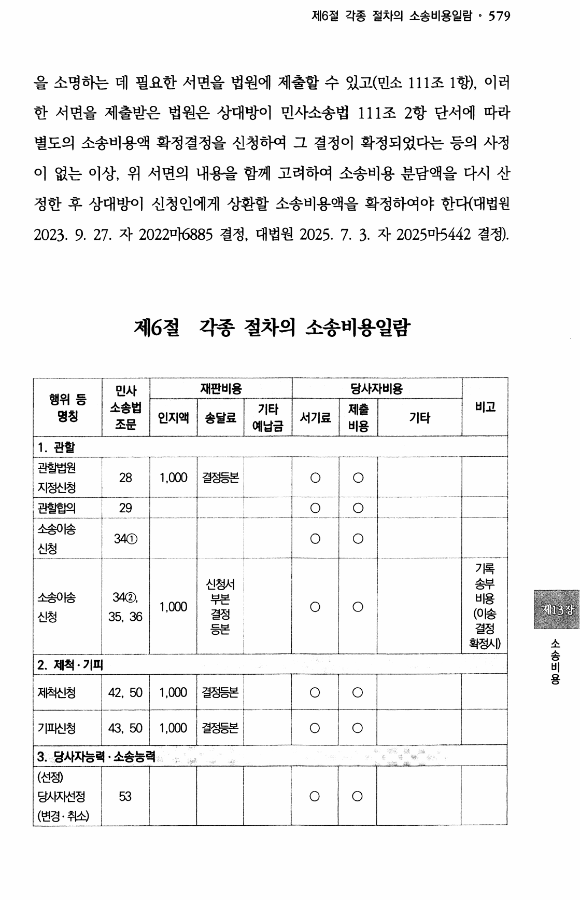

추출 텍스트(참고)

을 소명히는 데 필요한 서면을 법원에 제출할 수 있고(민소 111조 1힝), 이러
한 서면을 제출벋은 법원은 상대방이 민사소송법 111조 2항 단서에 따라
별도의 소송비용액 확정결정을 신청하여 그 결정이 확정되었다는 등의 사정
이 없는 이상, 위 서면의 내용을 함께 고려하여 소송비용 분담액을 다시 산
정한 후 상대방이 신청인에게 상환할 소송비용액을 확정하여야 한디(대법원
2023. 9. 27. 자 2022미C885 결정, 대법원 2025. 7. 3. 자 2025마5442 결정).
제6절 각종 절차의 소송비용일람
당사자비용
비고
미 민사 재판비용
행위 등
소송법 rl총최 기타 제출 비고
명칭 인지액 송달료 서기료 기타
조문 예납금 비용
플~푹軒←吼播옮 n
1. 관할
관할법원
28 1 ,떼 결정등본 ○ ○
지정신청
-戶 ~혹~초.○..르.~급Tl○l ....“.르.....
관힐합의 29
소송이송
34① ○ ○
신청
~
기록
신정서 송부
소송O洽 34②, 부본 비용
신청 35, 36 1 결정 (이송 제B장
등본 결정
확정시)
, M ○ ○
소
2. 제척 三 소 비 ○
요
◎
. 기피
저內신청 42, 50 1 ,패 결정등본 ○ ○
l
l
l
기피신칭 43, 50 1 ,0여 결정등본 ○ ○
3. 당사자능력 소송능력
(선정)
딩入M)선정
(변경 .
53 ○ ○
추난)

---
## 페이지 86

### 각종 절차의 소송비용일람표 (계속) (86면)

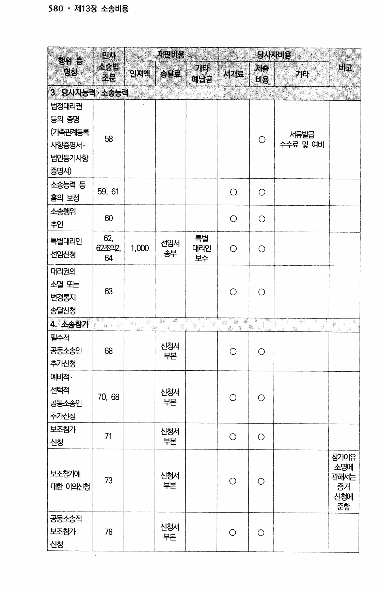

추출 텍스트(참고)

T
I
I 舅뼈 활 l폐軒l嗤재판 ~ 비 준~ 용 ~촌-'국 당사자비용
펴최嗚1一흐'타 - I ☞ ! 례
3. 당사자능력 .
민사 당사자비용
행위 등
소송법 지최 쳐一毛 명칭
조문
소송능력
壻 기 = 타 제출 l 비고
예닙금 비용
l 인지액 송달료 서기료
법정대리권
등의 증명
(7侄곤p11등록
人팀증명서 .
법인등7l人탑
증명서)
I
서류빌급
58 ○
수수료 및 여비
소송능력 등
59, 61 ○ ○
홈의 보정
소송행위
60 ○ ○
추인
혁--취~
62,
62조으E ,
특별
특별대리인 선임서
1.여0 대리인 ○ ○
선임신청 송부
여 보수
대리권의
소멸 또는
변경통지
송달신청
l
63 ○ ○
l
~~~~~ ~-
4. 소송참가
~~~~--롱=☞ ▼ -一-
팔수적
신청셔
공등h승인 68 ○ ○
부본
추가신청
예비적.
선택적 쎌예 FHI
70, 68 ○ ○
공동소송인 주눕
추가신청
보조침가 신정서
71 ○ o
신청 부본
침7m悍
소명에
보조침7때 괸해人膳
증거
신청에
준함
l 신정서
73 ○ ○
대한 이의신청 부본
공동소송적
신정서
보조침가 78 ○ ○
부본
신청
H

---
## 페이지 87

### 각종 절차의 소송비용일람표 (계속) (87면)

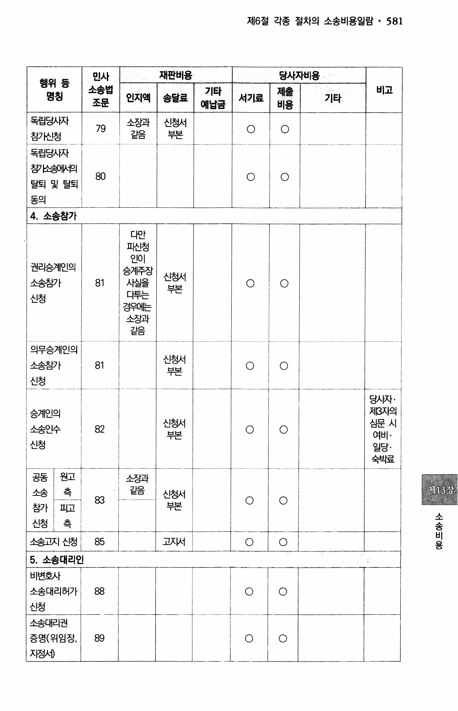

추출 텍스트(참고)

민사 재판비용 당사자비용
행위 등
명칭 소송법 인지액 1 'I 록듣 송송 .흔 달 ~ 달 닳蝗 료료 쪽륙.l 기타 서기료 제출 기타 비고
조문 예닙금 비용
! 독립딩火싸 소징과 신정서
79 ○ ○
침가신청 > ∈ 隍 ⊂ 부본
l
독립딩入싸
챰닙K뗍
80 ○ ○
탈퇴 및 탈퇴
도oI
◎司
l
넣
4. 소송참가
다만
피신청
인이
권리승게인의
승거悍장
신청시
소송참가 81 사실을 ○ ○
부본
댜투는
신청
경웨信
소징과
>卜으
드⊂
l
I
의무승계인의
신청서
소송침가 81 ○ ○
부본
신청
行-一--r--히
딩AMl .
승계인의 지B자의
심문 시
소송인수
여비.
신청 일당.
숙박료
I l
신청시
82 ○ ○
부본
공동 원고
소송 측
침가
신청
l 禍
l
소징과
같음 설합
83 ○ ○
고回 수흐
소
츠 司 소 ⊃ 비
요
◎
ll !
쏟고지 신청 85 고X써 ○ ○
5. 소송대리인
비변호사
소송대리허가 88 ○ ○
신청
l 소송대리권
중명(위임징,
지정서)
I
I 89 ○ l ○
l
l

---
## 페이지 88

### 각종 절차의 소송비용일람표 (계속) (88면)

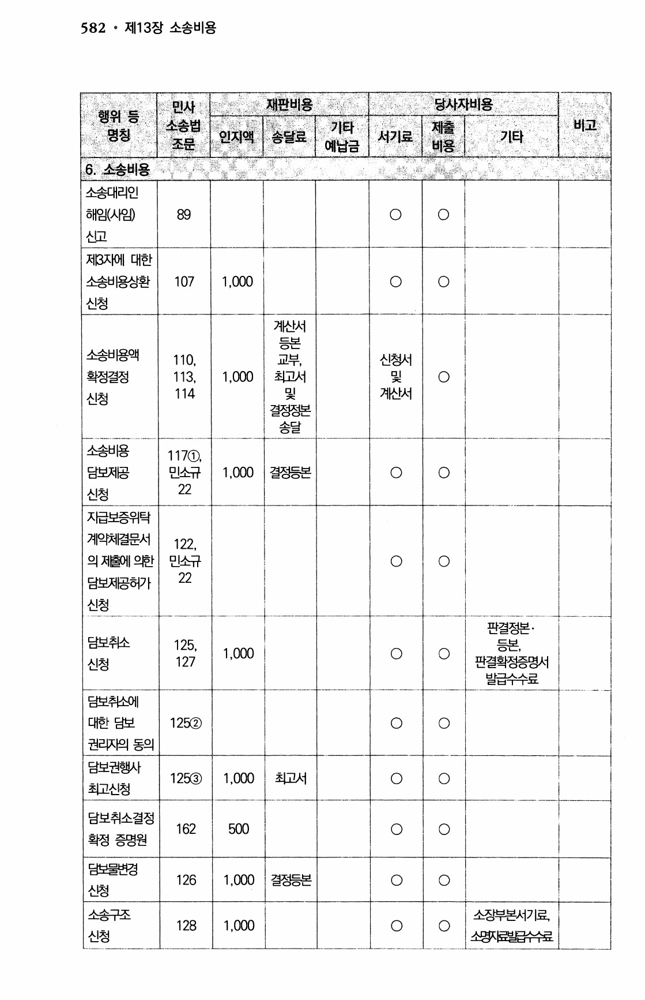

추출 텍스트(참고)

품J짧굻뛔흙트憑☜밝
민사 당사자비용
행위 등 J,칡w를T- 기타~ 소송법
명칭 인지액
조문
소송비용
틂대리인
세(사임)l89 ○ ○
l
제출 비고
송달 서기료
비용
6.
소송대리인
해임(人g) 89 ○ ○
싼모
저βX뻐l 대한
소송너e싱환 107
신청
1 ,0여 ○ ○
겨싼서
록
㉢느
교부,
초匡시
및
결정정본
송달
I
소송비용맥
1 10, 신청서
확정결정 1 13, 1 및
114 계산서
신청
, O야 ○
소송비용
1 17①,
딤보지俉 민소규 결정등본
신청 22
1 , 때 ○ ○
x后보중위탁
계으허멸문서
122,
의 지항l 으턴 민소규 ○ ○
딤보지몸허가 22
신청
판결정본.
담보추냔 125, 트브
1,야O ○ ○ ○느데
신청 127 판결획정증명서
빌급쓱료
딤보추佺에
대한 담보
권巳F뗍 등의
i
12a교) ○ ○
딤보권행사
12” 초但서
최고신청
l .n ○ ○
담보취소결정
162 5여 ○ ○
확정 증명원
~
'
I
딤보물변경
126 1 ,0여 결정등본 ○ ○
신청
l
소송구조 소징부본시기료
128 1 ,애0 ○ ○
신청 쏵벌藎

---
## 페이지 89

### 각종 절차의 소송비용일람표 (계속) (89면)

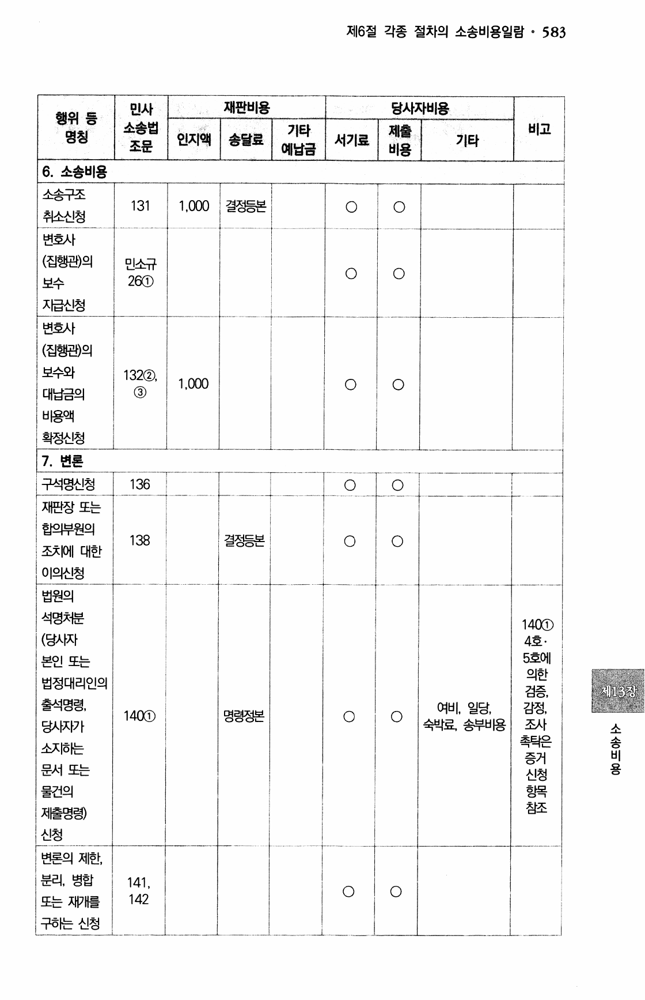

추출 텍스트(참고)

i l 재판비용 卜극--r--측-]
l 인지액 ' 송탈휘
l 興_‘軫=弼 따
下 . . .\”“品낡~巒.낡齡“~““““~~~~~T 딩사자비용 I
~~~~~츠1 베출
기타 I
행위 등 ( 민사
소송법
명칭
조문 jI용
l 빼기曼 ! 기타 제출 비고
인지액 송달료 서기료
예닙금 비용
6. 소송비용
一
소송구조 o l ol
131 1,000 결정등본
추냔신청 ----f-卜
l '
I W
l ○ ○
l
l
i
변호사
(집행괜의 민소규
○ ○
보수 2” H
入后신청
I l
변호사
(집행괸)의
보수와
대닙금의
너묩액
획정신청
I
132②
③
!
I
1 , 0여 ○ ○
l I
_느
~
Il'
록=
7. 변론
그희
구석명신청 136
-록戶 ~ ~
재핀장 또는
힘으得원의
138 ○
조치에 대한
이의신청
l1
커-
r.
법원의 I
석명놋든
(딩火따
븐긴 또는
법정대리인의
출석명령 ,
14ⓗ
4호.
5호에
의한
검증,
⊃쩌
回○?
당人恢PI 조사
촉틱은
소지하는
증거
문서 또는 신청
물건의 농卜모
⊆뒤
침조 저듣명령)
신청
l
제B장
여비’일당,
14여) 명령정본 ○ ○
숙박료, 송부너묩 소
송
비
용
l I
-▷뤼튼 -혁-~혁
변론의 제한,
분리, 병합
또는 재개를
구하는 신청
l
○ ○ 142 I
-L
l
l 1

---
## 페이지 90

### 각종 절차의 소송비용일람표 (계속) (90면)

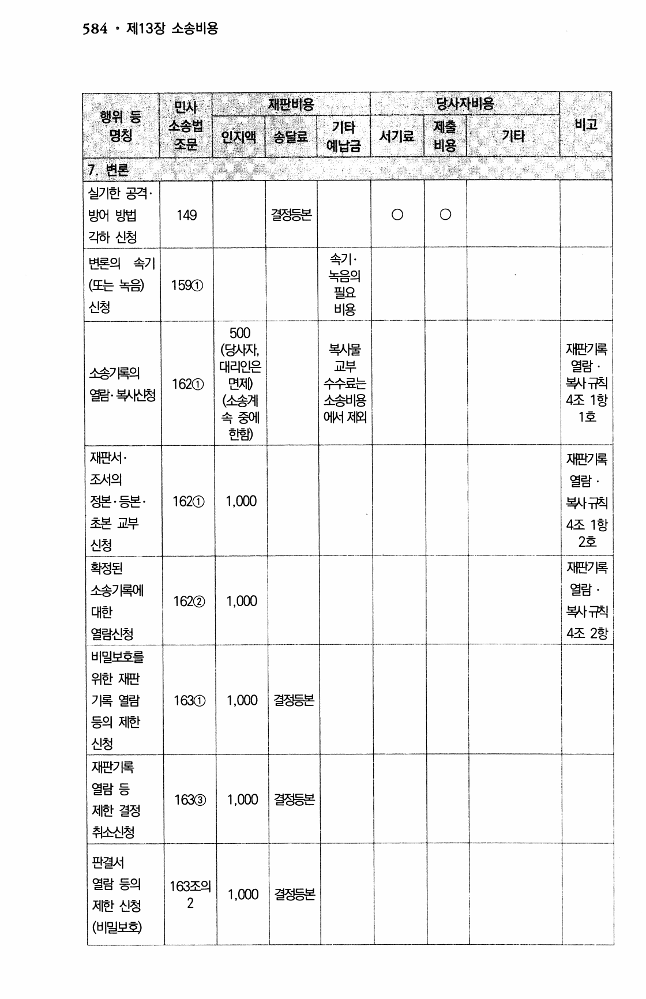

추출 텍스트(참고)

꿇l밞濁謹1琵휸떡고w
민사
행위 등
소송법 기타 제출 ;비비고고
며欠1 인지액 송달료 서기료 기타
◎⊃ 조문 예닙금 비용
;7. 변론
l l㉤l
실기한 공격 .
방어 빙법 149 결정등본 ○ ○
각하 신청
변론의 속기 속기
(또는 녹음)
신청
.
녹음의
1 5αD
필요
비용
(딩火씨, 재판7民
대리인은 열람
면저0
(소송계
속 중에
한행
.
복人튼
교부
쑥7唇의
162① 쮸료는 복사몰F첩
열람. 복人松l청
소송비용 4조 1항
어써 저티 1호
재판서 .
조서의
정본 .
재끈P唇
열람
등본
초본 교부
신청
.
1 복사쭤
4조 1 항
2호
, 1 62① 이O
_一LI-
재굔p昌
열람 .
확정된
소송기록에
162② 1,000
대한 뵉l규칙
열림신청 4조 2항
비말보호를
위한 재판
기록 열람 163① 1 ,이O 결정등본
등의 제한
신청
재판기록
열람 등
1” 1,떼 결정등본
제한 결정
취소신청
-느
판결시
열람 등의 163조의
1 ,ⓓ 결정등본
제한 신청 2
(비밀보회

---
## 페이지 91

### 각종 절차의 소송비용일람표 (계속) (91면)

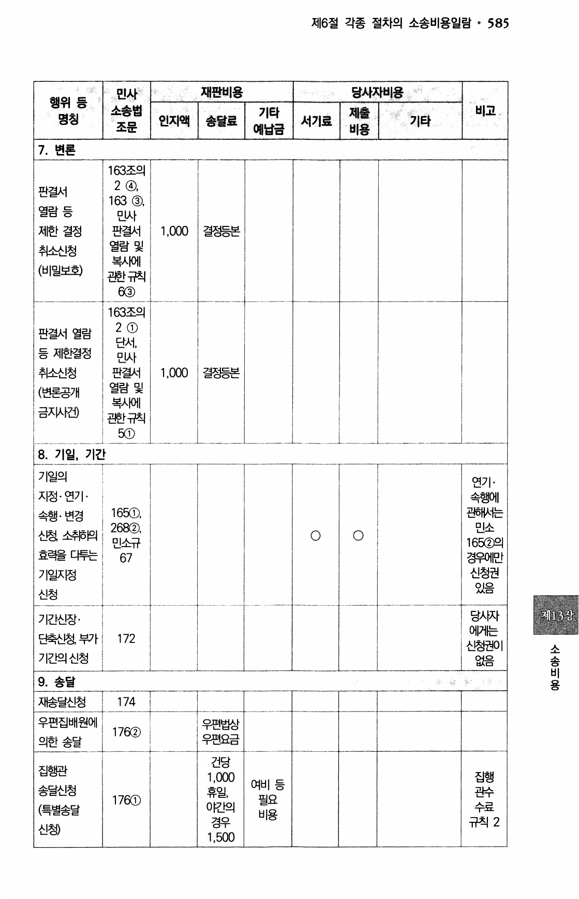

추출 텍스트(참고)

l 민사 ;
소송법l ' 조문 인지액 l
민사 재판비용 당사자비용 I
행위 등 혁배
소송법 l셔기攣!베를 "㉱ 명칭
조문
l 기타 제출 비고 磯 인지액 송달료 서기료 기타
예닙금 비용
7. 변론
l 163조의
2 ④,
163 ③,
민사
핀결시
열람 및
복人때l
곤턴司烝l
6③
l
판결서
열람 등
제한 결정 1 ,①0 결정등본
추냔신청
(비밀보회
163조의
2①
판결서 열람
딘시,
등 제한결정 민사
추난신청 판결서 1
(변론공개 열람 및
복人빼
금xM)건)
곤턴국폄
”
, OOO 결정등본
0 .IUM !
규칙 I
그1☜ 룔-▶ .!- l
8. 기일, 기간
기일의
지정 . 연기 .
속행 .
연기.
속행에
변경 곤폐서는
민소
신청 소추后뗍
16”
효력을 E痔는 경웨
기일자정
신청
l 만
신청권
OI으
샤㉢
lLl
16”,
26” ,
민소규
l
○ ○
l
艀쓰
l 제뻐장
- - ----一릎;---
딩火싸
어머彪
신청권o
~i74T
;우면법상
176② '우면요금
건딩
"” A죌밭
:1,5예
l
기간신장
딘축신청 부가 172
소
가긴의 신청 O세으 송
바므
비
9. 송달 용
재송달신청
우편집배원에 우면법상
17ⓒ
의힌 송달 우편요금
건딩
1 ,O이
뇰○i
下7르 0
집행관
집행
여비 등
송딥진청 곤佇
17” 필요
(특별송달 ORl의 수료
비용
경우 규칙 2
신촁
1 ,5예

---
## 페이지 92

### 각종 절차의 소송비용일람표 (계속) (92면)

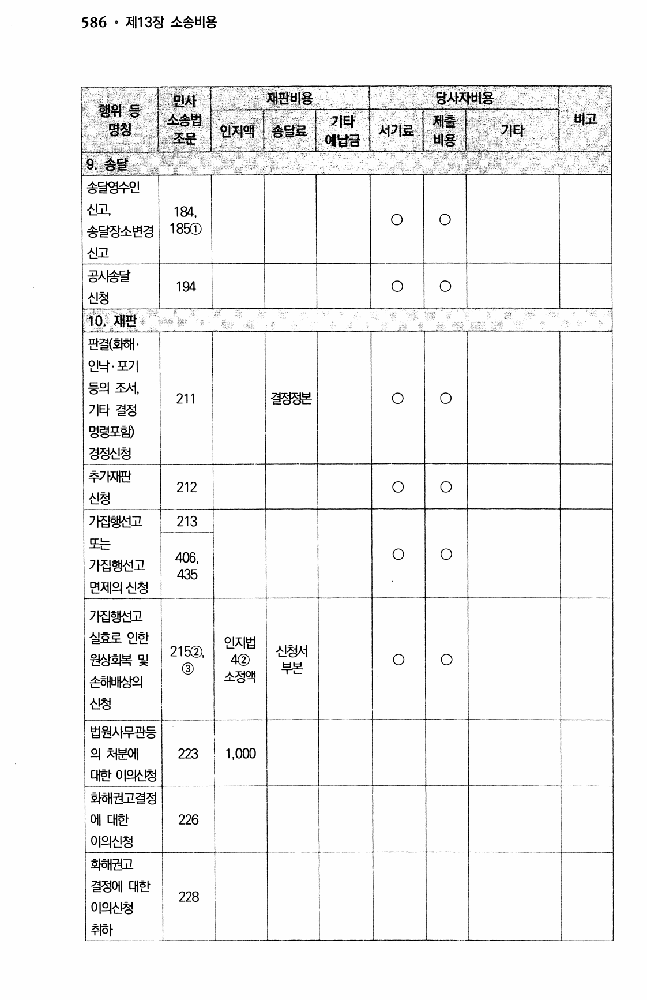

추출 텍스트(참고)

- 치
옥뇌
행위 등
명칭
1 비고
름 륙
r하총뉼
貯눕- 변 ---三 l 속담면수Q l
U -
I -확-~ 송딜영수인
신고 l 11테테,,
○○ ○
송달징소변경
l 11885”①
신고 l
F■ ◎
공人捨달
1여 ○ ○
신청
I
10 재판
I
l
판결(호后H .
인낙 . 포기
등의 조서,
211 결정정본 ○ ○
기타 결정
명령포험)
경정신청
추yMH판
212 ○ ○
신청
7띱행선고 213
또는
4" ○ ○
가집행선고
면제의 신청
,
가집행선고
실효로 인한 인지법
21”, 신청시
원상호념 및 4② ○ ○
③ 부본
소정액
손해배상의
신청
l
법원사무괸등
의 처분에 223 1,”
EH한 이으씬청
화해권고결정
에 대한 226
이의신청
호后H권고
결정에 대한
222288
이의신청
취하

---
## 페이지 93

### 각종 절차의 소송비용일람표 (계속) (93면)

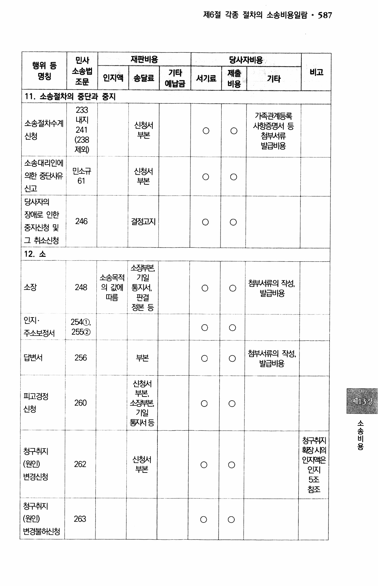

추출 텍스트(참고)

I 재판비용
프치똘~~"→~- ←
당사자비용
I송틜료M‘
l
稠 ;F~1
터屠l ,
민사
행위 등
소송법
명칭 조문
l 시기혔 I 기타 비고
인지액 송달료 서기료 기타 예닙금 비용
1 1 . 소송절차의 중단과 중지
l l
7膺관계등록
내지
소송절차수계 신청서 사힝증명서 등
241 ○ ○
신청 부본 첨부서류
(238
발급비용
제외)
소송대리인에
민소규 신청서
의한 중EI八유 ○ ○
61 仙 부본
신고
딩入씨의
징애로 인한
중자신청 및
그 취소신청
,
l
246 결정고지 ○ ○
l
l
llI
l
12. 소
ll
스징부본
기일
통x써 ,
▲수⊆저
÷○∋최 첨부서류의 작성,
소장 248 의 값에 ○ ○
빌급비용
따름 판결
저턴. 드
○느 ○ l
인지 . 2테①
○ ○
주소보정서 25”
뇌▷
첨부서류의 작성,
답변서 256 부본 ○ ○
발급비용
신청시
부본
소징喪;
기일
흥써등
l 一
! 제13장 l
고교경정
2266(0 ○ ○
신청
소
-f늅 - 송
청구추" 비
용
l
청구취지 혼짢火日
신청서 2MP나은
(원인) 262 ○ ○
부본 인지
변경신청
5조
침조
!Il 정구취지
(원인) 263 ○ ○ l
변경물효씬청

---
## 페이지 94

### 각종 절차의 소송비용일람표 (계속) (94면)

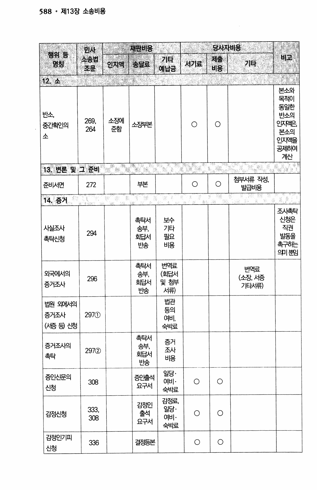

추출 텍스트(참고)

588 . 저"3징 소송비용
l- ~ 당사자비 ~ 용
행위 등 -~~~ ~
명칭
l 듣~一측툰하~춘= l 제출 l 비고
기타
[ 낸sL
- =鹿 ~들
12. 소
-內롱☜-- -흡 -~ l ll 본소와
목적이
동일한
게산
13. 변론 및 그 준비
~골록一
첨부서류 작성,'l
준비서면 i2721 l부본! l○l○
발급닙倡
l 14. 증거 !
조人倭탁
촉틱서 보수 신청은
사실조시 송부, 기타 직권
2엇
촉탁신청 회답서 필요 빌동을
뱐송 비용
으p l 본]
촉탁서 번역료
번역료
외국어써의 송부, (회딥火1
296 (소장 서증
중거조사 회딥서 및 첨부 기EH㈜
넌澧 서류)
l
l
법관
법원 오때써의
등의
증거조사 297①
여비,
(火恁 됩 싼덩 쑤l료
촉탁서
증거
증거조사의 송부,
297② 조사
초 뤄 타 뒤 회딥서 비용
빈송
일당 .
여비 .
증인신문의 裴\
신청 숙박료
l
[
308 ○ ○
감꿇
김정인
333 일당.
출석
여비.
요구서
숙박료
,
김정신청 ○ ○
l
I
l 감정인기피
신청
l l 336 결정등본 ○ ○

---
## 페이지 95

### 각종 절차의 소송비용일람표 (계속) (95면)

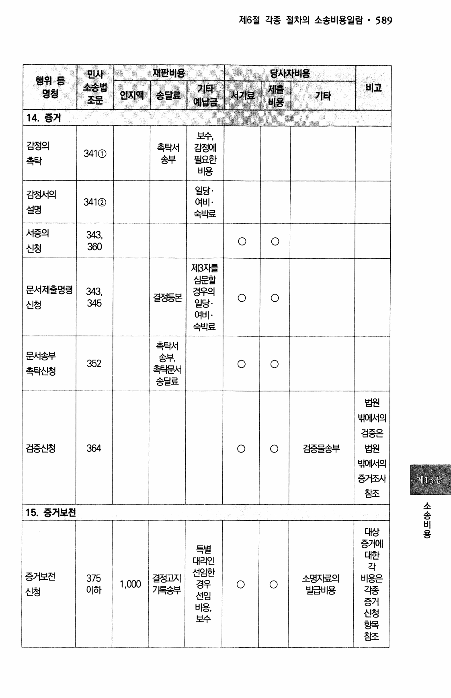

추출 텍스트(참고)

1 홅 鹿 훨.'혁,.-卜
민사
행위 등
소송법 기타 제출 비고
명칭 서기료 기타
조문 예닙금 비용
-一 -一一_-一_코 _코 -l
l
14. 증거
보수,
감정의 촉탁서 김정에
341①
云E내 송부 필요한
司터
비용
I
일당 .
여비 .
김정서의
341②
설명
숙박료
혁
서증의 343
신청
,
○ ○
36O
지β자를
심문할
문서제출명령 343 경우의
신청 일당.
여비.
쑤l료
,
결정등본 ○ ○
촉탁서
문서송부 송부,
352 ○ ○
촉탁신청 촉틱문서
송딜료
법법원원
밖밖어어써써의의
검검증증은은
검증신청 3벼 ○ ○ 검증물송부 법법원원
부부때때써써의의
증증거거좌좌ll 재13장
침침조조
-~ 소
15. 증거보전 송
비
용
l
대상
증거에
특별
대한
대리인
각
선임한
증거보전 375 결정고지 소명자료의 비용은
1 ,예O 경우 ○ ○
신청 이하 7昌송부 발급비용 각종
선임
증거
비용,
신청
보수
쥴隍
㉢∋
참조

---
## 페이지 96

### 각종 절차의 소송비용일람표 (계속) (96면)

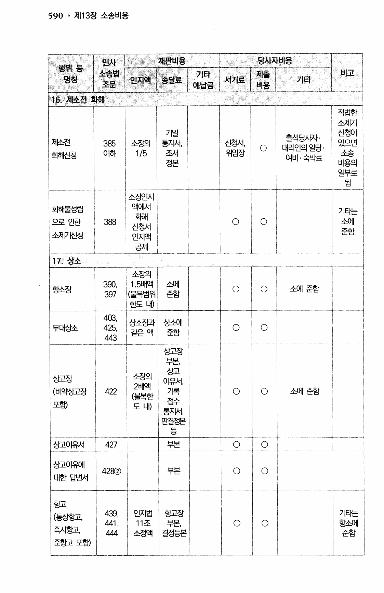

추출 텍스트(참고)

당사자비용 -.盤. % 鰲R1
..
재판비용
'혔 쎈 축~☞~"T 기타 인지액 I
민사
고가l 소송법 송탈뢰 예납금
조문
- _ - -L_
3 행위 등 r←륙례.善플~~.T~~ 審~1
명칭 l 인지액 ! 송달료 I
켑치 ∋
■
l 명칭 l소송법 기타 제출 l비비고고
서기료 기기타타-l -
I조문 예납금 비용
16. 제소전 화해
기일
,
적법한
소제기
기일 신청이
소窪1 특통Kx써써. 있으면
소송
비용의
일부로
됨
,
출석딩人따
지난전 신정서
호비신청 조서
衣涅
○느
, 385 소징의
○ 대리인의 일당
이하 1/5 위임장 여비.숙박료
l
3“
뵉_
l
소소징징인인X지지
액액어어써써
화화해해
신신청청서서
인인지지액액
공공제제
I 호偏H불성립 기티는
으로 인한 388 ○ ○ 소에
준함
소제기신정 I
_-l l
17. 상소
■■
F 口 “",홀.
소소장장의의
11 ..55배배Q액
((불불복복방범위 I
한한도도 나내)
l 3에, 소에
힝소장 ○ ○ 소에 준함
397 준함
403 ,
상스징과 상소에
부대상소 425, ○ ○
같은 액 豕옳卜
443 드흐
상고장
부본
l소징의
싱고
상고징 이유火1,
2배액
(비약싱고장 422 기록 ○ ○ 소에 준함
(불복힌
접수
포행 도내)
통x써,
판결정본
등 l
혁놂一
상고OR火1 부본 ○ l○ l 427
l
상고o위l
42” 부본 ○ ○
대한 답변시
항고
(통상힝고
즉시흔교
준힝고 포행
l 439 인지법 항고장 기탸는
11조 부본, 힝스에
소정액 견지⊂브 준함
E르◎㉢교~~
,
441 , ○ ○
444 l

---
## 페이지 97

### 각종 절차의 소송비용일람표 (계속) (97면)

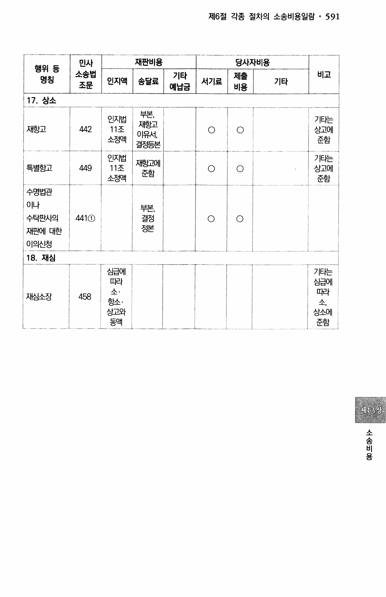

추출 텍스트(참고)

I
재판비용 당사자비용
게좋틜휘 蝗표直IW
.~~.~~~~~~~ 一一汗육~듣높 一튿 인지.堪 lo ○l
11조이유서, ,
소정액 결정등본
뷜鑒N빪 ..
부본,
뚫 ㉰,.
l
민사
행위 등
소송법 비고
명칭
조문
l 기타는
상고에
준함
l
기타 제출 비고
인지액 송달료 서기료 기타
예닙금 비용
17. 상소
부본,
인지법 기타는
재힝고
재힝고 442 11조 ○ ○ 상고에
이유서,
소정액 준함
결정등본
I!請 I 인지법 기티는
재혼江에
특별항고 449 11조 ○ ○ 싱고에
준함
소정액 준함
l
수명법관
ol나
부본, 蠻
수탁핀사의 결정
재판에 대한 가 ◎ 드 ⊆
이의신청
l I
색1①
l
ll
드
18. 재심
i l
ll
심급에
H尺l
소.
힝소 .
기타는
심급에
I日
재심소장 458
소
싱고외 싱소에
몽객 준함
소
송
비
용

---
